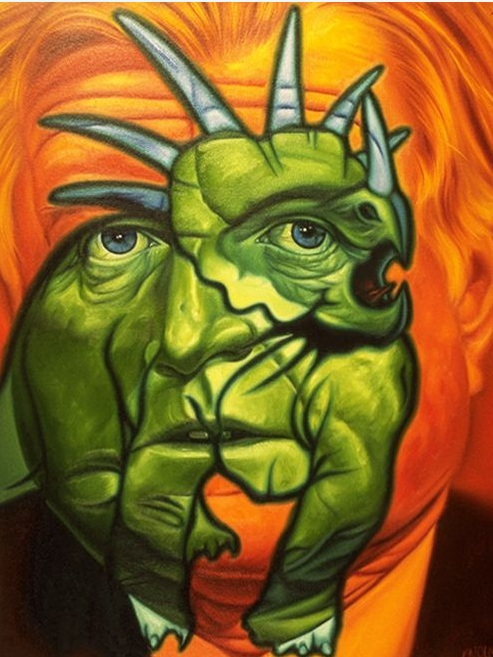
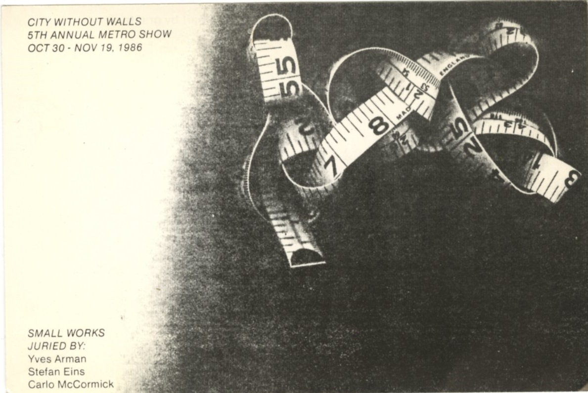
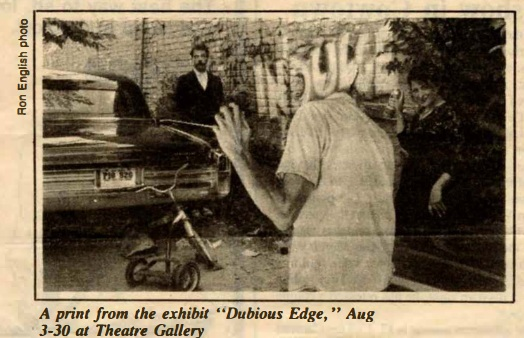
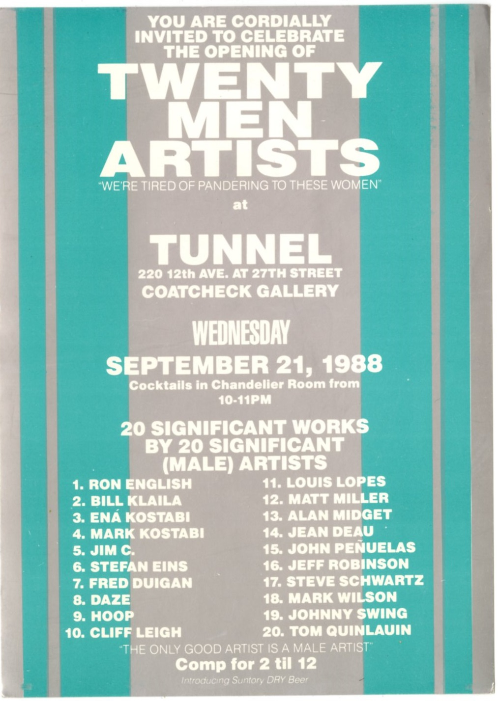

# 1980s Group Exhibitions

Group exhibitions featuring Ron English during the 1980s.  
Click on each image to see more information

| Image | Year | Dates | Venue | Title |
|-------|------|-------|-------|-------|
|  | 1982 | May 16–17, 1982 | Infomart (Texas Gallery Art Show, in conjunction with ARTFEST) | *Texas Gallery Art Show* |
|  | 1983 | April 11, 1983 | Limelight | *Ron English Presents: Art on the Dubious Edge* |
|  | 1986 | April 5, 1986 | Theatre Gallery | *Invading Aliens from the Beach* |
|  | 1986 | October 1986 | Houston Center for Photography | *Texas 150: New Texas Photography* |
|  | 1986 | October 30 – November 19, 1986 | Urban Artists' Collective | *5th Annual Metro Show* |
|  | Late 1980s (likely 1986 or 1987) | June 27 (one-night event) | Under Acme | *MGD — Painting N.Y.C.* |
|  | 1987 | January 18 – February 12, 1987 | Bond Gallery | *Para Photography* |
|  | 1988 | February 2, 1988 | Fashion Moda – Limelight | *2042: Art at the Speed of Life* |
|  | 1988 | May 4, 1988 | Tunnel Gallery | *Staff Infection* |
|  | 1988 | May – 26 June 1988 | Midtown Y Photography Gallery | *Ron English, Abbot Genser, Jeanine El’Gazi* |
|  | 1988 | July 6, 1988 | Tunnel Gallery | *The Immoral & Illegal Artshow* |
|  | 1988 | September 21, 1988 | Tunnel (Coatcheck Gallery) | *Twenty Men Artists* |
|  | 1988 | November 26, 1988 – January 9, 1989 | The New Waterfront Museum | *The All-Male Feminist Art Show* |
|  | 1989 | March 16–29, 1989 | Grace Harkin Gallery | *Art on the Run* |
|  | 1989 | March 22 – April 15, 1989 | The Police Building | *The Prisoners of Art* |
|  | 1989 | July 24 – August 2 and August 8–24, 1989 | Dance Theater Workshop Gallery | *Dog Days* |
|  | 1989 | December – January 3, 1990 | Black and White in Color Gallery | *The Helms Degenerate Art Show* |
|  | 1989 | December 1989 – January 1990 | Fashion Moda (South Bronx) | *[Exhibition/Fundraiser, December 1989 – January 1990]* |
|  | 1985 | August 3–30, 1985 | Theatre Gallery | *Dubious Edge* |
|  | 1987–1988 | December 12, 1987 – January 15, 1988 | Fashion Moda | *Omniscient Abandon* |
|  | 1988 | May 4, 1988 | Tunnel Gallery | *Staff Infection* |
|  | 1988 | September 21, 1988 | Tunnel (Coatcheck Gallery) | *Twenty Men Artists* |
|  | 1988 | May 9, 1988 | Limelight | *Ron English Presents Un-Censored* |
|  | circa 1988 | October 26, 1988 | Limelight | *Let Them Eat Art* |
|  | 1989 | August 2, 1989 | Red Zone | *Freedom of Expression Show* |

