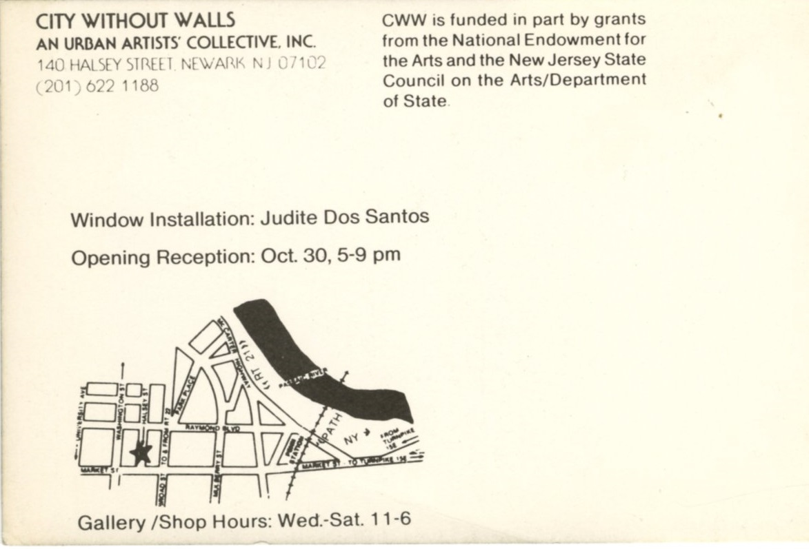

# *5th Annual Metro Show*  
### Urban Artists' Collective (City Without Walls), Newark (1986)

### **Group Exhibition**

     
**Year:** 1986  
**Dates:** October 30 – November 19, 1986  
**Venue:** Urban Artists' Collective (City Without Walls)  
**Location:** Newark, New Jersey, US  
**Title:** *5th Annual Metro Show*  

---

## Overview  

The fifth edition of the Metro Show presented by Newark’s **Urban Artists’ Collective**, bringing together a selection of regional artists engaged with social, cultural and urban themes. Ron English participated in this iteration of the show, which expanded the visibility of independent and experimental artists during the mid-1980s.

The exhibition emphasized collaboration, cross-disciplinary practices and an ongoing exchange between emerging visual artists in the New York/New Jersey area.

---

## Ephemera  

- Printed showcard (archival)

---

## Back to list  

➡️ [Return to 1980s Group Exhibitions](../1980s-group-exhibitions.html#city-without-walls-5th-annual-metro-show-1986-row)
