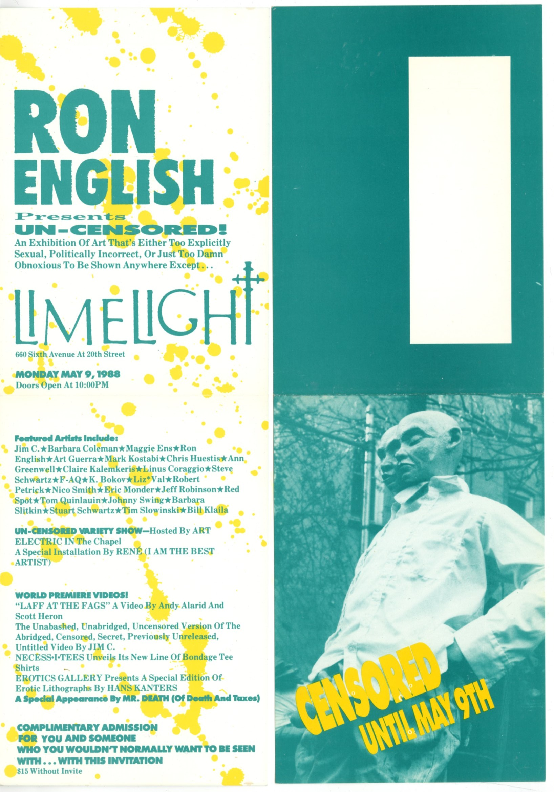

# *Ron English Presents Un-Censored*  
### Limelight, New York (1988)

     
**Year:** 1988  
**Date:** May 9, 1988  
**Venue:** Limelight  
**Location:** New York, NY  
**Title:** *Ron English Presents Un-Censored*

---

## Overview  

A one-night downtown presentation at **Limelight**, curated by Ron English, extending his interventionist and pop-subversive approaches to media culture and alternative exhibition spaces in the late 1980s.  

The show continued English’s early strategy of placing unconventional art programming within nightlife environments, a tactic closely tied to his Fashion Moda affiliations and Manhattan club-culture networks.

---

## Source  

Jéan-Noël Herlin Research Library —  
<https://www.jeannoelherlin.com/search/ron+english/>

---

## Back to list  

➡️ [Return to 1980s Group Exhibitions](../1980s-group-exhibitions.html#limelight-ron-english-presents-uncensored-1988-row)
