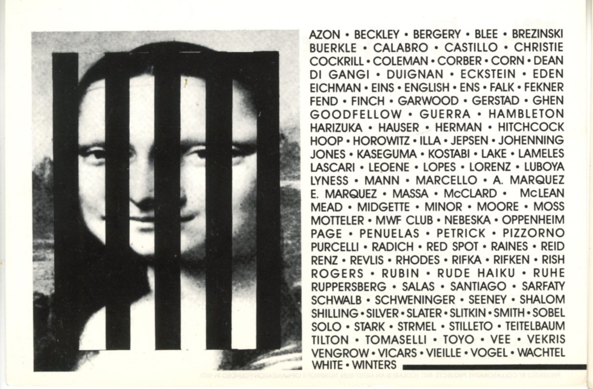
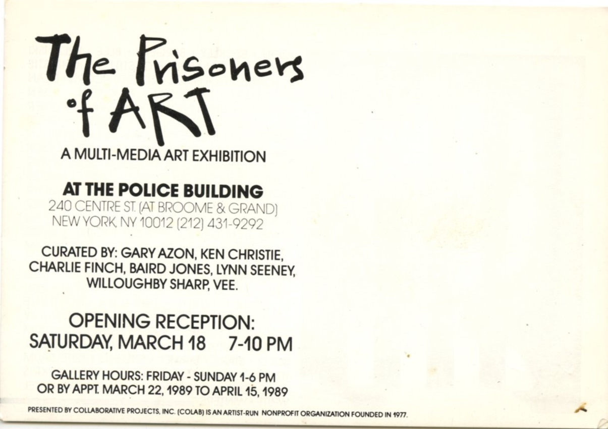

# *The Prisoners of Art*  
### The Police Building / COLAB, New York (1989)

**Year:** 1989  
**Dates:** March 22 – April 15, 1989  
**Venue:** The Police Building / COLAB  
**Location:** New York, New York, US  
**Title:** *The Prisoners of Art*

---

## Overview  

Group exhibition presented in the **historic Police Building** in New York, co-organized through **COLAB (Collaborative Projects Inc.)**—a central collective in the downtown alternative-art scene of the 1980s.

Ron English participated alongside other artists working with politicized imagery and counter-establishment themes, aligning with COLAB’s activist and experimental ethos.

---

## Sources  

- Eichman, Shawn. *“The Prisoners of Art.”* **Arts Magazine**, April 26, 1989, pp. 16-A–17-A.

---

## Back to list  

➡️ **[Return to 1980s Group Exhibitions](../1980s-group-exhibitions.html#police-building-prisoners-of-art-1989-row)**
