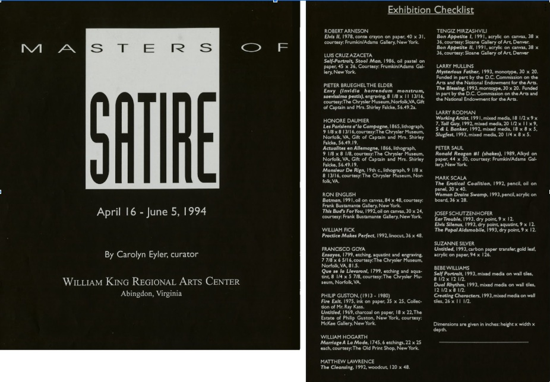
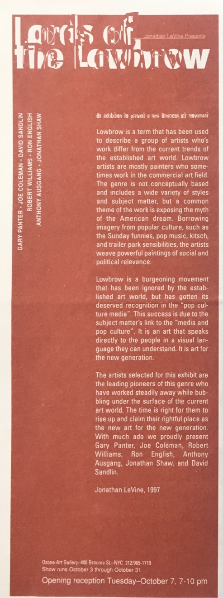
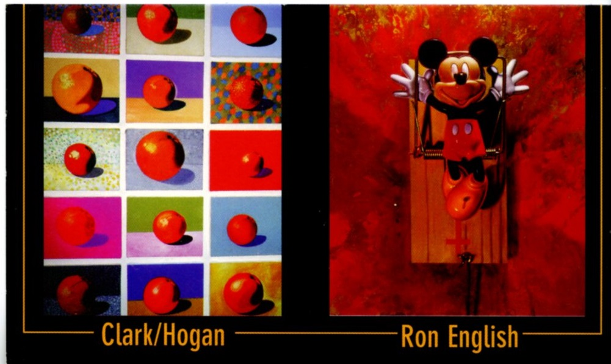
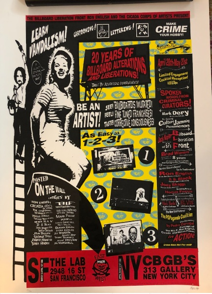

# 1990s Group Exhibitions

Group exhibitions featuring Ron English during the 1990s.  
Click on each image to see more information

| Image | Year | Dates | Venue | Title |
|-------|------|-------|-------|-------|
|  | 1990 | February 10 – March 9, 1990 | Zero One Gallery | *Agit-Pop America: Clark &amp; Ron English* |
|  | 1990 | July 6, 1990 | Palace de Beauté | *Freedom of Expression II* |
|  | 1990 | November 28, 1990 | Studio Z hair salon | *Censorship* |
|  | 1990 | November 29 – December 23, 1990 | The Gallery | *ART = MONEY?* |
|  | 1991 | January 27 – March 3, 1991 | Kenkeleba Gallery | *Time City / Outer Limits* |
|  | 1992 | March 1992 | Elston Fine Arts | *Urban Jungle* |
|  | 1992 | March 12 – April 12, 1992 | Gallery Stendhal | *Absolut Collaboration* |
|  | 1992 | May 8, 1992 | Limelight (Public Image) | *Urban Primitivism* |
|  | 1992 | December 3 – 13, 1992 | Trammell Crow Center, Upper West Pavilion | *Contact ’92: DCCCD Art Alumni Exhibition* |
|  | 1992 | September 26, 1992 | 10th Street Art Gallery | *Wild Kingdom: Animals &amp; Creatures in Imagery* |
|  | 1993 | June 1993 | Clark &amp; Co. (Galleries 1054) | *The New Romantics* |
|  | 1993 | August 3–21, 1993 | Frank Bustamante Gallery | *Summer Group Show* |
|  | 1993 | October 3–31, 1993 | Palm Beach Community College Museum of Art | *Art, Money &amp; Myth* |
|  | 1994 | April 16 – June 5, 1994 | William King Regional Arts Center | *Masters of Satire* |
|  | 1995 | 1995 (month not specified) | Robinson Galleries | *Group Exhibition — Robinson Galleries Artists* |
|  | 1995 | February 1–25, 1995 | Rockville Arts Place | *Black* |
|  | 1995 | March 25 – April 23, 1995 | Common Boundaries | *Art Amok: A Diabolical Experiment in Painting* |
|  | 1996–1997 | December 6, 1996 – January 4, 1997 | MOCA (Museum of Contemporary Art) | *Three Artists, Three Visions* |
|  | 1997 | 1997 (date unspecified) | The Tunnel (Chelsea/Brooklyn warehouse) | *Vision 21* |
|  | 1997 | February 14–27, 1997 | Tomasulo Gallery, McKay Library, Union County College | *The Graven Image* |
|  | c. 1997 | September 12 (c. 1997) | Ozone Art Gallery | *Ozone Art Gallery Grand Opening — Inaugural Group Exhibition* |
|  | 1997 | October 3 – 31, 1997 | Ozone Art Gallery | *Lords of the Lowbrow* |
|  | 1998 | May 1998 | Museum of Contemporary Art (MOCA DC) | *One Hundred and Ten NAFTA Oranges* |
|  | 1998 | June 6 – July 2, 1998 | Zero 1 Gallery | *POPaganda!* |
|  | 1998 | December 5, 1998 – January 16, 1999 | Merry Karnowsky Gallery | *Kittens 'n' Kads* |
|  | 1999 | March 12, 1999 (opening) | The Lab | *The Art of Midnight Editing: Two Decades of Culture Jamming and Drive-By Advertising Improvement* |
|  | 1999 | February 1–26, 1999 | CBGB’s 313 Gallery | *POPaganda²/Rejected II* |
|  | 1999 | April 28 – May 21, 1999 | 313 Gallery (CBGB's) | *20 Years of Billboard Alterations and Liberations* |
|  | 1999 | June 18 – July 13, 1999 | David Leonardis Gallery | *Ron English &amp; Alice Wheeler — Coast to Coast* |
|  | 1999 | July 23–25, 1999 | Woodstock ’99 Art Park | *Artists for Peace and the Environment* |
|  | 1996 | May 26 – June 29, 1996 | TRIBES Gallery (285 E 3rd St, New York) | *Prophets for Profit – The New School of AgitPop Propaganda* |

