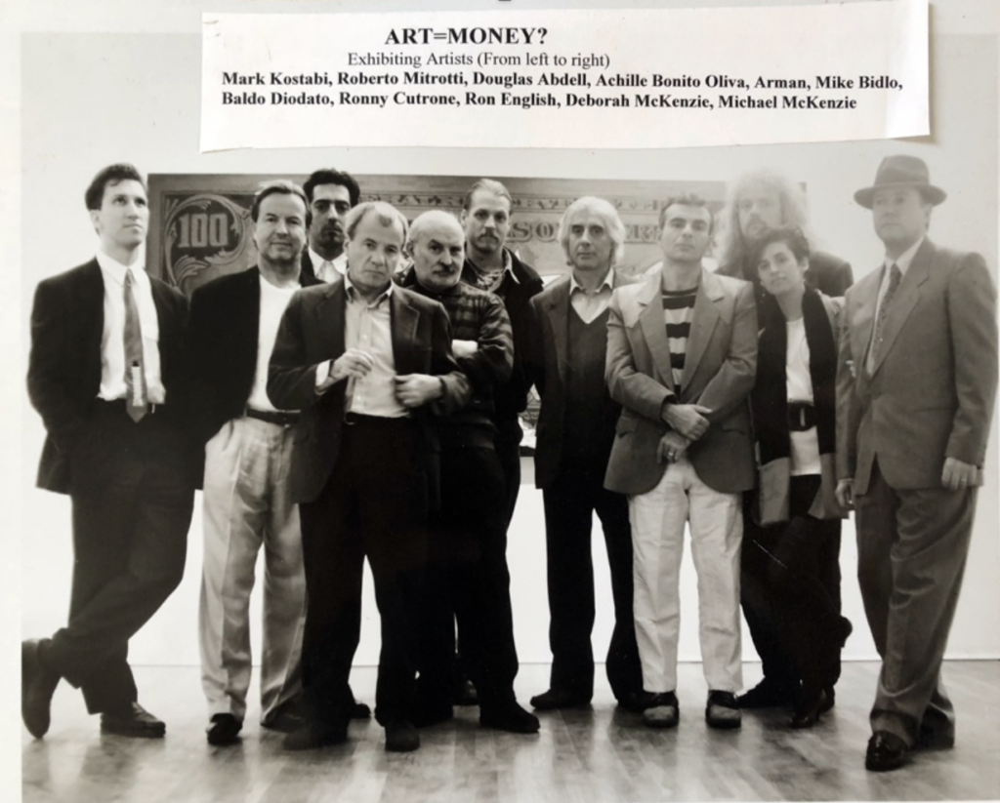
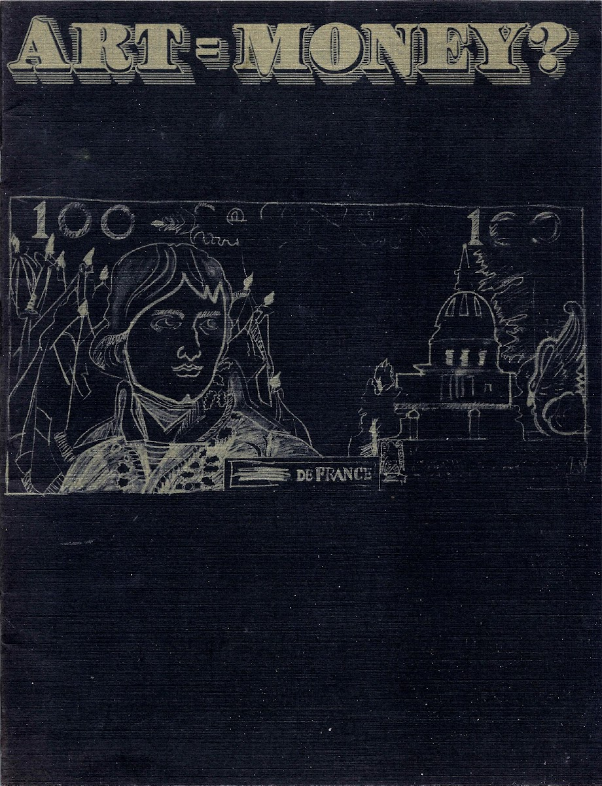
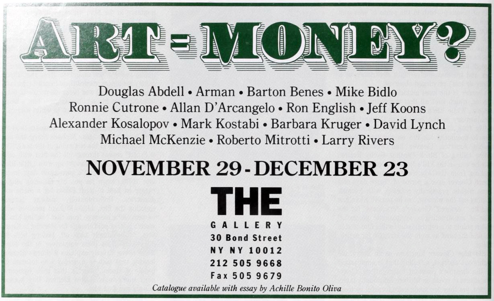

# *ART = MONEY?*  
### The Gallery, New York (1990)

     
**Year:** 1990  
**Dates:** November 29 – December 23, 1990  
**Venue:** The Gallery  
**Location:** New York, NY  

---

## Overview

A large multi-venue travelling exhibition examining relationships between art, commerce, collecting, power and cultural value. Beginning at **The Gallery** in New York, the exhibition continued through multiple U.S. cities and Italy over a two-year period, with work by prominent postmodern and appropriation-era artists.

---

## Touring exhibition schedule (as recorded)

- Hokin Gallery, Miami & Palm Beach — Apr 19 – May 10, 1991  
- Horwitch Gallery, Santa Fe — Summer 1991  
- Ayzenberg Gallery, Los Angeles — May 18 – June 8, 1991  
- Horwitch Gallery, Scottsdale — Winter 1991  
- Riposati Gallery, Rome — May 7 – 29, 1992  

---

## Sources / Links

- <https://gallery98.org/2024/art-money-group-show-with-mike-bidlo-jeff-koons-barbara-kruger-mark-kostabi-the-gallery-18-page-catalogue-with-card-1990/>
- <https://www.fg-collection.org/1990/11/1990-artmoney-achille-bonito-oliva.html>
- <https://www.robertomitrotti.com/>

---

## Back to list  

➡️ **[Return to 1990s Group Exhibitions](../1990s-group-exhibitions.html#the-gallery-art-equals-money-1990-row)**  
