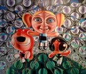
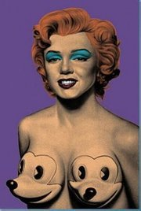

# 2000–2004 Group Exhibitions

Group exhibitions featuring Ron English from 2000 to 2004.  
Click on each image to see more information

| Image | Year | Dates | Venue | Title |
|-------|------|-------|-------|-------|
|  | 2000 | (date unspecified) | Zero One Gallery | *The Art of Ron English and Daniel Johnston* |
|  | 2000 | (date unspecified) | SubTonic | *The Art of Ron English and Daniel Johnston* |
|  | 2000 | May 24, 2000 | CB’s Gallery (313 Bowery) | *Lords of the Lowbrow II* |
|  | 2000 | May 25, 2000 | Gershwin Gallery | *Hollywood Glam* |
|  | 2000 | May 27 – June 24, 2000 | Merry Karnowsky Gallery | *Obey Popaganda — New Works by Shepard Fairey and Ron English* |
|  | 2001 | April 22 – May 28, 2001 | Museum of Contemporary Art, Washington | *Post-Pop, Post-Punk* |
|  | 2001 | May 24 – June 11, 2001 | Opera Gallery | *Bipolar Surrealism* |
|  | 2001 | June 2001 | Space 1026 | *Destroy All Monsters — The Art of Ron English and Daniel Johnston* |
|  | 2001 | June 28 – July 21, 2001 | Rockville Arts Place | *Second Childhood* |
|  | 2001 | October 19 – November 30, 2001 | Museum of Contemporary Art (MOCA DC) | *Playerhaters Don’t Hate the Game, Hate the Player* |
|  | 2002 | January 4, 2002 | Fifty24 Gallery | *Player Haters* |
|  | 2002 | February 16 – March 16, 2002 | Merry Karnowsky Gallery | *Playerhaters* |
|  | 2002 | July 25 – October 2002 | Artscape | *Loco Motion* |
|  | 2002 | September – September 30, 2002 | Tin Man Alley | *Gods and Guerrillas* |
|  | 2002 | October–November 2002 | Track 16 Gallery | *Juxtapoz 8th Anniversary Art Show* |
|  | 2002 | November 7 – December 7, 2002 | 111 Minna Gallery | *Popaganda* / *Pentings* |
|  | 2003 | January 23 – March 29, 2003 | 111 Minna Gallery | *Sci-Fi: Art by Hundreds of Talented Space Cadets* |
|  | 2003 | April 18 – May 17, 2003 | MOCA DC | *Art in the Age of Unreason* |
|  | 2003 | May 1 – May 31, 2003 | 111 Minna Gallery | *RE-Start* |
|  | 2003 | August 29 – October 4, 2003 | MOCA DC | *Public Image (Private Image)* |
|  | 2003 | August 16 – September 16, 2003 | Ghettogloss Gallery | *Street Dreams* |
|  | 2003–2004 | December 4, 2003 – February 7, 2004 | Earl McGrath Gallery | *Raising the Brow: East and West* |
|  | 2004 | May 6 – June 1, 2004 | FIFTY24SF Gallery | *Unframed: 1* |
|  | 2004 | August 21 – September 26, 2004 | Tin Man Alley (Jonathan LeVine) | *Pretty Ain’t Pretty* |
|  | 2004 | October 29 – November 20, 2004 | The Showroom NYC | *Tag the System* |
|  | 2004 | November 20 – December 5, 2004 | M Modern Gallery | *My Way: A Tribute to the Rat Pack* |
|  | 2004–2005 | November 30, 2004 – January 8, 2005 | Varnish Fine Art | *Misfit Toys* |
|  | 2004 | December 3–7, 2004 | SRX Studio | *Parallel Universe: Art Show of the New Movement* |
|  | 2004–2005 | December 11, 2004 – January 15, 2005 | Copro/Nason Gallery | *Krampus &amp; Christmas* |
