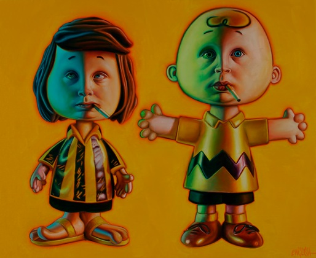

# 2005–2009 Group Exhibitions

Group exhibitions featuring Ron English between 2005 and 2009.

## Exhibitions
## 2005–2009 Group Exhibitions

| Image | Year | Dates | Venue | Title |
|-------|------|-------|-------|-------|
|  | 2007 | May 4–5 | Olivier Jestos, London | *DON'T DO THAT!* |
|  | 2005 | February 5 – March 5 | Jonathan LeVine Gallery | *Pop Pluralism* |
|  | 2005 | February 26 – March 2005 | Track 16 Gallery (Copro/Nason at Track 16) | *Eye of the Illuminati* |
|  | 2005 | July 23 – September 18 | Double Punch Gallery | *Board the Train* |
|  | 2005 | March – May 1 | The Escapist (Escapist Artspace) | *Superheroes of the Subversive: The Art of Daniel Johnston and Ron English* |
|  | 2005 | October 28 &amp; November 19 | Elms Lesters Painting Rooms | *LAST EXIT TO BROOKLYN: NEW YORK’S COUNTER CULTURE* |
|  | 2005 | September 17 – October 15 | Copro/Nason Gallery | *Ron English, Mark Mothersbaugh &amp; Daniel Johnston: 3 Man Art Exhibition* |
|  | 2005 | September 30 – October 20 | The Showroom NYC | *100 (Circus) Punks Rule NYC* |
|  | 2007 | March 3 – March 31, 2007 | Robert Berman Gallery (D5) | *Freaks &amp; Americana* |
|  | 2008 | January 12 – February 9, 2008 | Copro/Nason Gallery | *In the Land of Retinal Delights* (preview showcases) |
|  | 2008 | August 9 – August 30, 2008 | Copro/Nason Gallery | *Blab! Show 2008* |
|  | 2009 | January 2009 | C Pop Gallery | *Scion Installation 5: Self-Portraits* |
|  | 2009 | February – May 2009 | The Andy Warhol Museum | *The Vader Project* |
|  | 2009 | Feb 14 – Mar 8, 2009 | POVevolving Gallery | *Movers &amp; Shakers* |
|  | 2009 | March 19–22, 2009 | Shooting Gallery (SXSW space) | *New Brow: The Rise of Underground Art* |
|  | 2009 | April 1 – May 2009 | Chicago Tourism Center | *Officially Unofficial – Inspired Art for Obama* |
|  | 2009 | May 13 – July 10, 2009 | Dorothy Circus Gallery | *Yes We Can* |
|  | 2009 | June 6 – July 3, 2009 | Robert Berman Gallery | *Rock, Paper, Scissor* |
|  | 2009 | July 11 – August 1, 2009 | Copro Nason Gallery | *Monster?* |
|  | 2009 | August 2009 | Corey Helford Gallery | *The Multi-Plane Show* |
|  | 2009 | August 5–22, 2009 | Jonathan LeVine Gallery | *Beach Blanket Bingo – A Summer Mixer* |
|  | 2009 | October 2009 | StolenSpace Gallery | *Green Day Presents: The Art of Rock* |
|  | 2009 | October 1, 2009 | Opera Gallery | *Nimbus Vapor* |
|  | 2009 | October 12–31, 2009 | Opera Gallery (Seoul) | *Bright Society* |
|  | 2009 | October 24 – November 21, 2009 | Jonathan LeVine Gallery | *True Self* |
|  | 2009 | October 31 – December 12, 2009 | Atkinson Gallery (Millfield School) | *Natural Selection* |
|  | 2009 | November 17, 2009 – January 5, 2010 | ArcLight Hollywood | *Hollywood Bowl Poster Art Show* |
|  | 2009 | December 2009 | SCOPE Miami (Mauger Modern Art) | *There’s Still Life* |
|  | 2009 | December 2, 2009 – January 3, 2010 | ArtCenter/South Florida | *Blue Print For Space* |

