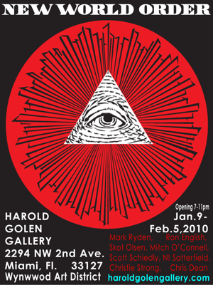
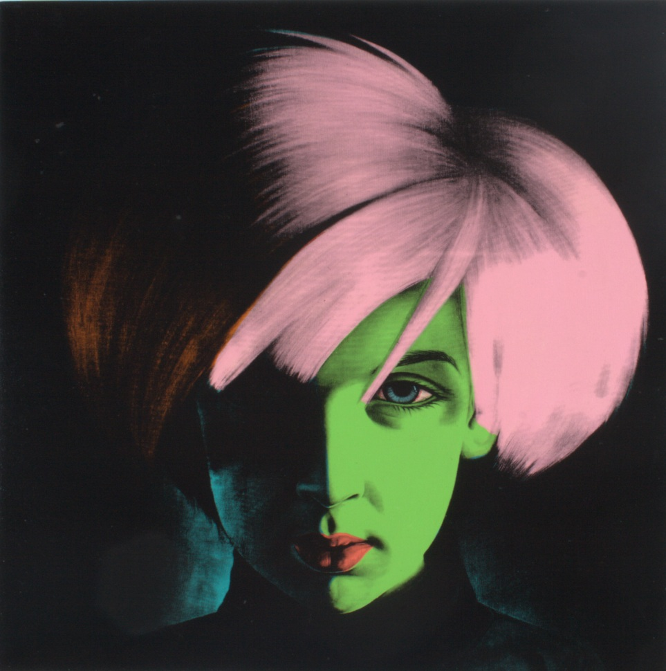

# 2010–2014 Group Exhibitions

Group exhibitions featuring Ron English from 2010 through 2014.

## Exhibitions

| Image | Year | Dates | Venue | Title |
|-------|------|-------|-------|-------|
|  | 2010 | January 9 – February 5, 2010 | Harold Golen Gallery | *New World Order* |
|  | 2010 | January 24, 2010 | Studio Museum Harlem | *The Obama Image Economy* |
|  | 2010 | February 9 – March 18, 2010 | Cerritos College Art Gallery | *Re:Creation – Serious Play with Canonical Art* |
|  | 2010 | February 27 – March 27, 2010 | Jonathan LeVine Gallery | *Five Year Anniversary* |
|  | 2010 | March 3 – March 7, 2010 | Manifest Equality Gallery (1341 Vine Street) | *Manifest Equality* |
|  | 2010 | April 1 – May 2, 2010 | 111 Minna Gallery | *Last Gasp 40th Anniversary Art Show* |
|  | 2010 | April 3 – April 30, 2010 | Robert Berman Gallery (D5) | *Another Nude Show* |
|  | 2010 | May 14, 2010 | Willoughby Windows v2.0 (Ad Hoc Art), 106 Willoughby Street | *Willoughby Windows v2.0* |
|  | 2010 | May 15 – August 22, 2010 | Bristol Museum & Art Gallery | *Art From the New World* |
|  | 2010 | June 5 – July 3, 2010 | V1 Gallery | *Album: A Group Exhibition* |
|  | 2010 | June 5 – June 26, 2010 | Copro Nason Gallery | *Metamorphosis* |
|  | 2010 | June 9 – June 23, 2010 | Galerie d’Art Yves Laroche | *Looking East* |
|  | 2010 | June 11 – June 20, 2010 | 6812 Melrose Avenue (The Vader Project) | *The Vader Project — Auction Exhibition Preview* |
|  | 2010 | June 19 – August 15, 2010 | Museo de la Ciudad de México | *Draw – Muestra de dibujo contemporáneo* |
|  | 2010 | June 26 – August 15, 2010 | Grand Central Art Center | *100 Artists See Satan: The Fundraiser* |
|  | 2010 | June 26 – October 15, 2010 | Palazzo Collicola Arti Visive (Museo Carandente) | *Pop Surrealism: What a Wonderfool World* / *Collezione Collicola – Pop Surrealism* |
|  | 2010 | July 10 – July 25, 2010 | Last Rites Gallery | *Lead Poisoning* |
|  | 2010 | July 31, 2010 | Open Space (citywide installation), Beacon | *Electric Windows* |
|  | 2010 | December 17, 2010 | ABV Gallery | *TOTT Global Artist Showcase* |
|  | 2010 | May 22, 2010 | Welling Court (Ad Hoc Art) | *Welling Court Mural Project* (Year 1) |
|  | 2010 | May 6 – June 6, 2010 | The Don Gallery / Le Raclet | *Editions Show* |
|  | 2010 | November 12 – December 17, 2010 | Frank M. Doyle Arts Pavilion | *Status Factory – The Art of Ron English* |
|  | 2010 | November 29 – December 5, 2010 | Wynwood (Primary Flight / Contra Projects) | *Contra Projects at Primary Flight* |
|  | 2010 | October 2, 2010 – January 8, 2011 | Riverside Art Museum | *California Kustom: Presented by Baby Tattooville* |
|  | 2010 | October 9–11, 2010 | St. Patrick’s School (RE:FORM SCHOOL) | *RE:FORM SCHOOL* |
|  | 2010 | September 11 – October 2, 2010 | Copro Nason Gallery | *BLABWORLD No. 1 SHOW … scenes from THE HEREAFTER* |
|  | 2010 | September 24 – October 1, 2010 | TT Underground Gallery | *Family Tradition* (curated by Ron English) |
|  | 2010 | September 30 – November 13, 2010 | The Don Gallery | *Hello Bro! Pop Surrealism Lowbrow Street Art e Graffiti* |
|  | 2011 | April 17 – August 8, 2011 | The Geffen Contemporary at MOCA | *Art in the Streets* |
|  | 2011 | April 29 – July 10, 2011 | Angel City Brewing | *Street Brewed: An Exhibition of Contemporary Street Art* |
|  | 2011 | August 4, 2011 | Trifecta Gallery (SAFEWALLS × Cirque du Soleil) | *SAFEWALLS x Cirque du Soleil* |
|  | 2011 | August 12 – September 4, 2011 | Strychnin Gallery | *The C.O.P. Guide to Etiquette & Keep A Breast* |
|  | 2011 | August 17 – September 17, 2011 | Varnish Fine Art | *The Varnish Vault* |
|  | 2011 | December 2 – 5, 2011 | 78 NW 25th St (Wynwood) | *The Underbelly Show* |
|  | 2010–2011 | December 18, 2010 – January 15, 2011 | The Hole | *POSTERMAT* |
|  | 2011 | February – February 25, 2011 | Opera Gallery | *Graff City* (*Graff-City*) |
|  | 2011 | February 11 – 20, 2011 | Dorothy Circus Gallery | *Private Collection Carnival* |
|  | 2011 | February 5 – April 17, 2011 | Grand Central Art Center (CSU Fullerton) | *Suggestivism* |
|  | 2011 | September 10, 2011 | Munky King Gallery | *Stop It* |
|  | 2011 | July 1 – 18, 2011 | Public/Image.3D | *POPaganda in Japan* |
|  | 2011 | July 1, 2011 (opening; ran through mid-July) | Corey Helford Gallery | *Zero to Sixty: Five Year Anniversary Gala Group Exhibition* |
|  | 2011 | June 17 – 30, 2011 | Opera Gallery | *The Street Art Show* |
|  | 2011 | February 28 – March 31, 2011 | Robert Berman Gallery (D5) | *Street ’N Low* |
|  | 2011 | March 11 – April 2011 | Gallery 1988 (Melrose) | *INLE* |
|  | 2011 | March 28 – April 10, 2011 | Opera Gallery | *South Park 15th Anniversary: 15 Artists Interpret “South Park”* |
 | 2011 | March 28 – April 15, 2011 | South Texas College, Pecan Campus Library Art Gallery | *The Other Side of Madison Avenue* |
 | 2011 | March 31 – August 14, 2011 | International Museum of Art & Science (IMAS) | *You Are Not Here* |
|  | 2011 | May 20 – May 29, 2011 | Toy Tokyo / TT Underground Gallery | *Getting Big!!!* |
|  | 2011 | May 7 – June 4, 2011 | Subliminal Projects | *New Masters* |
|  | 2011 | June 2 – September 15, 2011 | Scuola dei Mercanti (presented by Jonathan LeVine Gallery & Bonelli ArteContemporanea) | *The Emergence of the Pop Imagist* |
|  | 2011 | June 24 – July 21, 2011 | Lazarides (Rathbone Place) | *Skin Deep: Post-Instinctual Afterthoughts on Psychological Portraiture* |
|  | 2011 | June 25 – December 11, 2011 | Charles M. Schulz Museum | *Pop’d from the Panel* |
|  | 2011 | September 17 – October 29, 2011 | Wooster Street Social Club (curated by Anonymous Gallery) | *Flash* |
|  | 2011 | October 1 – November 8, 2011 | Riverside Art Museum | *Baby Tattooville On Parade* |
|  | 2011 | October 6 – 30, 2011 | Post No Bills | *English 101* |
|  | 2011 | October 6 – November 3, 2011 | Samuel Owen Gallery | *On Every Street* |
|  | 2011 | October 6 – November 6, 2011 | NH Lingotto Tech | *BAM ON TOUR 2011 – GRAFIK #2* |
|  | 2011 | November 19 – December 10, 2011 | Corey Helford Gallery | *Seasons in Supurbia* |
|  | 2011 | Late November – early December 2011 (Basel week) | Wynwood Walls (pop-up) | *Wynwood Walls Pop-up Show* |
|  | 2011 | November 30 – December 4, 2011 | Wynwood (Art Basel Miami week) | *The Underbelly Show* |
|  | 2011 | September 23 – October 16, 2011 | Opera Gallery | *Abstractions* |
|  | 2011 | September 3, 2011 | Crewest Gallery | *Quick and Painful* |
|  | 2011 | (date unspecified) | Dream in Plastic | *Dim Dum Dolls* |
|  | 2012 | August 2012 | Opera Gallery | *Marilyn: Nobody Else But You* |
|  | 2012 | April 21, 2012 | LALA Gallery | *LA Freewalls Inside* |
|  | 2012 | April 28 – May 19, 2012 | Thinkspace | *New Blood* |
|  | 2012 | August 24 – September 1, 2012 | Lazarides Rathbone | *Klimt Illustrated* |
|  | 2012 | August 3 – December 2012 | LALA Gallery | *Public Works* |
|  | 2012 | August 8 – 25, 2012 | Jonathan LeVine Gallery | *Détournement: Signs of the Times* |
|  | 2012 | December 14–16, 2012 | Openhouse Gallery | *Hello Kitty, Hello Art!* |
|  | 2012 | December 15, 2012 – January 26, 2013 | Corey Helford Gallery | *Crucifixion* |
|  | 2012 | December 2012 | Nicewalk Gallery (Wynwood Walls) | *Time Evaporates, Emotion Elevates* |
|  | 2012 | December 7, 2012 – April 6, 2013 | BYU Museum of Art | *We Could Be Heroes* |
|  | 2012 | January 21 – February 11, 2012 | Copro Nason Gallery | *Conjoined 2 in 3D: The Sequel* |
|  | 2012 | January 27 – February 19, 2012 | Opera Gallery | *Making Faces* |
|  | 2012 | January 28 – May 31, 2012 | Pima Air & Space Museum | *The Boneyard Project: Return Trip* |
|  | 2012 | July 6 – 29, 2012 | Museo Casa del Conte Verde | *Pop Surrealism – Stay Foolish!* |
|  | 2012 | June 30 – July 13, 2012 | London Pleasure Gardens; Black Rat Gallery | *Letters from America* |
|  | 2012 | June 5 – July 31, 2012 | Stephen Webster | *City of Fire* |
|  | 2012 | March 15 – 23, 2012 | Spazio Orlandi / Superground | *NEO POP – Pop Surrealism vs Urban Art* |
|  | 2012 | March 30 – April 29, 2012 | Mondo Bizzarro Gallery | *Pop Rhapsody* |
|  | 2012 | May 10 – 20, 2012 | Webb’s Auction House & Gallery | *Ron English Exhibition* |
|  | 2012 | May 11 – 31, 2012 | Opera Gallery | *Streets of the World* |
|  | 2012 | May 17 – June 3, 2012 | Graffik Gallery | *D.I.Z.N.I.: Dysfunctional Irate Zany Neurotic Individuals* |
|  | 2012 | May 25 – June 17, 2012 | Opera Gallery | *I Want to Be Loved by You* (Marilyn tribute) |
|  | 2012 | May 26 – September 16, 2012 | me Collectors Room | *Art & Toys – Collection Selim Varol* |
|  | 2012 | September 13 – October 6, 2012 | Opera Gallery | *Graff the Peace! Graff the War!* |
|  | 2012 | October 18, 2012 | Sun West Studios | *Young Artists for St. Jude* |
|  | 2012 | November 1 – 29, 2012 | Opera Gallery | *Crucial Fiction* |
|  | 2012 | November 2012 | Opera Gallery | *Urban Art* |
|  | 2012 | November 7 – 11, 2012 | Carolines on Broadway (NY Comedy Festival) | *The Art of Comedy* |
|  | 2012 | November 9 – 18, 2012 | Factory 7 (Opera Gallery London & ANV) | *Urban Masters* |
|  | 2012 | 2012 | Markowicz Fine Art | *Sagamore Miami Beach Presents – Music is Life* |
|  | 2013 | January 12 – February 2, 2013 | The Clutter Gallery | *The (In)action Figure Show* |
|  | 2013 | February 2013 | Bait | *Street Fighter Art Show Tribute* |
|  | 2013 | February 2 – March 16, 2013 | Corey Helford Gallery | *Flying West for the Winter* |
|  | 2013 | June 8 – July 6, 2013 | The Clutter Gallery | *Thought Factory* |
|  | 2013 | June 8 – July 28, 2013 | X on Main | *Between the Scenes* |
|  | 2013 | June 15 – July 7, 2013 | The Cotton Candy Machine | *Tiny Trifecta (3rd Annual)* |
|  | 2013 | June 27 – August 4, 2013 | The Dorian Grey Gallery | *Michael McKenzie presents: ROCKicons* |
|  | 2013 | July 18, 2013 | Opera Gallery & Art Walk (event) | *POW — The Very Best of Urban Art* |
|  | 2013 | August 7 – 24, 2013 | Jonathan LeVine Gallery (pop-up) | *10 Years of Wooster Collective: 2003–2013* |
|  | 2013 | December 3 – 8, 2013 | Opera Gallery (Art Basel Miami Beach) | *Tempest* |
|  | 2013 | December 4, 2013 – January 4, 2014 | Varnish Fine Art | *The Varnish Vault – 2013 Holiday Season* |
|  | 2013 | March 21 – April 7, 2013 | Opera Gallery | *The Pop Surrealism Show* |
|  | 2013 | May 3 – 30, 2013 | Casa dell’Architettura / Acquario Romano | *Suggestivism* |
|  | 2013 | September 20 – November 11, 2013 | Long Beach Museum of Art | *Risque {Dirty Little Pictures}* |
|  | 2013 | September 6, 2013 | 111 Minna Gallery | *20th Anniversary Group Art Show* |
|  | 2014 | September 20, 2014 | Allouche Gallery | *Inaugural Exhibition (Grand Opening)* |
|  | 2014 | December 1 – 7, 2014 | Pop-Up (Art | History project space) | *Pop-Up Street Art Exhibition to Celebrate Miami Marine Stadium* |
|  | 2014 | December 1 – 7, 2014 | Miami Marine Stadium | *Winter Benefit Exhibition* |
|  | 2014 | June 14 – July 7, 2014 | The Cotton Candy Machine | *Tiny Trifecta (4th Annual)* |
|  | 2014 | March 13 – April 20, 2014 | Opera Gallery | *The Great American Icons* |
|  | 2014 | March 15 – 28, 2014 | Corey Helford Gallery | *POP-EYECONIC Group Show* |
|  | 2014 | May 15 – June 14, 2014 | Jonathan LeVine Gallery (Chelsea—two locations) | *Art Truancy: Celebrating 20 Years of Juxtapoz Magazine* |
|  | 2014 | October 30 – December 20, 2014 | Galerie Yves Laroche | *Égrégore: The Zenith of Pop Surrealism* |
|  | 2014 | September 20, 2014 – January 25, 2015 | Harwood Museum of Art (Mandelman-Ribak Gallery) | *¡Orale! Kings and Queens of Cool — Lowbrow Insurgence: The Rise of Post-Pop Art* |

