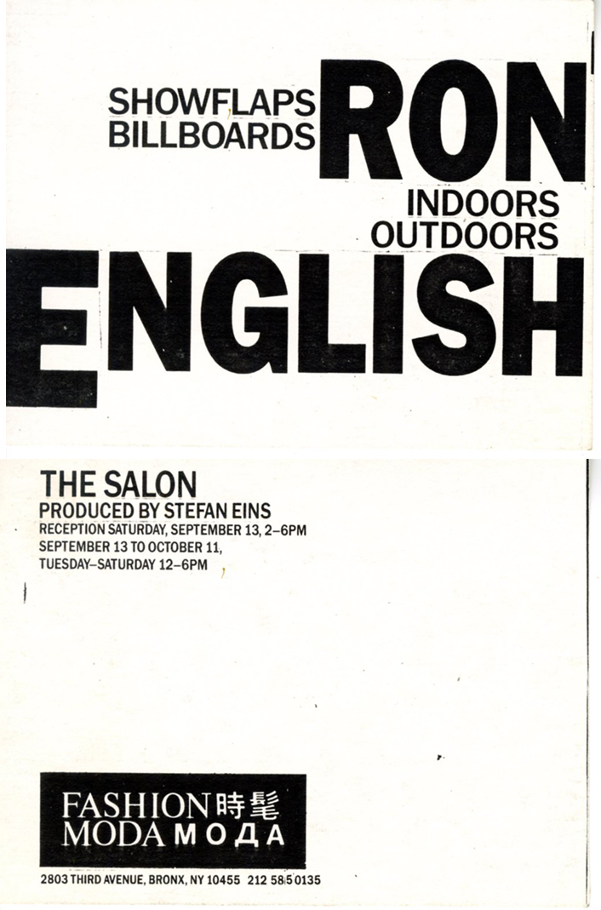

# 1980s Solo Exhibitions

### Early solo exhibitions, studio presentations, and experimental shows from Ron English’s first two decades of activity.  
Click on each image to see more information

| Image | Year | Dates | Venue | Title |
|-------|------|-------|-------|-------|
|  | 1980 | December 7 | Kwikwash Gallery | *Annus ... Mirabilis* |
|  | 1988 | 11 August – 3 September 1988 | Fotogalerie Prinsengracht 356 | *Ron English* |
|  | 1989 | March 4–25, 1989 | OK Harris Works of Art | *Ron English* |
|  | 1986 | September 13 – October 11, 1986 | Fashion Moda (Produced by Stefan Eins) | *SHOWFLAPS / Billboards — Ron English (Indoors/Outdoors)* |  
|  | 1988 | May 19 – June 26, 1988 | The Midtown Y Photography Gallery | *Photographs by Ron English* |
|  | 1980 | November 28, 1980 | Levlowe Gallery | *Beyond the Groovy Planet* |

