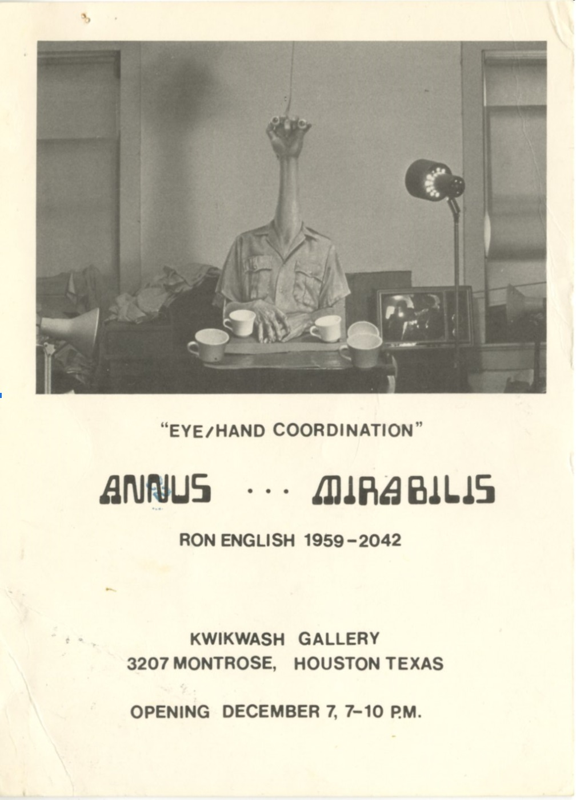

  <a href="../../index.html">Home</a>
  <a href="solo-exhibitions.html">Solo exhibitions</a>
  <a href="group-exhibitions.html">Group exhibitions</a>
  <a href="murals-and-street-works.html">Murals &amp; street works</a>
  <a href="pop-ups-shops-brand-activations.html">Pop-ups, shops &amp; brand activations</a>
  <a href="benefit-auctions-charity-projects.html">Benefit auctions, charity projects</a>
  <a href="film-screenings-festivals-film-events.html">Film screenings, festivals &amp; film events</a>
  <a href="digital-projects-nft-crypto-art.html">Digital projects, NFT &amp; crypto-art</a>
  <a href="public-talks-lectures-book-signings.html">Public talks, lectures &amp; book signings</a>
  <a href="special-events-parties-tours.html">Special events, parties &amp; tours</a>

# 1970s and 1980s Solo Exhibitions

Early solo exhibitions, studio presentations, and experimental shows from Ron English’s first two decades of activity.  
Click on each image to see more information

| Image | Year | Dates | Venue | Title |
|-------|------|-------|-------|-------|
|  | c. 1979 | December 7 | Kwikwash Gallery | *Annus ... Mirabilis* |
|  | 1988 | 11 August – 3 September 1988 | Fotogalerie Prinsengracht 356 | *Ron English* |
|  | 1989 | March 4–25, 1989 | OK Harris Works of Art | *Ron English* |
