<style>
  .top-nav {
    text-align: center;
    margin: 16px 0 24px 0;
  }

  .top-nav a {
    display: inline-block;
    margin: 4px 6px;
    padding: 4px 10px;
    background: #eef3ff;
    border-radius: 14px;
    text-decoration: none;
    color: #1a4fa3;
    font-size: 13px;
    border: 1px solid #d6e1ff;
    transition:
      background 0.25s ease,
      box-shadow 0.25s ease,
      transform 0.15s ease,
      color 0.25s ease,
      border-color 0.25s ease;
  }

  .top-nav a:hover {
    background: linear-gradient(135deg, #ffd6ff, #ffc0e6, #ffe6a8);
    border-color: #ff96d5;
    color: #5a0075;
    box-shadow: 0 0 8px rgba(255, 150, 213, 0.7);
    transform: translateY(-1px);
  }

  .mural-thumb {
    max-width: 50px;
    height: auto;
    display: block;
  }

  /* TABLE STYLING */
  table {
    font-size: 18px;
    color: #111;
    border-collapse: collapse;
    width: 100%;
  }

  table th,
  table td {
    text-align: center;
    vertical-align: middle;
    padding: 10px;
    border: 1px solid #bbb;
  }

  table th {
    font-weight: 700;
  }

  table td {
    font-weight: 500;
  }
.glow-text {
  font-size: 24px;
  font-weight: 700;
  animation: rainbowGlow 3s linear infinite;
}

@keyframes rainbowGlow {
  0%   { color: #ff4bd7; text-shadow: 0 0 12px #ff4bd7; }
  25%  { color: #ff9b4b; text-shadow: 0 0 12px #ff9b4b; }
  50%  { color: #ffd84b; text-shadow: 0 0 12px #ffd84b; }
  75%  { color: #7eff4b; text-shadow: 0 0 12px #7eff4b; }
  100% { color: #4bafff; text-shadow: 0 0 12px #4bafff; }
}

}

  <a href="../index.html">Home</a>
  <a href="solo-exhibitions.html">Solo exhibitions</a>
  <a href="group-exhibitions.html">Group exhibitions</a>
  <a href="murals-and-street-works.html">Murals &amp; street works</a>
  <a href="pop-ups-shops-brand-activations.html">Pop-ups, shops &amp; brand activations</a>
  <a href="benefit-auctions-charity-projects.html">Benefit auctions, charity projects</a>
  <a href="film-screenings-festivals-film-events.html">Film screenings, festivals &amp; film events</a>
  <a href="digital-projects-nft-crypto-art.html">Digital projects, NFT &amp; crypto-art</a>
  <a href="public-talks-lectures-book-signings.html">Public talks, lectures &amp; book signings</a>
  <a href="special-events-parties-tours.html">Special events, parties &amp; tours</a>

# 1990s Solo Exhibitions

### Early solo exhibitions, studio presentations, and experimental shows from Ron English’s first two decades of activity.  
Click on each image to see more information

| Image | Year | Dates | Venue | Title |
|-------|------|-------|-------|-------|
|  | 1990 | May 25, 1990 | Red Zone, 440 W 54th St, New York City | *Pavlov’s Dog: The Last Supper and other paintings by Ron English* |
|  | c. 1990s | December 12 (c. 1990s) | Art Bar &amp; Café | *Ron English* |
| <a href="1990s-solo-shows/fotofest-1990-robinson-galleries.html">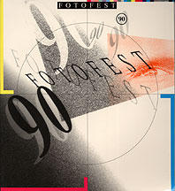</a> | 1990 | February 11 – March 3, 1990 | Thomas V. Robinson / Robinson Galleries | *Ron English (FotoFest ’90)* |
| <a href="1990s-solo-shows/the-art-store-new-paintings-1990.html">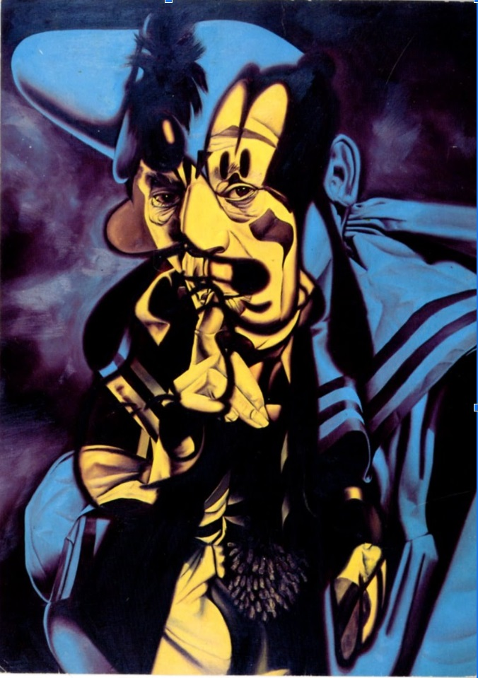</a> | 1990 | May 5 – June 2, 1990 | The Art Store | *New Paintings* |
|  | 1991 | September 14 – October 13, 1991 | Gallery Stendhal | *Inbred/Hybrid* |
| <a href="1990s-solo-shows/robinson-galleries-pop-america-1992.html">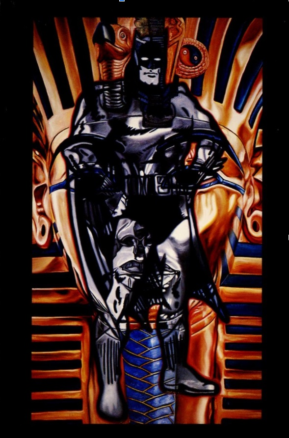</a> | 1992 | February 9 – (date unspecified), 1992 | Thomas V. Robinson Galleries | *Pop America* |
| <a href="1990s-solo-shows/gallery-stendhal-heykid-1992.html">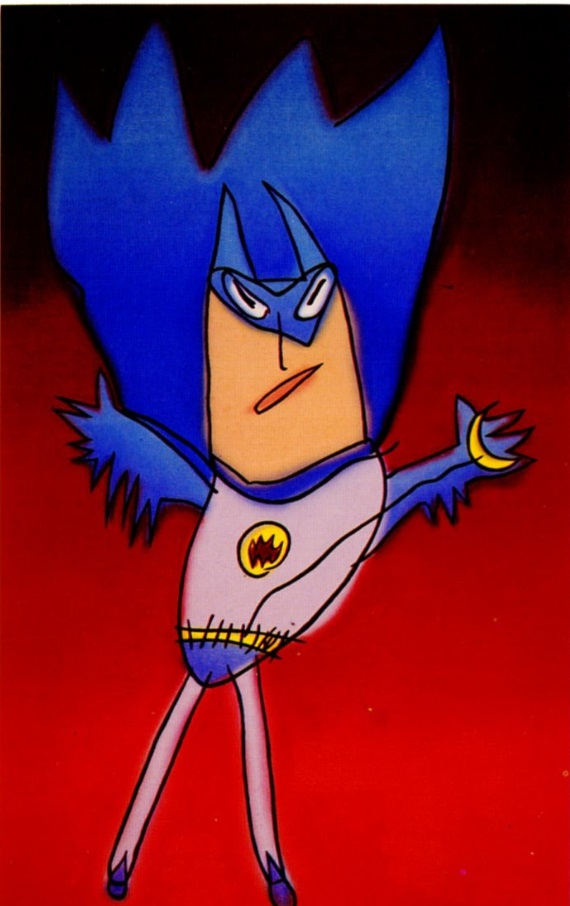</a> | 1992 | November 12 – December 12, 1992 | Gallery Stendhal | *HEY! My Kid Could Do That!* |
|  | 1992 | November 21 – December 17, 1992 | Clark &amp; Company | *Ron English — Inaugural Exhibition at Clark &amp; Company* |
|  | 1993 | March 24, 1993 | Debris at USA (Big Bottom Lounge) | *Recent Works by Ron English* |
| <a href="1990s-solo-shows/tunnel-gallery-recent-works-1994.html">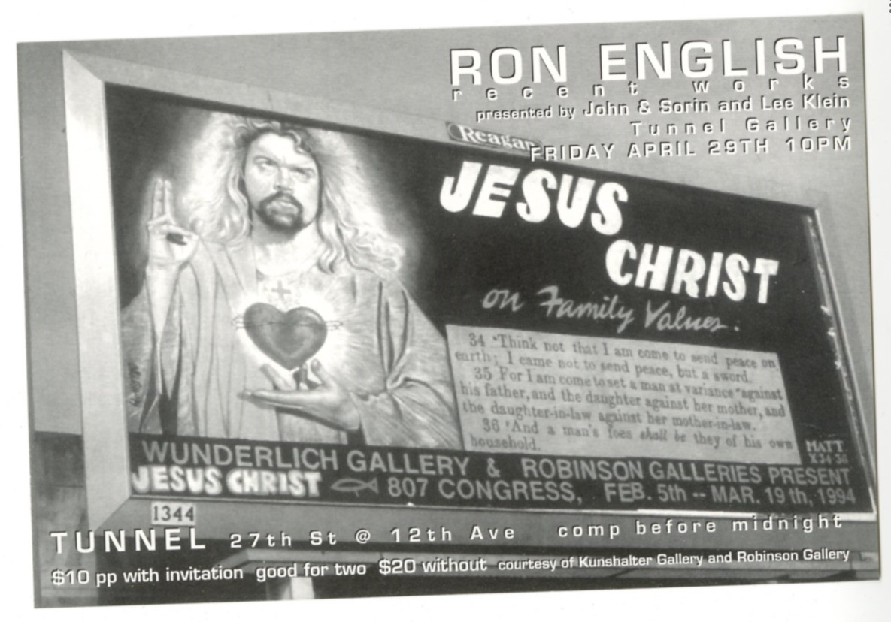</a> | 1994 | February 5 – March 19, 1994 | Tunnel Gallery | *Ron English: Recent Works* |
| <a href="1990s-solo-shows/wunderlich-art-in-heaven-1994.html">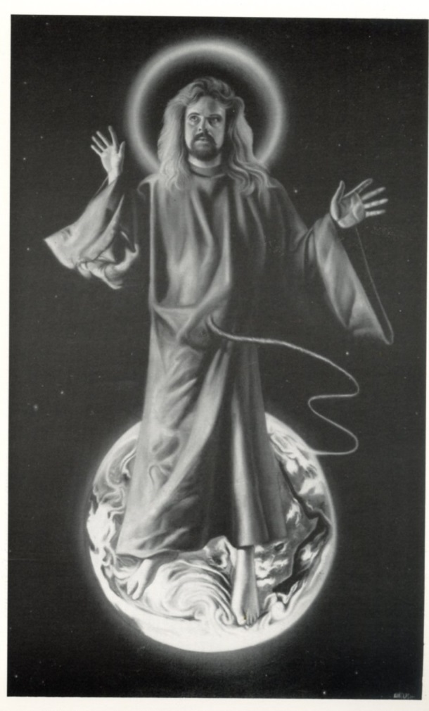</a> | 1994 | February 5 – March 19, 1994 | Wunderlich Gallery | *Art in Heaven* |
| <a href="1990s-solo-shows/michael-kisslinger-art-in-heaven-1994.html">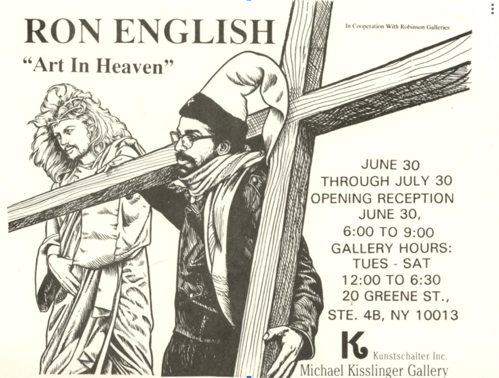</a> | 1994 | June 30 – July 30, 1994 | Michael Kisslinger Gallery | *Art in Heaven* |
| <a href="1990s-solo-shows/revisionist-modernism-moca-dc-1994-95.html">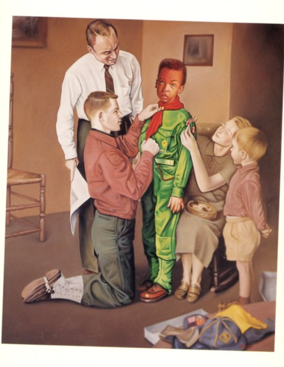</a> | 1994–1995 | December 2, 1994 – January 1, 1995 | Museum of Contemporary Art, Washington, DC | *Revisionist Modernism* |
| <a href="1990s-solo-shows/maxwells-art-of-ron-english-1996.html">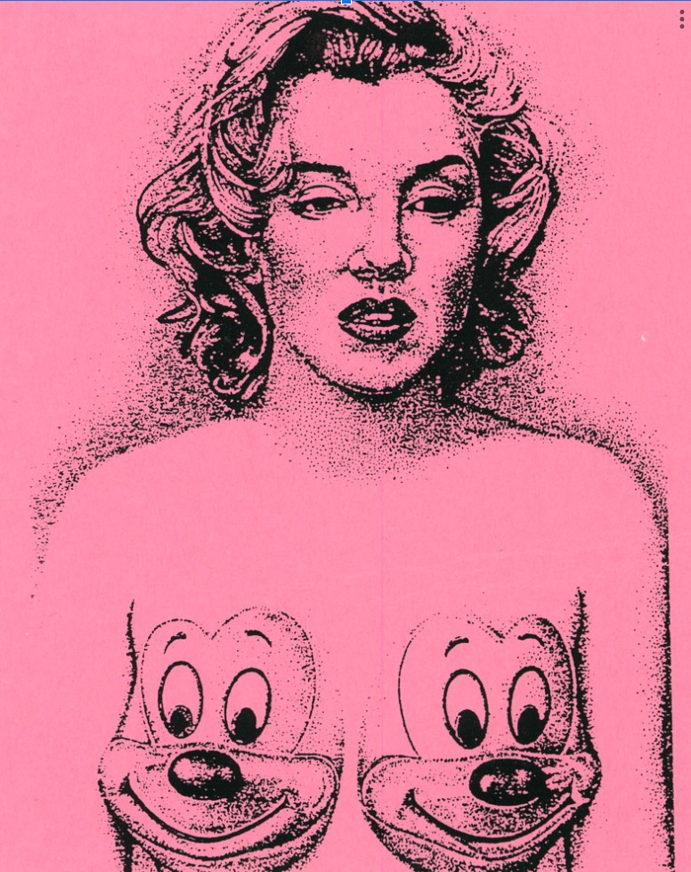</a> | 1996 | 1996 | Maxwell’s (Jonathan LeVine presents) | *The Art of Ron English* |
| <a href="1990s-solo-shows/den-of-thieves-new-giclee-canvases-1996.html">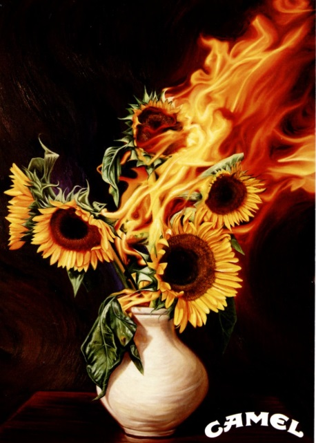</a> | 1996 | April 11, 1996 | Den of Thieves | *New Giclée Canvases* |
| <a href="1990s-solo-shows/the-gem-ron-english-1996.html">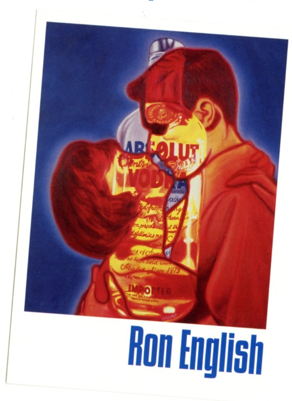</a> | 1996 | October 18, 1996 | The Gem | *Ron English at The Gem* |
| <a href="1990s-solo-shows/agit-pop-america-stendhal-1997.html">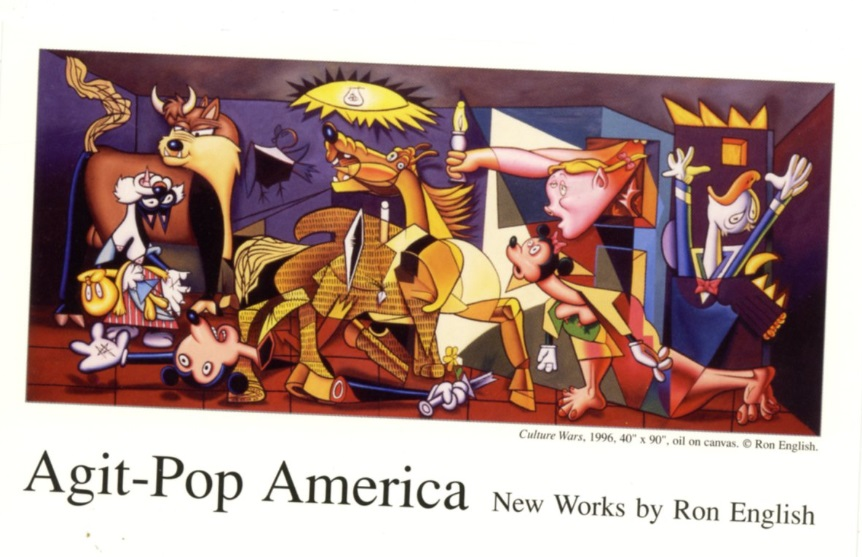</a> | 1997 | April 3 – April 30, 1997 | Gallery Stendhal | *Agit-Pop America* |
| <a href="1990s-solo-shows/noiseville-98-1998.html">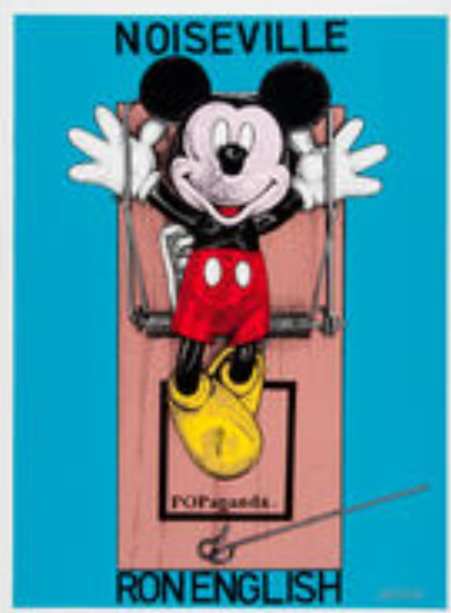</a> | 1998 | July 31 – August 16, 1998 | Noiseville Gallery | *Noiseville 98* |

