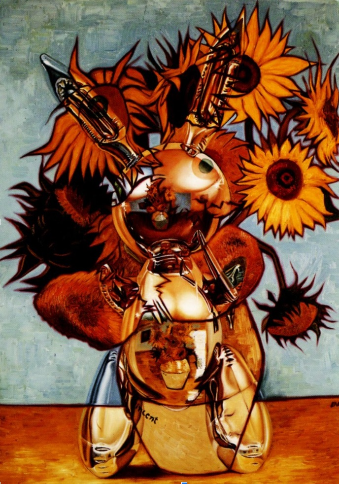

# *Inbred/Hybrid* — Gallery Stendhal (1991)

### **Solo Exhibition**

**Year:** 1991  
**Dates:** September 14 – October 13, 1991  
**Venue:** Gallery Stendhal  
**Location:** New York, New York, USA  
**Title:** *Inbred/Hybrid*

---

## Overview

*Inbred/Hybrid* marked a pivotal early-1990s New York presentation of Ron English’s evolving painting practice. The exhibition featured his **appropriative reinterpretations of art-historical icons**, a direction he would continue to develop throughout the decade.

The show included English’s early reworking of **Picasso’s *Guernica***—one of his first explorations of the painting that would become a recurring motif in his career. By merging cartoon archetypes with the emotional weight of modernist masterpieces, English underscored the collision between consumer culture and art history.

The invitation promoted the show as a bold, iconoclastic step in his Popaganda development.

---

## Sources

- Invitation card: *Ron English: Inbred/Hybrid* (Gallery Stendhal, New York, 1991-09-14)

---

## Back to list
➡️ [Return to 1990s Solo Exhibitions](../1990s-solo-exhibitions.html#gallery-stendhal-heykid-1992-row)

