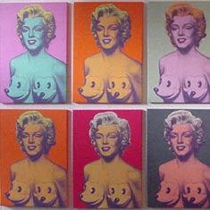

# *Ron English* — FIFTY24SF Gallery (Upper Playground), San Francisco (2003)

### **Solo Exhibition**

**Year:** 2003  
**Date:** May 2, 2003  
**Venue:** FIFTY24SF Gallery (Upper Playground)  
**Location:** San Francisco, California, USA  
**Title:** *Ron English*

---

## Overview

Ron English presented a solo exhibition at **FIFTY24SF Gallery (Upper Playground)** in San Francisco.  
The gallery’s archived page lists the exhibition as part of its **2003 program** and associates it with  
English’s recurring exploration of advertising imagery, pop-culture icons, and reinterpreted historical figures.1  
The gallery also lists English among its represented artists and describes his practice as engaging  
brand critique and comic-book–influenced visual strategies.2  
An independent listing on *ArtBusiness.com* confirms Ron English’s appearance on the  
FIFTY24SF exhibition schedule.3

---

### Sources

1. <https://www.fifty24sf.com/archive/ron-english-fifty24sf-upper-playground-2003>  
2. <https://www.fifty24sf.com/>  
3. <https://www.artbusiness.com/fifty24sf.html>

---

## Back to list  

➡️ [Return to 2000s Solo Exhibitions](../2000s-solo-exhibitions.html#fifty24sf-ron-english-2003-row)
