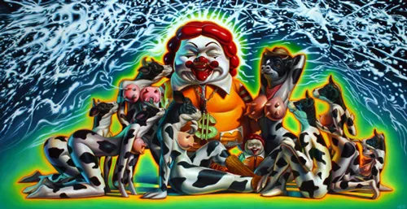

# *Big Picture Pop* — Opera Gallery, New York (2007)

### **Solo Exhibition**

     
**Year:** 2007  
**Dates:** November 29 – late December 2007  
**Venue:** Opera Gallery (SoHo)  
**Location:** New York, New York, USA  
**Title:** *Big Picture Pop*

---

## Overview

*Big Picture Pop* presented Ron English’s large-scale canvases and sculptural works at **Opera Gallery’s SoHo location** during the 2007 holiday season. This exhibition highlighted English’s mastery of oversized pop-icon imagery — including reengineered advertising mascots, hybrid cultural figures, and high-saturation visual satire.

Press coverage from the time noted strong turnout and enthusiasm, as the show arrived at a moment when Pop Surrealism and designer-toy culture were expanding rapidly in New York. English’s work bridged fine art and pop culture, echoing his billboard interventions while delivering polished, gallery-ready compositions.

The exhibition ran through late December and aligned English with a global roster of contemporary artists represented by Opera Gallery.

---

## Sources

- Laughing Squid — *Ron English at Opera Gallery in NYC*:  
  https://laughingsquid.com/ron-english-at-opera-gallery-in-nyc/  

- Hypebeast — coverage of *Big Picture Pop*:  
  https://hypebeast.com/2007/12/ubiq-presern  

- Kayos Productions — artist/production clients list referencing the show:  
  https://www.kayosproductions.com/clients  

- Artnet — Ron English exhibition history:  
  https://www.artnet.fr/galeries/galerie-jacob-paulett/artiste-ron-english/

---

## Back to list  

➡️ [Return to 2000s Solo Exhibitions](../2000s-solo-exhibitions.html#opera-gallery-big-picture-pop-2007-row)
