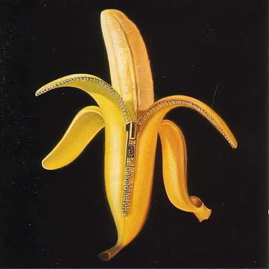

# *POPaganda: The Art and Subversion of Ron English* — Plush Lounge, Key Club, Los Angeles (2003)

### **Solo Presentation / One-Night Event**

**Year:** 2003  
**Date:** September 5, 2003  
**Venue:** Plush Lounge, Key Club  
**Location:** Los Angeles, California, USA  
**Title:** *POPaganda: The Art and Subversion of Ron English*

---

## Overview

Held for one night at the **Plush Lounge** inside the Key Club on the Sunset Strip, this 2003 presentation showcased Ron English’s newest works created for **The Dandy Warhols’ album _Welcome to the Monkey House_**. These pieces extended English’s exploration of music culture, counterculture iconography and psychedelic pop mashups.

A major component of the evening was an early **sneak preview screening** of the documentary *POPaganda: The Art and Subversion of Ron English*, offering audiences an intimate look at his billboard interventions, culture-jamming projects and the philosophy behind his Popaganda universe.

The event merged art exhibition, album visual premiere and film preview, presenting English in an interdisciplinary light that suited the Key Club’s hybrid music-and-nightlife setting.

---

## Sources

-Showcard (ephemera)

---

## Back to list

➡️ [Return to 2000s Solo Exhibitions](../2000s-solo-exhibitions.html#key-club-plush-lounge-popaganda-2003-row)
