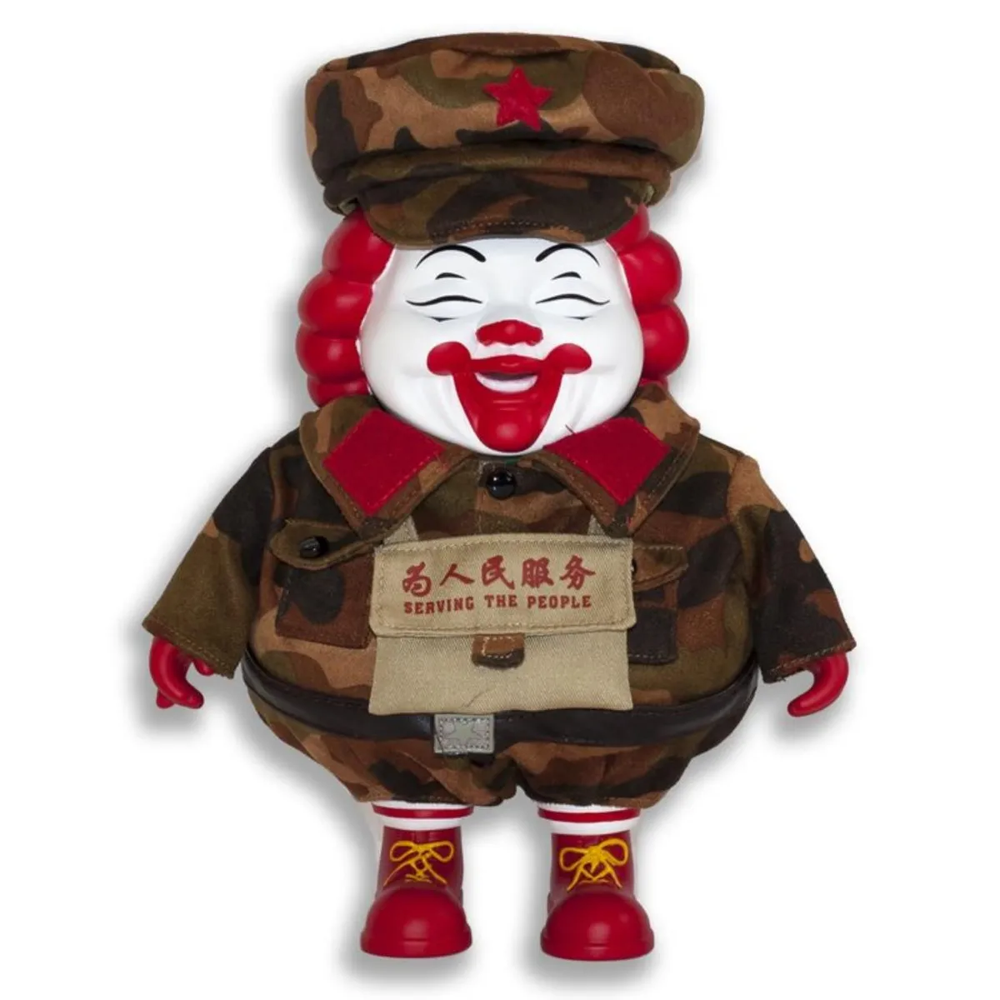

# *POPaganda Asia Tour* — Hong Kong, Manila, Shanghai (2008–2009)

### **Touring Program / Multi-city Exhibition Series**

**Years:** 2008–2009  
**Launch:** Late 2008, Hong Kong  
**Primary Venue:** Delay No Mall / MINDstyle LIFEstyle (Hong Kong)  
**Additional Stops:** Manila (Fresh), Shanghai (MINDstyle / partner events)  
**Title:** *POPaganda Asia Tour*

---

## Overview

The *POPaganda Asia Tour* marked Ron English’s major expansion into the Asian pop-art and designer-toy market between **late 2008 and early 2009**. Launched at **Delay No Mall / MINDstyle LIFEstyle in Hong Kong**, the tour blended fine art, limited-edition collectibles, live signings and promotional drops across Asia.

### **Hong Kong Launch (Late 2008)**
The tour debuted with large crowds, media coverage and exclusive releases that positioned English as a crossover figure between street art, pop surrealism and the booming vinyl-toy world.

### **Manila (January 2009)**
At **Fresh Manila**, English presented additional works and hosted signings, with local press highlighting the appearance of pieces referencing **Abraham Obama**, cultural parody and hybrid pop-iconography.

### **Shanghai (2009)**
Further events and special releases—such as the *MC Supersized Camo* edition—connected the tour to Shanghai’s emerging urban-art market.

This multi-city tour underscored English’s international reach and cultivated a strong collector base in Asia, particularly among designer-toy and pop-culture audiences.

---

## Sources

- Vinyl Pulse — Announcement of POPaganda Asia Tour launch:  
  https://www.vinylpulse.com/2008/12/ron-englishs-popaganda-asia-tour.html  

- Business Traveller — Coverage of the Hong Kong opening:  
  https://www.businesstraveller.com/news/2009/01/12/a-show-to-tickle-pop-art-enthusiasts/  

- Vinyl Pulse — Manila stop coverage (*Abraham Obama* feature):  
  https://www.vinylpulse.com/2009/01/ron-englishs-abraham-obama-fresh-0110.html  

- YouTube — POPaganda Asia Tour Opening at Delay No Mall:  
  https://www.youtube.com/watch?v=FjKmGNcqaNM  

- Trampt — *MC Supersized Camo (Shanghai edition)*:  
  https://www.trampt.com/item/mc-supersized-camo-shanghai-ron-english-mc-supersized-Yex7sg1rlAA1jX  

---

## Back to list  

➡️ [Return to 2000s Solo Exhibitions](../2000s-solo-exhibitions.html#popaganda-asia-tour-2008-row)

