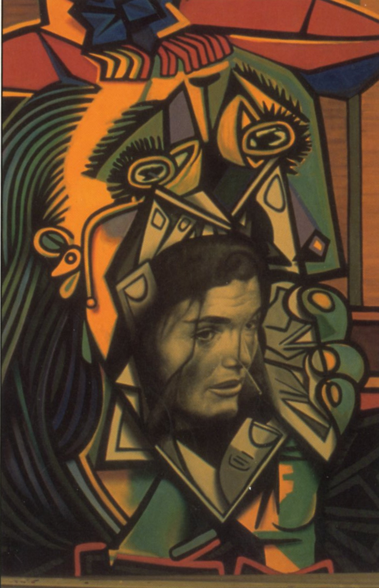

# *Modernism for a New Millennium* — Sam Cintron Gallery, Jersey City (2000)

### **Solo Exhibition**

**Year:** 2000  
**Dates:** January 27 – February 27, 2000  
**Venue:** Sam Cintron Gallery  
**Location:** Jersey City, New Jersey, USA  
**Title:** *Modernism for a New Millennium*

---

## Overview

*Modernism for a New Millennium* introduced Ron English’s early-2000s work inside a vast **25,000-square-foot** space at Sam Cintron Gallery. The exhibition blended new paintings with well-known pieces from the late 1990s, placing English’s pop-iconography critiques within a raw industrial setting.

The opening reception reportedly drew **around a thousand visitors**, filling the warehouse-like gallery. English’s work formed the core of the show, including his **youth-inspired Batman series** and paintings such as **_Weeping Women_**. The display framed English as an artist bridging late-20th-century modernism with a new millennium shaped by media saturation and cultural remixing.

---

## Sources

- ReverbNation — Sam Cintron profile:  
  [https://www.reverbnation.com/samcintron?popup_bio=true](https://www.reverbnation.com/samcintron?popup_bio=true)

---

## Back to list  

➡️ [Return to 2000s Solo Exhibitions](../2000s-solo-exhibitions.html#sam-cintron-modernism-millennium-2000-row)
