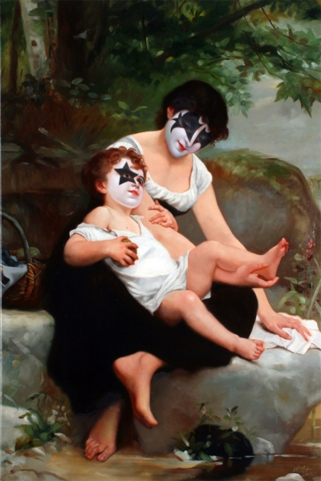

# *The Secret History of KISS* — Shooting Gallery, San Francisco (2008)

### **Solo Exhibition**

**Year:** 2008  
**Dates:** November 1 – December 6, 2008  
**Venue:** Shooting Gallery  
**Location:** San Francisco, California, USA  
**Title:** *The Secret History of KISS*

---

## Overview

*The Secret History of KISS* was Ron English’s 2008 solo exhibition at **Shooting Gallery** in San Francisco’s Larkin Street district, strategically timed to coincide with the U.S. election season. The show blended English’s high-saturation Popaganda style with political parody, celebrity critique and rock-icon reinvention.

The exhibition reimagined the rock band **KISS** through English’s lens of cultural satire—merging political motifs, branding tropes and comic exaggeration. Large-scale paintings and installation works drew strong turnout, with significant local press coverage from art blogs, culture magazines, and gallery reviewers.

---

## Sources

- Archive.org — *SF Bay Guardian* gallery listings (Nov. 2008 issue):  
  [https://archive.org/stream/Issue43.07/Issue43.07_djvu.txt](https://archive.org/stream/Issue43.07/Issue43.07_djvu.txt)  
  [https://archive.org/stream/Issue43.09/Issue43.09_djvu.txt](https://archive.org/stream/Issue43.09/Issue43.09_djvu.txt)

- Arrested Motion — Opening and preview coverage:  
  [https://arrestedmotion.com/2008/11/openings-ron-english-shooting-gallery/](https://arrestedmotion.com/2008/11/openings-ron-english-shooting-gallery/)  
  [https://arrestedmotion.com/2008/10/preview-ron-english-shooting-gallery/](https://arrestedmotion.com/2008/10/preview-ron-english-shooting-gallery/)

- Shooting Gallery archived page:  
  [https://shootinggallerysf.com/shows/ron-english/](https://shootinggallerysf.com/shows/ron-english/)

- ArtBusiness.com — Opening night review and event photos:  
  [https://www.artbusiness.com/1open/110108.html](https://www.artbusiness.com/1open/110108.html)

---

## Back to list  

➡️ [Return to 2000s Solo Exhibitions](../2000s-solo-exhibitions.html#shooting-gallery-secret-history-kiss-2008-row)
