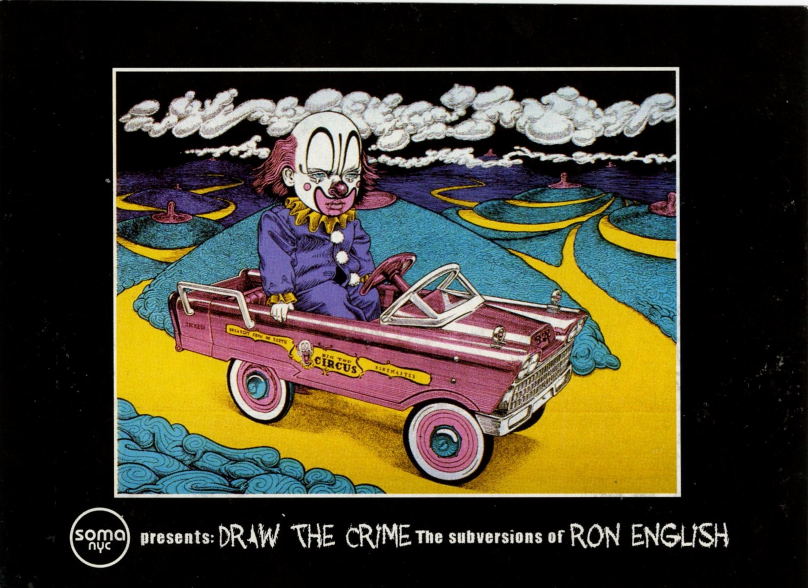

# *Draw the Crime – The Subversions of Ron English* — Soma NYC, New York (2002)

### **Solo Exhibition**

**Year:** 2002  
**Dates:** October 3 – December 3, 2002  
**Venue:** Soma NYC Counter Culture Store-Gallery  
**Location:** New York, New York, USA  
**Title:** *Draw the Crime – The Subversions of Ron English*

---

## Overview

*Draw the Crime – The Subversions of Ron English* brought the artist’s politically charged billboard interventions into the setting of **Soma NYC**, a counterculture store-gallery in New York. The exhibition focused on English’s long-running practice of hijacking advertising language and corporate mascots and turning them into sharp critiques of consumerism, war and media influence.

The show opened on **October 3** with a 7–11 pm reception and presented a body of work that included pieces such as **_KISS Kids on Coke_**, where rock iconography and soda branding collide in a single image. Installed inside a hybrid retail–gallery environment, the exhibition underlined how English blurs the line between street action, pop product and fine art object, placing his subversive images back into a commercial context for viewers to confront at close range.

---

## Sources

- Graffiti / street art history listing (2002 archive, includes *Draw the Crime – The Subversions of Ron English* at Soma NYC):  
  https://ftp.icm.edu.pl/packages/graffiti.old/index/history2002.html  

---

## Back to list  

➡️ [Return to 2000s Solo Exhibitions](../2000s-solo-exhibitions.html#soma-nyc-draw-the-crime-2002-row)
