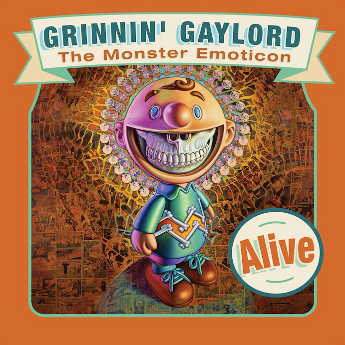

# 2010s Solo Exhibitions

### Museum and gallery solo exhibitions from a decade of large-scale Popaganda environments and international projects.  
Click on each image to see more information

| Image | Year | Dates | Venue | Title |
|-------|------|-------|-------|-------|
|  | 2010 | November 12 – December 17, 2010 | Frank M. Doyle Arts Pavilion (Orange Coast College) | *Status Factory – The Art of Ron English* |
|  | 2011 | March 28 – April 15, 2011 | South Texas College, Pecan Campus Library Art Gallery | *The Other Side of Madison Avenue* |
|  | 2011 | March 31 – August 14, 2011 | International Museum of Art & Science (IMAS) | *Ron English – You Are Not Here* |
|  | 2011 | June 24 – July 21, 2011 | Lazarides (Rathbone Place) | *Skin Deep: Post-Instinctual Afterthoughts on Psychological Portraiture* |
|  | 2011 | July 1 – 18, 2011 | Public/Image.3D | *POPaganda in Japan* |
|  | 2011 | October 6 – 30, 2011 | Post No Bills | *English 101* |
|  | 2011 | November 19 – December 10, 2011 | Corey Helford Gallery | *Seasons in Supurbia* |
|  | 2012 | May 10 – 20, 2012 | Webb’s Auction House & Gallery | *Ron English Exhibition* |
|  | 2012 | November 1 – 29, 2012 | Opera Gallery | *Crucial Fiction* |
|  | 2013 | June 8 – July 6, 2013 | The Clutter Gallery | *Thought Factory* |
|  | 2013 | June 8 – July 29, 2013 | X on Main | *Between the Scenes – X On Main* |
|  | 2013 | October 26 – November 16, 2013 | Corey Helford Gallery | *POPAGANDASTAN – New Works from Ron English* |
|  | 2014 | October 21 – December 21, 2014 | CAIXA Cultural Rio de Janeiro | *Ron English – Do Estúdio para a Rua* |
|  | 2010 | September 12 – October 29, 2010 | Opera Gallery | *Status Factory By Ron English* |
|  | 2014 | Dec 21, 2014 | Secret Fresh Gallery (Ronac Art Center) | *Ron English X Secret Fresh* |
|  | 2015–2016 | December 12, 2015 – January 9, 2016 | Corey Helford Gallery | *NeoNature: We Are the New They* |
|  | 2016 | February 20 – March 31, 2016 | Dorothy Circus Gallery | *Sugar High* |
|  | 2016 | September 22 – October 19, 2016 | Allouche Gallery | *Ron English / Guernica* |
|  | 2017 | March 19 – April 19, 2017 | JPS Gallery | *Garden of Mutant Plants* |
|  | 2017 | April 4 – December 10, 2017 | Museo de la Paz de Gernika | *Reimagining Guernica* |
|  | 2017 | May 6–14, 2017 | The Qube, PMQ | *East Meets West* |
|  | 2017 | December 2–30, 2017 | Corey Helford Gallery | *TOYBOX: America in the Visuals* |
|  | 2017–2018 | Late 2017 – January 2018 | Gallery @ The Falcon | *POPaganda* |
|  | 2018 | October 11 – November 25, 2018 | Allouche Gallery | *Delusionville* |
|  | 2018 | October 18 – November 18, 2018 | Galerie Matthew Namour | *Universal Grin* |
|  | 2019 | May 24, 2019 | Red Truck Gallery | *Mojo Voodoo / Heavy Metal Muzick* |
|  | 2019 | June 21 – July 14, 2019 | Pop Life Global Q-Plex | *English Translation Series* |
