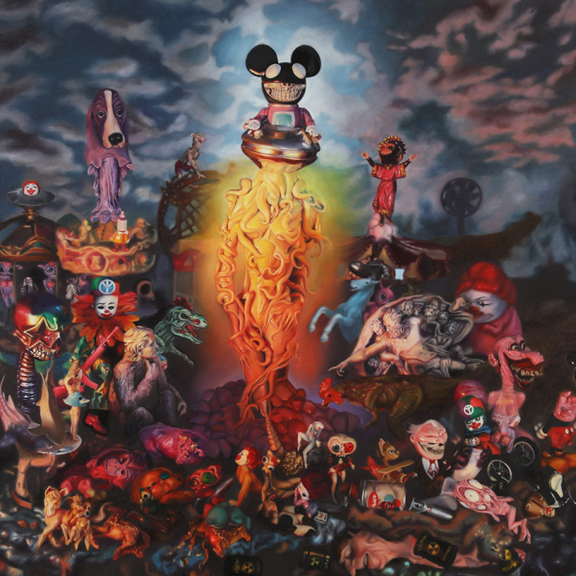

# *TOYBOX: America in the Visuals*
### Corey Helford Gallery, Los Angeles (2017)

### **Solo Exhibition**

**Year:** 2017  
**Dates:** December 2–30, 2017  
**Venue:** Corey Helford Gallery  
**Location:** Los Angeles, California, US  
**Title:** *TOYBOX: America in the Visuals*

---

## Overview

Solo exhibition transforming the United States into a **“toy box”** of mascots, cartoons, hybrid characters, and satirical brand parodies. English’s critique of commercial imagery unfolds across large-format paintings and sculptural interventions, expanding his longstanding POPaganda ethos.

---

## Images from the Exhibition

  

    
    
    
    
    
    
    
    
    
    
    
    
    
    
    
    
    
    
    
    
    
    
    
    
    
    
    
    
    
    
    
    
    
    
    
    
    
    
    
  

---

## Sources

- Corey Helford  
  https://coreyhelfordgallery.com/shows/corey-helford/year%3A2017/

- I Support Street Art  
  https://www.isupportstreetart.com/festibition/toybox-america-visuals-ron-english/

- LA Taco  
  https://lataco.com/preview-ron-english-toybox-america-visuals

- MutualArt  
  https://www.mutualart.com/Exhibition/Ron-English--Delusionville/314573D03371A42B

---

## Back to list

➡️ [Return to 2010s Solo Exhibitions](../2010s-solo-exhibitions.html#corey-helford-toybox-2017-row)
