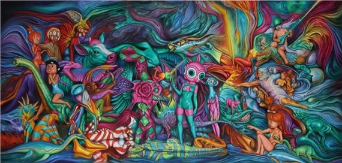

# *Living in Delusionville*
### Mesa Contemporary Arts Museum (Mesa Arts Center), Arizona (2022–2023)

### **Solo Exhibition**

**Years:** 2022–2023  
**Dates:** September 9, 2022 – January 22, 2023  
**Venue:** Mesa Contemporary Arts Museum (Mesa Arts Center)  
**Location:** Mesa, Arizona, US  
**Title:** *Living in Delusionville*

---

## Overview

Large solo exhibition at **Mesa Contemporary Arts Museum**, bringing English’s ongoing **Delusionville** universe into immersive installations, paintings, sculpture, and character narratives.  
The exhibition included video elements, screenings, and POPaganda world-building, connecting gallery environments to English’s long-term multimedia storytelling and animated film project.

---

## Sources

- Downtown Mesa (opening reception)  
  https://downtownmesa.com/do/fall-2022-art-exhibit-opening-reception  

- Downtown Mesa — Exhibition  
  https://downtownmesa.com/do/living-in-delusionville-art-exhibit  

- POPaganda  
  https://www.popaganda.com/news/living-in-delusionville  

- BoingBoing  
  https://boingboing.net/2022/10/12/ron-english-exhibit-living-in-delusionville-at-mesa-arts-center.html  

- Mesa Arts Center  
  https://www.mesaartscenter.com/explore-and-connect  

- MutualArt  
  https://www.mutualart.com/Exhibition/Ron-English--Living-in-Delusionville/B5BB03A14556B806  

- POPaganda — Film screening  
  https://www.popaganda.com/news/film-screening-ofnbspliving-in-delusionville  

---

## Back to list  

➡️ [Return to 2020s Solo Exhibitions](../2020s-solo-exhibitions.html#mesa-living-in-delusionville-2022-23-row)
