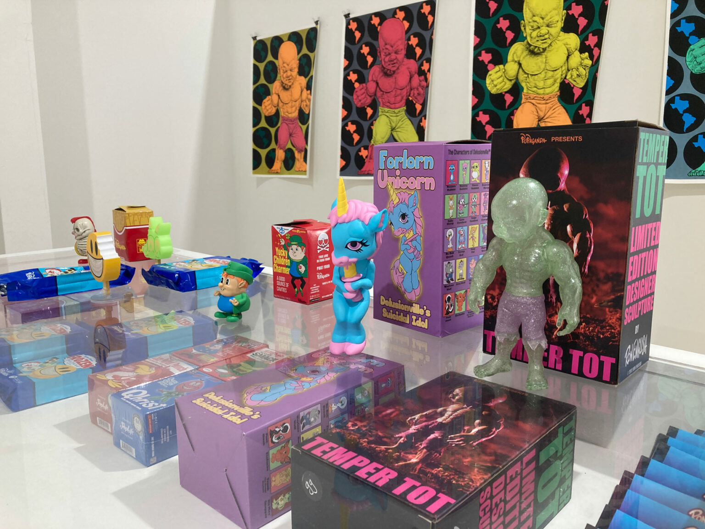

# *Texas: Naturally Surreal* — Ro2 Art Gallery (Dallas, 2024)

### **Solo Exhibition**

**Year:** 2024  
**Dates:** May 18 – June 22, 2024  
**Venue:** Ro2 Art Gallery (Tin District)  
**Location:** Dallas, Texas, US  
**Title:** *Ron English: Texas: Naturally Surreal*

---

## Overview

Solo presentation at **Ro2 Art Gallery (Tin District)** highlighting English’s surrealist counter-narratives in the context of Texas regional culture. Works explore hybrid characters, painterly fusions of landscape and mascot iconography, and the tension between local mythologies and English’s established POPaganda universe.

---

## Sources

- MutualArt — Exhibition Listing  
  https://www.mutualart.com/Exhibition/Ron-English--Texas--Naturally-Surreal/32CDEA46925B958E  

- MutualArt — Artist Page  
  https://www.mutualart.com/Artist/Ron-English/D2860FD527C9F0B2/Biography  

- Glasstire — “Surreal in Texas: Two Exhibitions in Dallas”  
  https://glasstire.com/2024/06/21/surreal-in-texas-two-exhibitions-in-dallas/  

---

## Back to list  

➡️ [Return to 2020s Solo Exhibitions](../2020s-solo-exhibitions.html#ro2-texas-naturally-surreal-2024-row)
