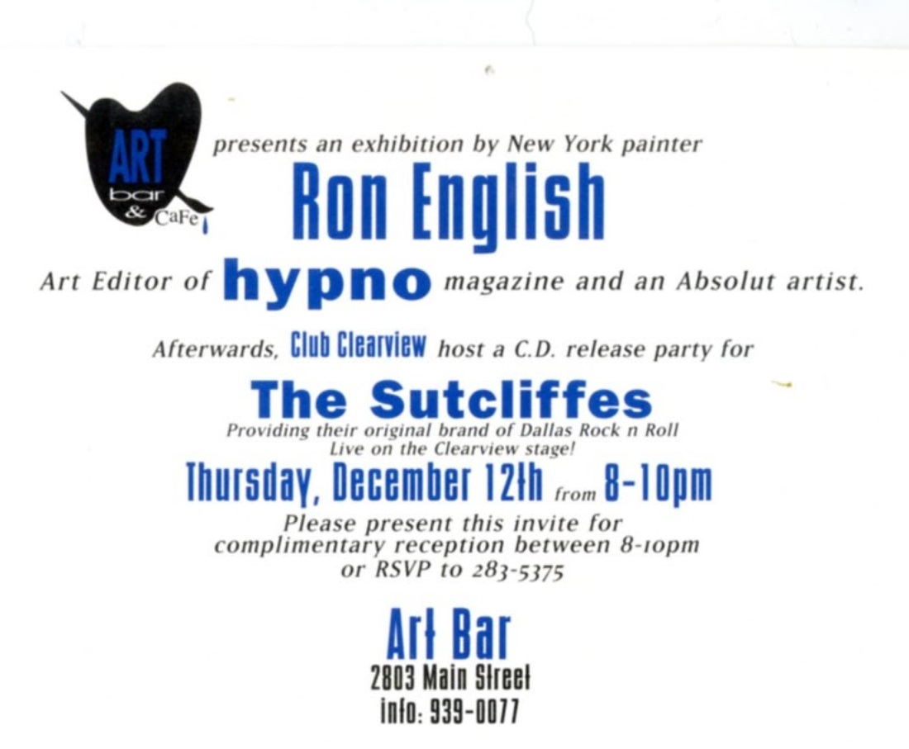

  <a href="../../index.html">Home</a>
  <a href="../../solo-exhibitions.html">Solo exhibitions</a>
  <a href="../../group-exhibitions.html">Group exhibitions</a>
  <a href="../../murals-and-street-works.html">Murals &amp; street works</a>
  <a href="../../pop-ups-shops-brand-activations.html">Pop-ups, shops &amp; brand activations</a>
  <a href="../../benefit-auctions-charity-projects.html">Benefit auctions &amp; charity projects</a>
  <a href="../../film-screenings-festivals-film-events.html">Film screenings, festivals &amp; film events</a>
  <a href="../../digital-projects-nft-crypto-art.html">Digital projects, NFT &amp; crypto-art</a>
  <a href="../../public-talks-lectures-book-signings.html">Public talks, lectures &amp; book signings</a>
  <a href="../../special-events-parties-tours.html">Special events, parties &amp; tours</a>

# Art Bar & Café — Dallas (c. 1990s)

### **Solo Exhibition**

**Year:** c. 1990s  
**Dates:** December 12 (approx.)  
**Venue:** Art Bar & Café  
**Location:** Dallas, Texas, USA  
**Title:** *Ron English* (solo exhibition)

---

## Overview

This early solo exhibition of Ron English took place at **Art Bar & Café**, a well-known Dallas venue that blended nightlife, alternative culture, and grassroots arts programming. The showcard identifies the evening as a **dedicated Ron English presentation**, with the exhibition followed by a Club Clearview CD-release party for local Dallas band *The Sutcliffes*.

While modest in scale, the event reflects English’s growing presence in independent art spaces during the early 1990s, particularly in cities supportive of alternative music and countercultural art scenes.

---

## Sources

- **Showcard:** *Ron English — Art Bar & Café* (Dallas, c. 1990s).  
  *(Physical ephemera provided by archive.)*

---

## Back to list
➡️ [Return to 1990s Solo Exhibitions](1990s-solo-exhibitions.html)
