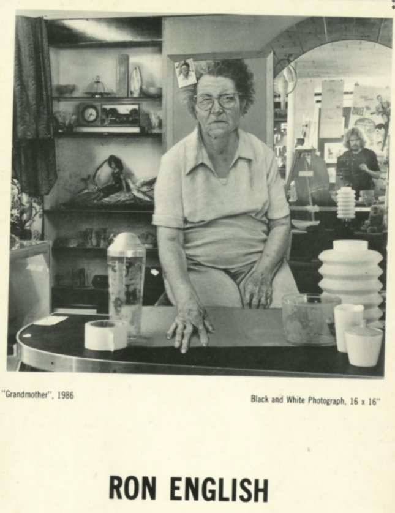

  <a href="../../index.html">Home</a>
  <a href="../../solo-exhibitions.html">Solo exhibitions</a>
  <a href="../../group-exhibitions.html">Group exhibitions</a>
  <a href="../../murals-and-street-works.html">Murals &amp; street works</a>
  <a href="../../pop-ups-shops-brand-activations.html">Pop-ups, shops &amp; brand activations</a>
  <a href="../../benefit-auctions-charity-projects.html">Benefit auctions, charity projects</a>
  <a href="../../film-screenings-festivals-film-events.html">Film screenings, festivals &amp; film events</a>
  <a href="../../digital-projects-nft-crypto-art.html">Digital projects, NFT &amp; crypto-art</a>
  <a href="../../public-talks-lectures-book-signings.html">Public talks, lectures &amp; book signings</a>
  <a href="../../special-events-parties-tours.html">Special events, parties &amp; tours</a>

[⬅ Back to 1970s–1980s solo exhibitions](1970s-1980s-solo-exhibitions.html#ok-harris-ron-english-1989-row)

# 1989 – *Ron English* (OK Harris Works of Art, New York)

**Year:** 1989  
**Dates:** March 4–25, 1989  
**Venue:** OK Harris Works of Art  
**Location:** New York, New York, US  
**Title:** *Ron English*  

## Notes

Solo exhibition at Ivan Karp’s OK Harris Works of Art, presenting Ron English’s early photographic pieces and illusionistic staged scenes. The show extends his investigations into constructed reality—tableaux built in the studio and photographed as “straight” images, without darkroom trickery—placing them in conversation with the gallery’s reputation for conceptual and photo-based work.

As one of English’s first documented New York solo exhibitions, the show helped introduce his POPaganda sensibility to a downtown audience, foreshadowing later moves into billboard interventions and large-scale painting.

## Sources

- [Gallery 98 – *Ron English, OK Harris Gallery* (exhibition card, 1989)](https://gallery98.org/2021/ok-harris-gallery-ron-english-card-1989)  
- [OK Harris – *Exhibition Schedule 1979–1989* (PDF)](https://www.okharris.com/previous/2ExhSchedSept1979-July1989.pdf)
