

  <a href="index.html">Home</a>
  <a href="solo-exhibitions.html">Solo exhibitions</a>
  <a href="group-exhibitions.html">Group exhibitions</a>
  <a href="murals-and-street-works.html">Murals &amp; street works</a>
  <a href="pop-ups-shops-brand-activations.html">Pop-ups, shops &amp; brand activations</a>
  <a href="benefit-auctions-charity-projects.html">Benefit auctions, charity projects</a>
  <a href="film-screenings-festivals-film-events.html">Film screenings, festivals &amp; film events</a>
  <a href="digital-projects-nft-crypto-art.html">Digital projects, NFT &amp; crypto-art</a>
  <a href="public-talks-lectures-book-signings.html">Public talks, lectures &amp; book signings</a>
  <a href="special-events-parties-tours.html">Special events, parties &amp; tours</a>

# Murals and Street Works
**Click on each image to see more information.**

| Image | Year | Location | Mural title |
|:-----:|:----:|:--------:|:-----------:|
|  | 1988 | Fashion Moda, South Bronx, New York, US | Fashion Moda façade mural |
|  | 1989 | Berlin Wall, Checkpoint Charlie, West Berlin, West Germany | Checkpoint Charlie mural (“Peace on Earth”) |
| [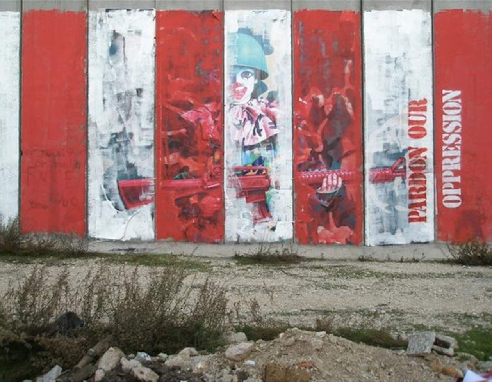](murals/west-bank-2007.html) | 2007 | West Bank barrier, Bethlehem area, Palestine | Protest mural (“Pardon Our Oppression”) |
|  | 2008 | Wynwood streets (Primary Flight), Miami, Florida, US | Primary Flight mural |
|  | 2009 | Medicine Agency, San Francisco, California, US | Medicine Agency “Guernica” mural |
|  | 2009 (March) | Jersey City, New Jersey, US (Cole St / Hudson County Art Supply) | Collaborative mural by Ron English, Bigfoot & Jason Maloney |
|  | 2010 (June–Oct) | Colonne di San Lorenzo, Milan, Italy | Absolut Wallpaper mural – *Elvis–Elvis* |
|  | 2010 | Los Angeles Arts District, Los Angeles, California, US | Urban Bigfoot (LA Freewalls) |
|  | 2010 | Wynwood (Primary Flight × Contra Projects), Miami, Florida, US | Contra Projects collaborative mural |
|  | 2010 | Wynwood Walls, Miami, Florida, US | Baby Hulk / Temper Tot (Wynwood Walls) |
| [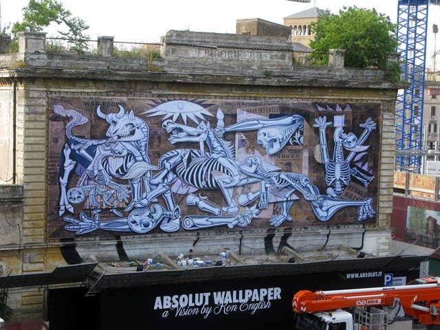](murals/absolut-wallpaper-2010-rome-milan.html) | 2010 (May–Oct) | Rome (ex-Mattatoio/Testaccio) & Milan (Colonne di San Lorenzo), Italy | Absolut Wallpaper (public walls) – “X-Ray Guernica” |
|  | 2011 | Reynosa, Tamaulipas, Mexico (near U.S.–Mexico border) | “You Must Be This Color” & “Double Donkey” (billboard interventions) |
|  | 2012 | London Pleasure Gardens (Royal Victoria Docks), London, UK | London Pleasure Gardens murals & installations |
|  | 2012 | Stavanger (Atlantic Hotel façade), Norway | Nuart Festival mural |
|  | 2012 | Little Italy (Mulberry St.), Manhattan, New York, US | Temper Tot (green version) |
| [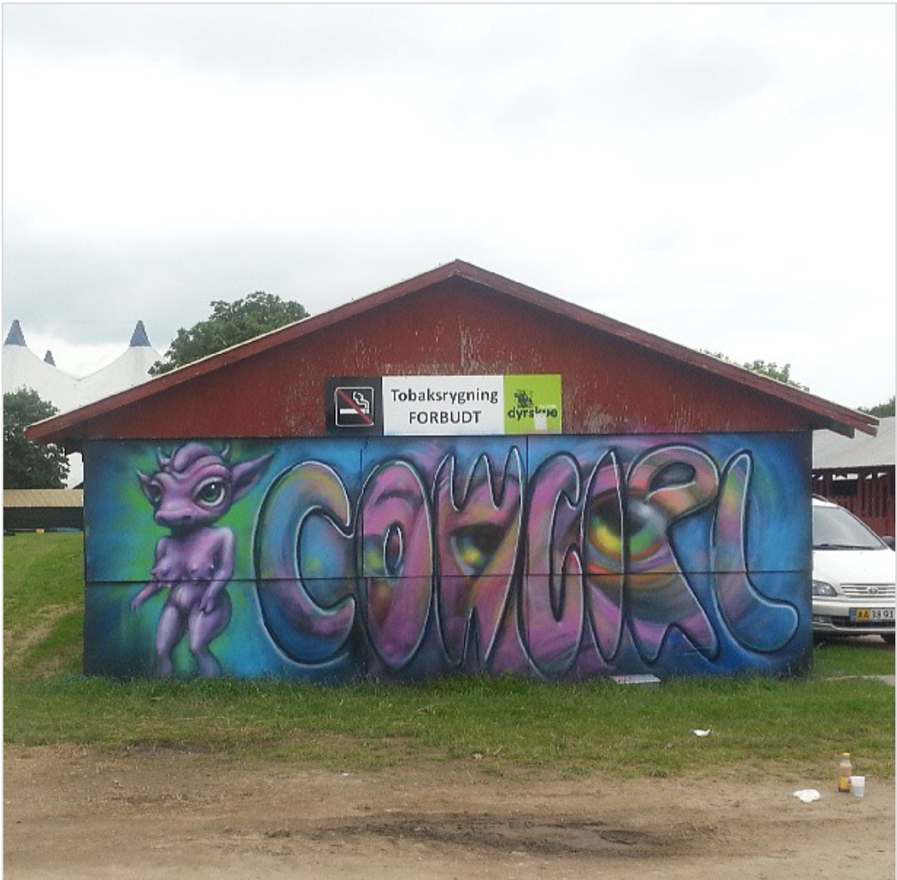](murals/cowgirl-roskilde-2013.html) | 2013 | Roskilde Festival (Dyreskuepladsen), Roskilde, Denmark | Cowgirl Stable mural |
|  | 2013 | Avilés / Asturias region, Spain | Avant-Garde Urbano mural – Ron English |
| [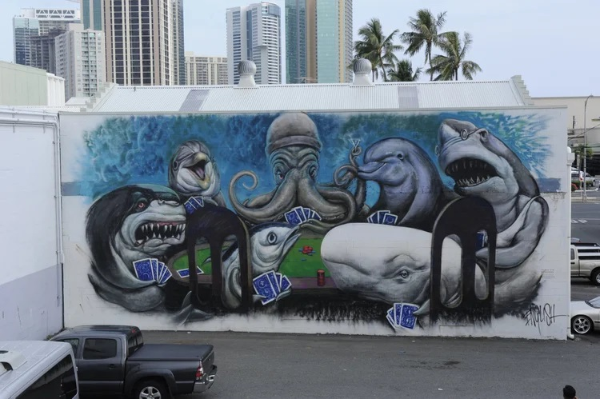](murals/powwow-hawaii-2013.html) | 2013 | Kakaʻako, Honolulu, Hawaii, US | “Underwater Poker Game” mural – POW! WOW! Hawaii |
|  | 2013 | Via dei Pisoni 89, Quadraro, Rome, Italy | Temper Tot & Mousemask Murphy (Quadraro) |
|  | 2014 | Miami Marine Stadium, Miami, Florida, US | Marine Stadium Mural Project |
| [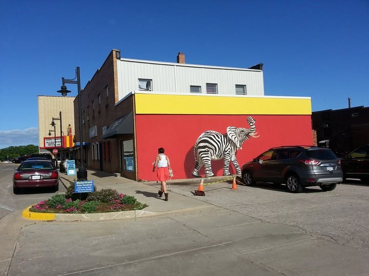](murals/zelephant-south-haven-2014.html) | 2014 | South Haven, Michigan, US | “Zelephant” mural (Waterfront Film Festival) |
|  | 2014 | Black Ocean (Chelsea), New York, US | Rooftop trompe-l’œil “Pool” |
|  | 2014 | 646 N 7th St (wall 2), Richmond, Virginia, US | Grin Baby (Richmond Mural Project) |
| [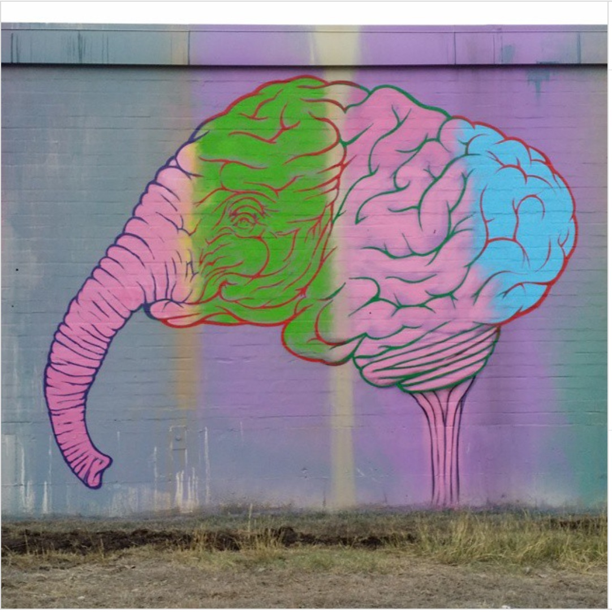](murals/victoria-2015.html) | 2015 (Mar 18–22) | Victoria, Texas, US | “Brain Elephant” & “Brain Heart” murals – with RISK |
|  | 2015 | Spider House, Austin, Texas, US | “Grin” façade mural (SXSW/RXSM) |
|  | 2015 | Spider House Cafe & Ballroom, Austin, Texas, US | RXSM / Spider House Ballroom mural (with RISK) |
|  | 2015 | The Compound, Harlem, New York, US | Ronnie Rabbbit chalk drawing |
| [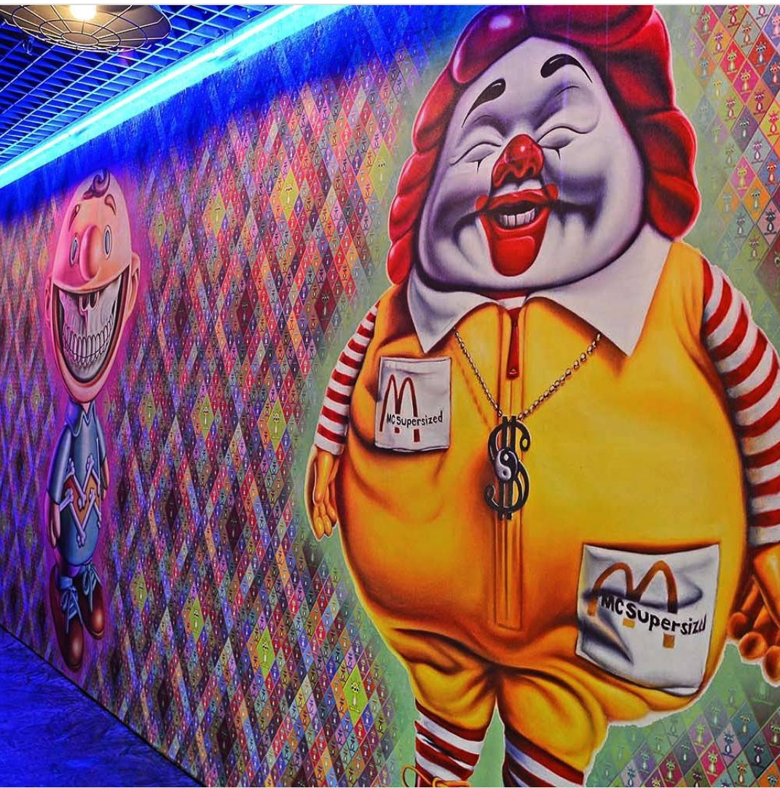](murals/mindstyle-china-2015.html) | 2015 | MINDstyle / Pop Life Global Headquarters, China | MC Supersized & Grin mural |
| [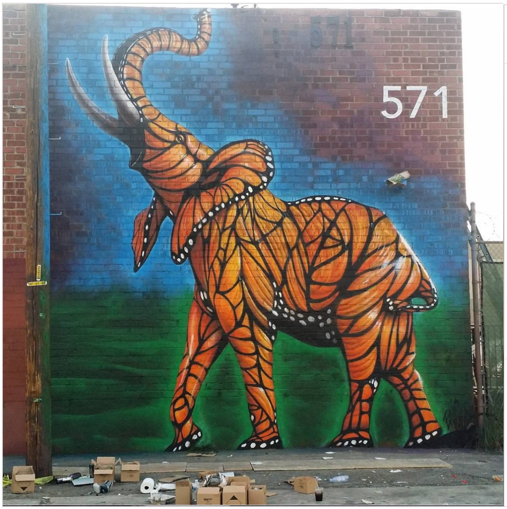](murals/corey-helford-2015.html) | 2015 (Dec 8) | Corey Helford Gallery, Los Angeles, California, US | “Monarch Elephant” mural – Corey Helford Gallery |
|  | 2015 | Houston & Bowery Wall, New York, NY, US | American Depopulation (Bowery Wall) |
|  | 2015 | Coney Art Walls, Coney Island, Brooklyn, New York, US | Grinnin’ McB (Coney Art Walls) |
|  | 2015 | Little Italy (Mulberry St.), Manhattan, New York, US | Temper Tot (pink LoMan version) |
|  | 2015 | New York, New York, US | #NotACrime — “Three Wise Monkeys” mural |
|  | 2016 (Mar) | City Walk, Dubai, UAE | Dubai Walls mural – Delusionville characters |
|  | 2016 | MAGIC CITY – The Art of the Street, Dresden, Germany | Temper Tot at Magic City |
|  | 2016 | Long Beach Convention & Entertainment Center, Long Beach, California, US | ComplexCon murals |
|  | 2016 | Troutman Street, Bushwick, Brooklyn, New York, US | Humpty Trumpty |
|  | 2017 (July) | Decatur, Illinois, US (Ken’s Aquarium & Pet Supply, 730 E. Cerro Gordo) | Elefanka mural by Ron English |
|  | 2017 (Sept) | Wassertorstraße 64, Kreuzberg, Berlin, Germany | “Temper Tot” mural by Ron English |
| [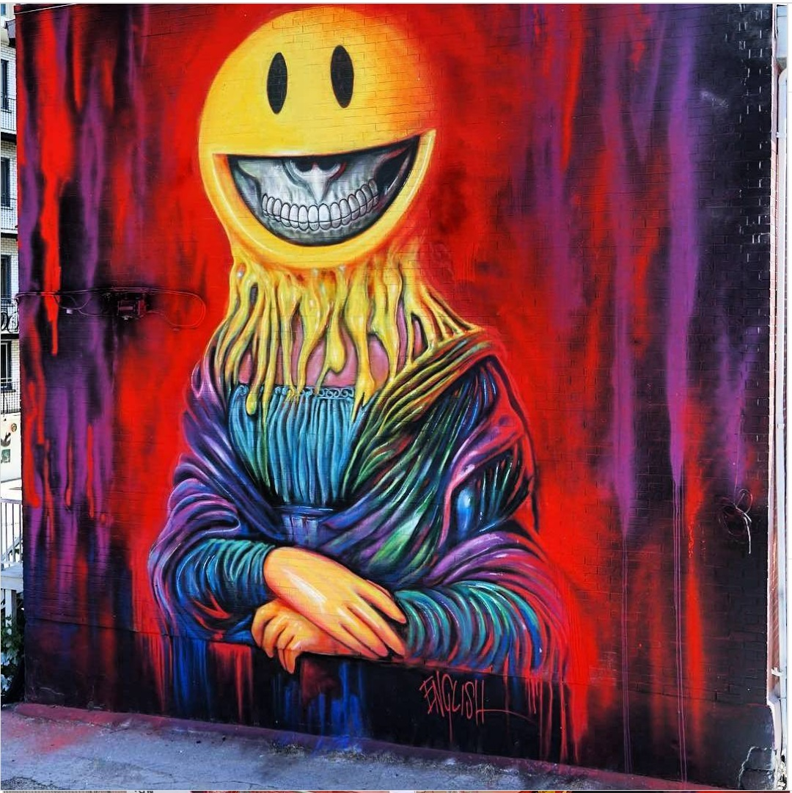](murals/mural-festival-2017-montreal.html) | 2017 | Boulevard Saint-Laurent (MURAL Festival), Montreal, Quebec, Canada | Sourire Mona Lisa |
|  | 2017 | Schöneberg (Urban Nation / ONE WALL), Berlin, Germany | ONE WALL (Urban Nation Museum mural) |
|  | 2017 | 1st Avenue at St. Marks Place, Manhattan, New York, US | Manhattan Runners |
|  | 2018 | 45 Beekman St., Beacon, New York, US | “Montana Mouse on the House” (Beacon Popmart) |
|  | 2018 | ProAm Studio City building, Changping Town, Dongguan, Guangdong, China | Seventh-floor POPaganda walls (ProAm Studio City) |
|  | 2018 | Wynwood Walls (citywide programming), Miami, Florida, US | Wynwood Walls – Basel Week murals |
|  | 2019– (permanent) | K11 MUSEA (Opera Theatre), Hong Kong | Ronnie Rabbits Delusion |
|  | 2019 | Wynwood, Miami, Florida, US | Entrance mural for POP MART (Art Basel pop-up) |
|  | 2019 | Erie Street basketball court (266 Erie St), Jersey City, New Jersey, US | Elefanka and Mousezilla |
|  | 2019 | Wynwood & Miami Design District, Miami, Florida, US | Art Basel Miami Week mural (Delusionville) |
|  | 2019 | Lyon, France | Elefanka |
| [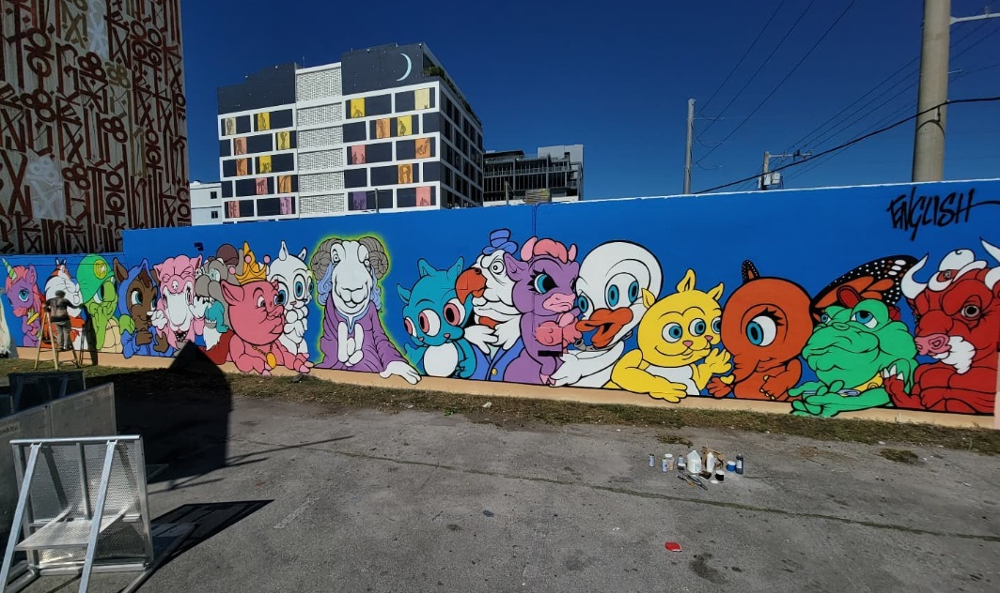](murals/last-supper-delusionville-2021.html) | 2021 (Dec) | Wynwood, Miami, Florida, US | “The Last Supper in Delusionville” – Art Basel / Wynwood |
|  | 2021 | Coney Island, Brooklyn, New York, US | “Punk & Pink Skunk” mural |
|  | 2021 | Coles Street rooftop (Jersey City Mural Festival), Jersey City, New Jersey, US | Jersey City Mural Festival rooftop mural |
|  | 2022 | New Orleans, Louisiana, US | Plessy School Mural – “New Orleans” |
|  | 2022 (Mar 4) | Washington, D.C., US | LCCC Delusionville mural – Murals for Humanity |
|  | 2022 | Deep Ellum, Dallas, Texas, US | Texas Tantrum Trots and Pals |
| [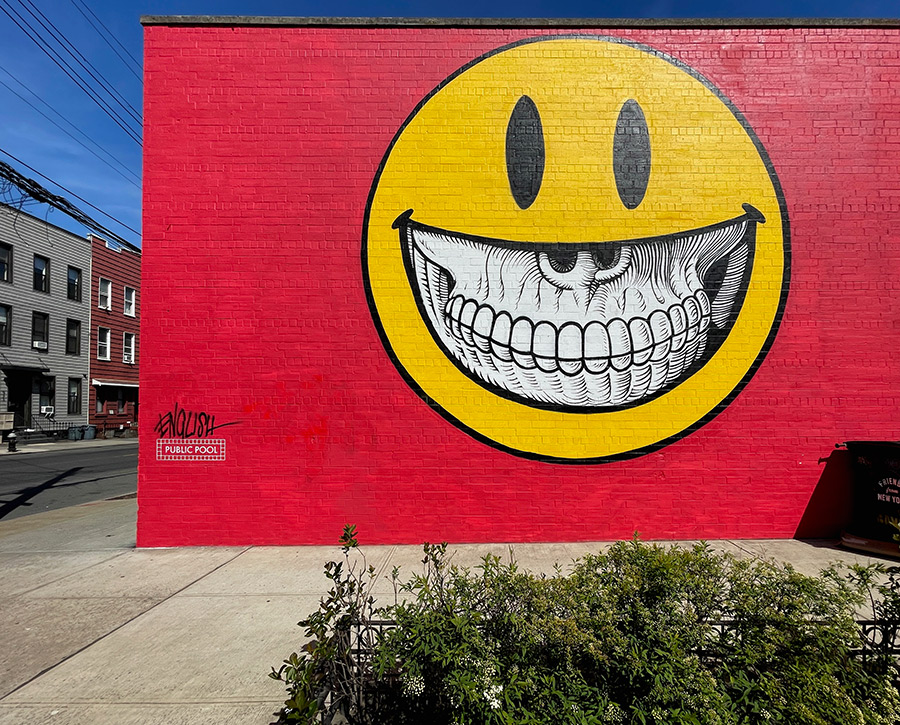](murals/grin-mural-2024.html) | 2024 | Greenpoint, Brooklyn, New York, US | “Grin” mural (Public Pool project) |
