

  
    <a href="index.html">Home</a> ·
    <a href="solo-exhibitions.html">Solo&nbsp;exhibitions</a> ·
    <a href="group-exhibitions.html">Group&nbsp;exhibitions</a> ·
    <a href="murals-and-street-works.html">Murals&nbsp;&amp;&nbsp;street&nbsp;works</a> ·
    <a href="pop-ups-shops-brand-activations.html">Pop-ups,&nbsp;shops&nbsp;&amp;&nbsp;brand&nbsp;activations</a> ·
    <a href="benefit-auctions-charity-projects.html">Benefit&nbsp;auctions&nbsp;&amp;&nbsp;charity&nbsp;projects</a> ·
    <a href="film-screenings-festivals-film-events.html">Film&nbsp;screenings,&nbsp;festivals&nbsp;&amp;&nbsp;film&nbsp;events</a> ·
    <a href="digital-projects-nft-crypto-art.html">Digital&nbsp;projects,&nbsp;NFT&nbsp;&amp;&nbsp;crypto-art</a> ·
    <a href="public-talks-lectures-book-signings.html">Public&nbsp;talks,&nbsp;lectures&nbsp;&amp;&nbsp;book&nbsp;signings</a> ·
    <a href="special-events-parties-tours.html">Special&nbsp;events,&nbsp;parties&nbsp;&amp;&nbsp;tours</a>
  

# Murals and Street Works

| Image | Year | Location | Mural title |
| --- | --- | --- | --- |
|  | 1989 | Berlin Wall, Checkpoint Charlie, West Berlin, West Germany | Checkpoint Charlie mural (“Peace on Earth”) |
| [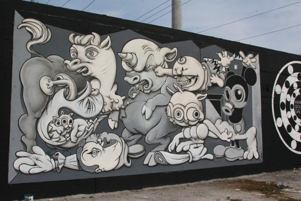](murals/primary-flight-2008.html) | 2008 | Wynwood streets (Primary Flight), Miami, Florida, US | Primary Flight mural |
|  | 2009 | Medicine Agency, San Francisco, California, US | Medicine Agency “Guernica” mural |
|  | 2010 | Los Angeles Arts District, Los Angeles, California, US | Urban Bigfoot (LA Freewalls) |
|  | 2010 | Wynwood (Primary Flight × Contra Projects), Miami, Florida, US | Contra Projects collaborative mural |
| [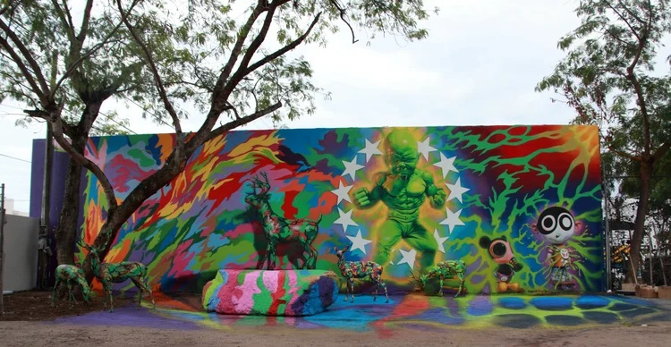](murals/wynwood-babyhulk-2010.html) | 2010 | Wynwood Walls, Miami, Florida, US | Baby Hulk / Temper Tot (Wynwood Walls) |
|  | 2012 | London Pleasure Gardens (Royal Victoria Docks), London, UK | London Pleasure Gardens murals & installations |
| [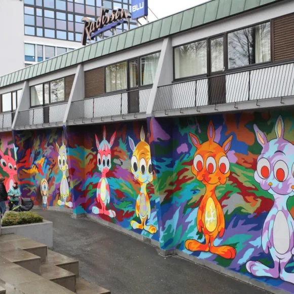](murals/nuart-2012.html) | 2012 | Stavanger (Atlantic Hotel façade), Norway | Nuart Festival mural |
| [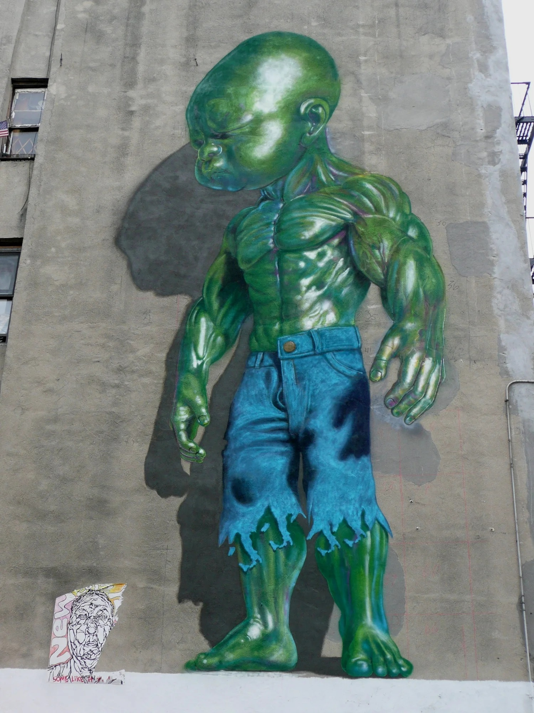](murals/temper-tot-little-italy-2012.html) | 2012 | Little Italy (Mulberry St.), Manhattan, New York, US | Temper Tot (green version) |
|  | 2013 | Via dei Pisoni 89, Quadraro, Rome, Italy | Temper Tot & Mousemask Murphy (Quadraro) |
| [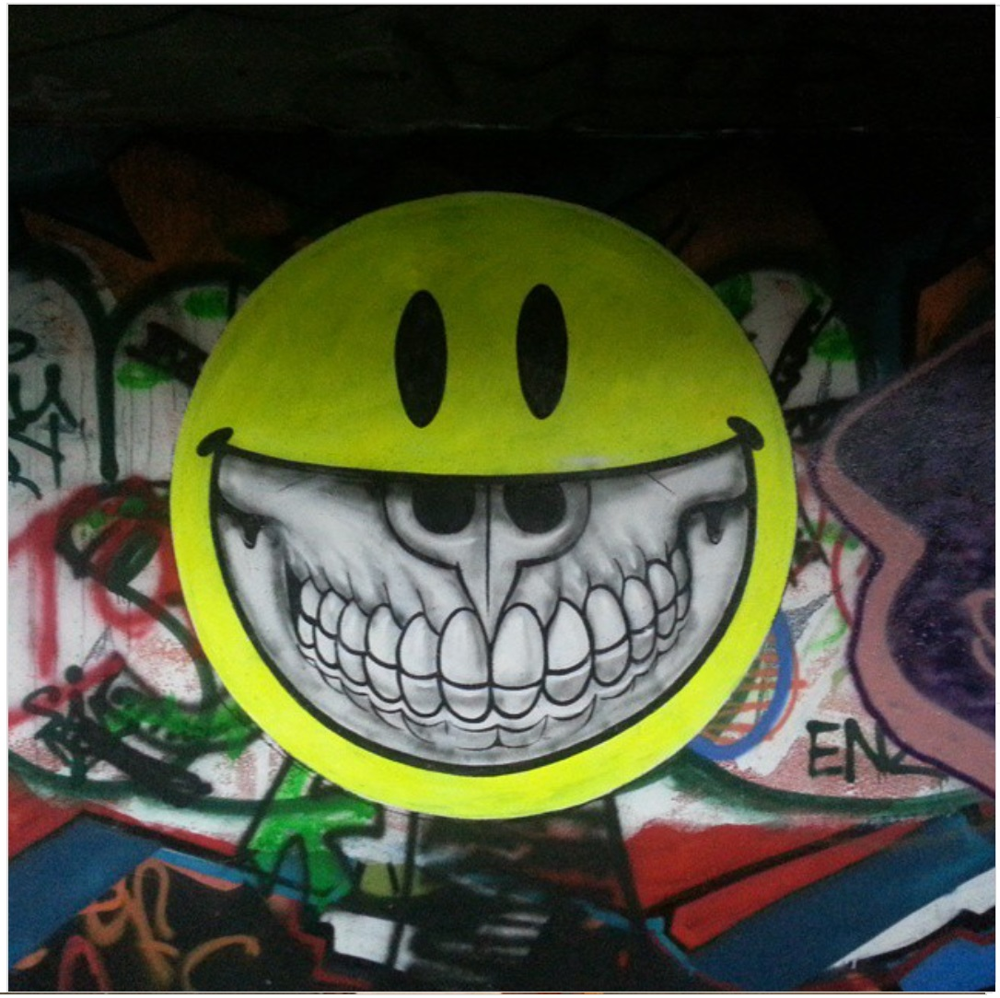](murals/miami-marine-stadium-2014.html) | 2014 | Miami Marine Stadium, Miami, Florida, US | Art | History Marine Stadium Mural Project |
|  | 2014 | 646 N 7th St (wall 2), Richmond, Virginia, US | Grin Baby (Richmond Mural Project) |
|  | 2015 | Spider House Cafe & Ballroom, Austin, Texas, US | RXSM / Spider House Ballroom mural (with RISK) |
|  | 2015 | Houston & Bowery Wall, New York, NY, US | American Depopulation (Bowery Wall) |
| [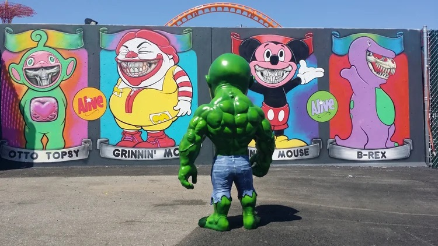](murals/coney-island-2015.html) | 2015 | Coney Art Walls, Coney Island, Brooklyn, New York, US | Grinnin’ McB (Coney Art Walls) |
| [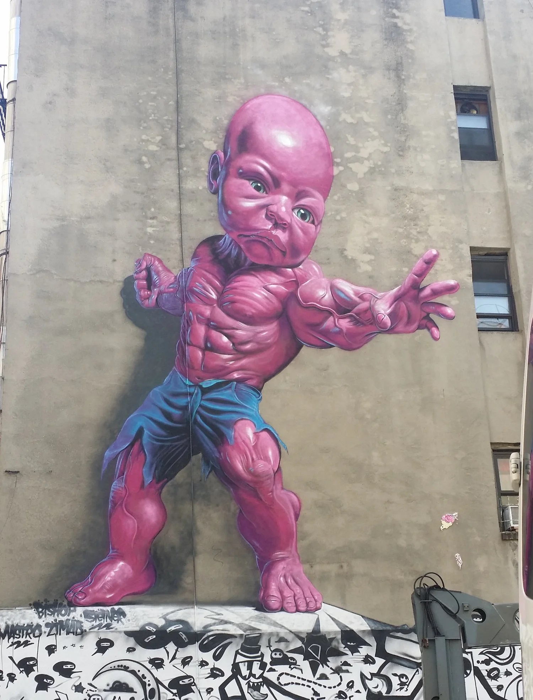](murals/temper-tot-little-italy-2015.html) | 2015 | Little Italy (Mulberry St.), Manhattan, New York, US | Temper Tot (pink LoMan version) |
| [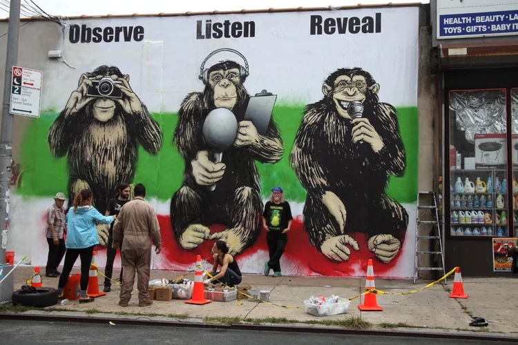](murals/notacrime-2015.html) | 2015 | New York, New York, US | #NotACrime — “Three Wise Monkeys” mural |
| [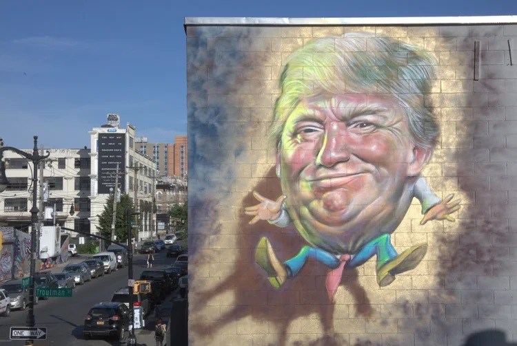](murals/trumpty-dumpty-2017.html) | 2017 | Troutman Street, Bushwick, Brooklyn, New York, US | Trumpty Dumpty |
|  | 2017 | Boulevard Saint-Laurent (MURAL Festival), Montreal, Quebec, Canada | Sourire Mona Lisa |
|  | 2017 | Schöneberg (Urban Nation / ONE WALL), Berlin, Germany | ONE WALL (Urban Nation Museum mural) |
| [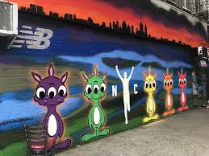](murals/manhattan-runners-2017.html) | 2017 | 1st Avenue at St. Marks Place, Manhattan, New York, US | Manhattan Runners |
| [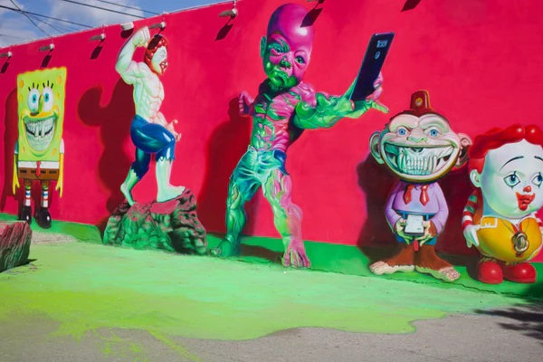](murals/wynwood-2018.html) | 2018 | Wynwood Walls (citywide programming), Miami, Florida, US | Wynwood Walls – Basel Week murals |
|  | 2019– (permanent) | K11 MUSEA (Opera Theatre), Hong Kong | Ronnie Rabbits Delusion |
|  | 2019 | Erie Street basketball court (266 Erie St), Jersey City, New Jersey, US | Elefanka and Mousezilla |
|  | 2019 | Lyon, France | Elefanka |
| [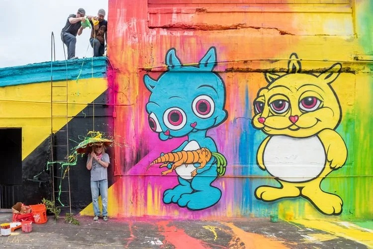](murals/jersey-city-mural-festival-2021.html) | 2021 | Coles Street rooftop (Jersey City Mural Festival), Jersey City, New Jersey, US | Jersey City Mural Festival rooftop mural |
| [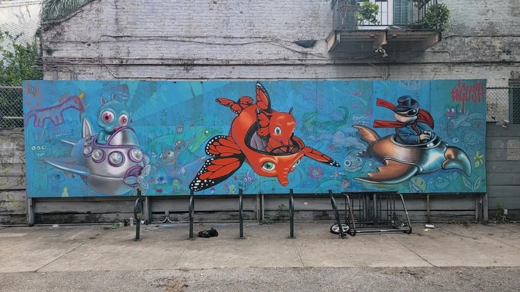](murals/plessy-school-new-orleans-2022.html) | 2022 | New Orleans, Louisiana, US | Plessy School Mural – “New Orleans” |
| 2022 | November 2022 | Deep Ellum, Dallas, Texas, US | Texas Tantrum Trots and Pals | Installed in the heart of Deep Ellum’s arts district, *Texas Tantrum Trots and Pals* marked English’s return to Texas with one of the neighborhood’s most flamboyant recent murals. The piece blends POPaganda characters with Texas-themed surrealism, adding to Deep Ellum’s tradition of loud, maximalist walls. Coverage from D Magazine and StreetArtCities highlights how the mural immediately became a landmark within the district’s revitalized public-art scene. | **[Images ↓](#texas-tantrum-trots-and-pals)** · **[Sources ↓](#texas-tantrum-trots-and-pals-sources)** |

---
## Image gallery

### 2022 – *Texas Tantrum Trots and Pals* (Deep Ellum, Dallas)

[Back to entry ↑](#texas-tantrum-trots-and-pals-row)

---

## Sources by mural

### 1989 – Berlin Wall, Checkpoint Charlie (Checkpoint Charlie mural – “Peace on Earth”)

- [ILoveGraffiti – Ron English am Checkpoint Charlie 1989](https://ilovegraffiti.de/blog/2009/11/10/ron-english-am-checkpoint-charlie-1989/)
- [The Rumpus – Ron English Remembers the Berlin Wall, 1989](https://therumpus.net/2009/11/09/ron-english-remembers-the-berlin-wall-1989/)
- [Pond5 – Berlin Wall graffiti footage](https://www.pond5.com/stock-footage/item/10920270-west-berlin-west-germany-1988-berlin-wall-graffiti-art-bulld?dd_referrer=https%3A%2F%2Fwww.google.com%2F)
- [Stiftung Berliner Mauer – Postcard archive](https://sammlung.stiftung-berliner-mauer.de/Result?sId=605&pId=13670919&sw=Postkarte&page=1&list=0&k=WEB_0405&sort=DatumAsc&smode=And&collectionTitel=Themen&collectionSubTitel=Mauerkunst&pageSize=16)
- [Poiein Kai Prattein – Kuzdas photography](http://poieinkaiprattein.org/beyond-images/photography/kuzdas/exhibition-at-goethe-in-athens/index.htm)
- [Festival of Lights Magazine – Berliner Mauer Kunst](https://magazin-festival-of-lights.de/en/berliner-mauer-kunst)

[Back to entry ↑](#berlin-wall-1989-row)

### 2008 – Primary Flight mural (Wynwood, Miami)

- [Cool Hunting – 2008 Art Basel recap](https://coolhunting.com/culture/2008-art-basel/)
- [Marc Woehr – Wynwood Art District 2008](https://marcwoehr.com/project/art-basel-miami-2008-wynwood-art-district/)
- [Art Crimes – 2008 graffiti archive](https://ftp.icm.edu.pl/packages/graffiti.old/index/history2008.html)
- [Arrested Motion – Ron English Primary Flight mural](https://arrestedmotion.com/2009/12/basel-week-miami-09-ron-english-primary-flight-mural/)
- [Designboom – Primary Flight at Art Basel Miami](https://www.designboom.com/art/primary-flight-at-art-basel-miami-12-05-08/)
- [Junta de Andalucía – Primary Flight resource](https://edea.juntadeandalucia.es/bancorecursos/items/a3d927ad-142d-40f6-9fe5-a18c40806da8/1/viewscorm.jsp?.vi=file)

[Back to entry ↑](#primary-flight-2008-row)

### 2009 – Medicine Agency “Guernica” mural (San Francisco)

- [Arrested Motion – Video of mural at Medicine Agency](https://arrestedmotion.com/2009/12/video-ron-english-mural-medicine-agency-gallery/)
- [Laughing Squid – Mandala Grin puzzle release](https://laughingsquid.com/ron-english-mandala-grin-jigsaw-puzzle-release-party-signing-at-medicine-agency/)

[Back to entry ↑](#medicine-agency-2009-row)

### 2010 – Urban Bigfoot (LA Freewalls)

- [Flickr – keysflyingatme photo set](https://www.flickr.com/photos/keysflyingatme/with/5293488135)
- [PBS SoCal – Mural citations are off the wall](https://www.pbssocal.org/history-society/mural-citations-are-off-the-wall-politics)
- [HuffPost – Street art essay](https://www.huffpost.com/entry/street-art-its-not-meant_b_5610496)
- [LA Taco – Urban Bigfoot coverage](https://lataco.com/urban-bigfoot-ron-english-la-freewalls)
- [Clutter Magazine – Progress on Urban Bigfoot mural](https://www.cluttermagazine.com/news/2013/11/progress-ron-englishs-urban-bigfoot-mural-la)
- [Clutter – Urban Bigfoot tag archive](https://www.cluttermagazine.com/tags/urban-bigfoot)
- [Daily Record – Best pictures gallery](https://www.dailyrecord.co.uk/news/uk-world-news/gallery/todays-best-pictures-around-globe-3767077)
- [YouTube – Urban Bigfoot mural video](https://www.youtube.com/watch?v=mA2RbTO0MdM)

[Back to entry ↑](#urban-bigfoot-la-row)

### 2010 – Contra Projects collaborative mural (Wynwood, Miami)

- [Soul of Miami – Primary Flight 2010](https://www.soulofmiami.org/2010/11/08/primary-flight-street-art-murals-1129-12510/)
- [Brooklyn Street Art – Contra Projects](https://www.brooklynstreetart.com/tag/contraprojects/)
- [Brooklyn Street Art – Primary Flight archive](https://www.brooklynstreetart.com/category/primary-flight/)
- [Hypebeast – Status Factory / Contra Projects](https://hypebeast.com/2010/11/ron-english-status-factory-exhibition-mural-frank-doyle-arts-pavilion)
- [Vandalog – Fairey & Ron English in Miami](https://blog.vandalog.com/2010/11/12/fairey-ron-english-in-miami/)

[Back to entry ↑](#primary-flight-2010-row)

### 2010 – Baby Hulk / Temper Tot (Wynwood Walls)

- [Wynwood Walls – Ron English profile](https://thewynwoodwalls.com/artists/ron-english/)
- [Miami New Times – Wynwood Walls expands](https://www.miaminewtimes.com/arts/wynwood-walls-expands-with-ron-english-and-dearraindrop-6380212)
- [Street Art Avenue – Baby Hulk Wynwood](https://street-art-avenue.com/2014/06/ron-english-baby-hulk-wynwood-walls-miami-8345)
- [Beyond Square Footage – Ron English feature](https://beyondsquarefootage.com/beyondsquarefootage/2018/5/28/ron-english-standing-strong-inside-the-walls)
- [Miami Niche – Ron English in Wynwood](http://www.miaminiche.com/ron-english-and-that-renaissance-landmark-work-that-you-do-not-expect/)

[Back to entry ↑](#wynwood-babyhulk-2010-row)

### 2012 – London Pleasure Gardens murals & installations

- [Artlyst – Shepard Fairey and Ron English tag LPG](https://www.artlyst.com/news/shepard-fairey-and-ron-english-tag-london-pleasure-garden/)
- [Butterfly Art News – LPG preview](https://butterflyartnews.com/2012/06/30/preview-london-pleasure-gardens/)
- [Butterfly Art News – LPG festival coverage](https://butterflyartnews.com/festivals/london-pleasure-garden/)
- [Vandalog – Street art at the London Pleasure Gardens](https://blog.vandalog.com/2012/07/01/street-art-at-the-london-pleasure-gardens/)
- [Clutter Magazine – Ron English, Shepard Fairey and TrustoCorp x LPG](https://www.cluttermagazine.com/news/2012/07/ron-english-shepard-fairey-and-trustocorp-x-london-pleasure-gardens)
- [Vandalog – Ron English in 40 words or less](https://blog.vandalog.com/2012/07/04/ron-english-in-40-words-or-less/)
- [The Guardian – Fairey & English mural in London](https://www.theguardian.com/artanddesign/2012/jun/28/shepard-fairey-largest-uk-mural)

[Back to entry ↑](#lpg-2012-row)

### 2012 – Nuart Festival mural (Stavanger)

- [Aftenbladet – Kaniner invaderer Atlantic](https://www.aftenbladet.no/kultur/i/djRvO/kaniner-invaderer-atlantic)
- [Getty Images – Nuart 2012 mural photo](https://www.gettyimages.com.mx/detail/fotograf%C3%ADa-de-noticias/mural-by-us-street-artist-ron-english-on-the-fotograf%C3%ADa-de-noticias/848758746)
- [Aftenbladet – 10 fantastic Nuart works](https://www.aftenbladet.no/aktuelt/i/AdkmXE/10-fantastiske-nuart-kunstverk-vi-nesten-hadde-glemt)
- [Vandalog – Nuart outdoor work](https://blog.vandalog.com/2012/10/22/nuart-part-4-more-outdoor-work/)
- [StreetArtNews Japan – Ron English at Nuart](http://www.streetartnewsjapan.com/2012/09/ron-english-in.html)
- [MarianneRa – Nuart 2012 photo post](https://mariannera.wordpress.com/2012/11/29/)

[Back to entry ↑](#nuart-2012-row)

### 2012 – Temper Tot (green version), Little Italy

- [Vandalog – Temper Tot in Little Italy](https://blog.vandalog.com/2012/11/05/ron-englishs-temper-tot-in-little-italy/)
- [Flickr – Temper Tot 2012](https://www.flickr.com/photos/wallyg/8321047215)
- [Thom Bradley – Little Italy murals](https://thombradley.wordpress.com/2015/08/11/nyc-little-italy-murals/)

[Back to entry ↑](#temper-tot-little-italy-2012-row)

### 2013 – Temper Tot & Mousemask Murphy (Quadraro, Rome)

- [Repubblica Roma – Ron English al Quadraro](https://roma.repubblica.it/cronaca/2013/10/10/news/le_pareti_del_quadraro_per_il_warhol_della_street_art-68269324/)
- [Repubblica Roma – Photo gallery](https://roma.repubblica.it/cronaca/2013/10/10/foto/la_street_art_di_ron_english_sulle_pareti_del_quadraro-68267075/)
- [Ecomuseo Casilino – Ron English, “Senza titolo”](https://www.ecomuseocasilino.it/loc/quadraro-vecchio/page/2/)
- [M.U.Ro – Press clippings](https://muromuseum.blogspot.com/p/blog-page_12.html)
- [BLocal Travel – M.U.Ro walking tour](https://www.blocal-travel.com/street-art/the-muro-walking-tour-and-so-im-back-html/)
- [Minorsights – M.U.Ro Museum of Urban Art](https://www.minorsights.com/2015/01/italy-muro-museum-of-urban-art-in-rome.html)
- [StreetArtNYC – Rome’s Quadraro neighborhood](https://streetartnyc.org/blog/2015/09/30/street-art-nyc-in-romes-quadrado-neighborhood-with-beau-stanton-dilka-bear-maupal-ron-english-veks-van-hillik-and-mr-thoms/)

[Back to entry ↑](#mousemask-temper-rome-2013-row)

### 2014 – *Art | History Marine Stadium Mural Project* (Miami Marine Stadium)

- [Brooklyn Street Art – Miami waterfront stadium project](https://www.brooklynstreetart.com/2014/10/09/a-miami-waterfront-stadium-slaughtered-by-street-artists-to-save-it/)
- [Street Art United States – Miami Marine Stadium](https://streetartunitedstates.com/miami-marine-stadium/)
- [Constant Contact archive – Art | History Mural Project](https://archive.constantcontact.com/fs155/1102788388105/archive/1118353439526.html)
- [Vimeo – Miami Marine Stadium mural video](https://vimeo.com/109771373)
- [Bandcamp – Art History Mural Project soundtrack](https://luvjonez.bandcamp.com/album/art-history-mural-project-soundtrack)
- [Instagram – Project snapshot](https://www.instagram.com/p/s31XG_xCrH/)

[Back to entry ↑](#miami-marine-stadium-2014-row)

### 2014 – Grin Baby (Richmond Mural Project)

- [Richmond Mural Project – Murals](https://richmondmuralproject.squarespace.com/murals-1)
- [Street Art Avenue – Richmond 2014](https://street-art-avenue.com/2014/10/ron-english-richmond-mural-project-2014-16703)
- [Flickr – Sky Noir photo](https://www.flickr.com/photos/skynoir/14315097410)
- [RVA Mag – Ron English in Richmond](https://rvamag.com/art/street-art/more-crazy-stories-from-street-art-godfather-ron-english.html)

[Back to entry ↑](#grin-baby-richmond-2014-row)

### 2015 – RXSM / Spider House Ballroom mural (Austin)

- [Montana-Cans – RISK & Ron English mural in Austin](https://www.montana-cans.blog/risk-ron-englishs-latest-mural-austin-texas/)
- [POPaganda – RXSM: The Expression of Ron English](https://www.popaganda.com/news/archive-rxsm-the-expression-of-ron-english)
- [POPaganda – RXSM Film Festival at Spider House Ballroom](https://www.popaganda.com/news/archive-rxsm-film-festival-at-spider-house-ballroom)
- [The Daily Texan – Spider House mural concerns reader](https://thedailytexan.com/2015/04/23/spiderhouse-mural-concerns-reader/)
- [Instagram – RXSM mural reel](https://www.instagram.com/reel/DPumpUsERNx/)

[Back to entry ↑](#rxsm-spiderhouse-2015-row)

### 2015 – American Depopulation (Bowery Wall)

- [Graffiti Art Magazine – Facebook post](https://www.facebook.com/graffitiartmagazine/posts/10155446922310414/)
- [EV Grieve – Bowery/Houston mural wall](https://evgrieve.com/2015/09/the-houstonbowery-mural-wall-is-now.html)
- [Untapped Cities – Ron English at Bowery mural](https://www.untappedcities.com/ron-english-criticizes-american-consumerism-with-street-art-at-bowery-mural/)
- [Brooklyn Street Art – American Temper Tot mural](https://www.brooklynstreetart.com/2015/04/29/ron-english-and-the-american-temper-tot-pop-out-in-new-york-city/)
- [Hypebeast – New POPaganda Bowery mural](https://hypebeast.com/2015/4/ron-englishs-new-popaganda-bowery-mural-pairs-an-american-flag-with-a-hulk-baby)
- [StreetArtNYC – Ron English brings his vision to the Bowery Wall](https://streetartnyc.org/blog/2015/04/18/ron-english-brings-his-vision-to-the-legendary-houston-bowery-wall/)
- [Goldman Properties – Bowery Wall program](https://goldmanproperties.com/bowery-wall/)

[Back to entry ↑](#bowery-wall-2015-row)

### 2015 – Grinnin’ McB (Coney Art Walls)

- [Alamy – Grinnin’ McB mural](https://www.alamy.com/coney-walls-art-otto-topsy-grinnin-mc-b-rex-coney-island-seaside-brooklyn-new-york-ny-usa-image230898857.html)
- [Flickr – Elise Feinstein photo](https://www.flickr.com/photos/elisefeinstein/18932924542/)
- [PMS Blog – Coney Art Walls](https://pmsstopmotion.weebly.com/pms-blog/coney-art-walls)
- [Time Out New York – Coney Art Walls exhibition](https://www.timeout.com/newyork/blog/coney-island-bring-backs-the-popular-street-art-exhibition-coney-art-walls-060316)
- [Brooklyn Street Art – Coney Art Walls exceeds expectations](https://www.brooklynstreetart.com/2015/06/24/coney-art-walls-exceeds-expectations-30-reasons-to-go/)

[Back to entry ↑](#coney-island-2015-row)

### 2015 – Temper Tot (pink LoMan version), Little Italy

- [StreetArtNews – New Temper Tot in Little Italy](https://streetartnews.net/2015/07/ron-english-temper-tot-new-piece-in.html)
- [Viewing NYC – Pink Temper Tot](https://viewing.nyc/street-artist-ron-english-puts-up-a-new-temper-tot-in-little-italy/)
- [Dreamstime – Pink Temper Tot editorial photo](https://www.dreamstime.com/editorial-stock-photo-new-giant-pink-temper-tot-mural-ron-english-little-italy-manhattan-york-august-image57808983)
- [Brooklyn Street Art – LoMan Festival launch](https://www.brooklynstreetart.com/2015/08/12/lomanart-festival-launches-its-first-blast-in-nyc/)
- [NY1 Spectrum – LoMan Mural Festival](https://ny1.com/nyc/all-boroughs/news/2015/08/5/mural-art-festival-hopes-to-leave-big-mark-on-lower-manhattan)
- [UrbanArtNow – Purple/pink Hulk baby](https://www.tumblr.com/urbanartnow/125840866228/the-purple-hulk-baby-mural-by-ron-english)

[Back to entry ↑](#temper-tot-little-italy-2015-row)

### 2015 – #NotACrime mural (“Three Wise Monkeys”)

- [NotACrime – Harlem project](https://www.notacrime.me/harlem)
- [GlobeNewswire – Campaign launch](https://www.globenewswire.com/news-release/2015/09/22/1254813/0/en/NotACrime-Unveils-Street-Art-Campaign-to-Expose-Human-Rights-Abuses-in-Iran-During-United-Nations-General-Assembly.html)
- [NotACrime – Murals overview](https://www.notacrime.me/harlem/murals)
- [Instagram – #NotACrime mural post](https://www.instagram.com/p/9lYcqmtENO/)

[Back to entry ↑](#notacrime-2015-row)

### 2017 – *Trumpty Dumpty* (Bushwick)

- [Dreamstime – Bushwick Trumpty Dumpty mural](https://www.dreamstime.com/editorial-stock-photo-mural-art-depicting-donald-trump-troutman-street-brooklyn-new-york-march-outdoor-gallery-known-as-bushwick-image89349508)
- [Jacqueline Mahadel – Bushwick street art post](https://jacquelinemhadel.com/2017/03/22/brooklyn-new-york-street-art-trumpty-dumpty-by-ron-english/)
- [Google Street Art – Tweet archive](https://x.com/googlestreetart/status/822489895096713217)
- [Canberra Times – Trump art article](https://www.canberratimes.com.au/story/6047759/gang-gang-street-art-humpty-trumpty-has-a-great-fall/)
- [Arrested Motion – Streets: World Roundup](https://arrestedmotion.com/2016/07/streets-world-roundup-feb-21-july-10/)
- [I Support Street Art – Trump street art walls](https://www.isupportstreetart.com/trump-street-art-walls-say/)
- [Barbara Picci – Bushwick coverage](https://barbarapicci.com/2016/06/30/ron-english-bushwick-brooklyn/)

[Back to entry ↑](#trumpty-dumpty-2017-row)

### 2017 – *Sourire Mona Lisa* (MURAL Festival, Montréal)

- [MURAL Festival – Official artwork archive](https://muralfestival.com/artwork/ron-english-2017-2/)
- [Cultura Inquieta – Festival highlights](https://culturainquieta.com/arte/arte-urbano/el-mural-festival-de-montreal-ha-vuelto-a-dejarnos-impresionantes-obras-de-arte-urbano/)
- [Journal Métro Montréal – Festival program](https://journalmetro.com/actualites/montreal/1140830/le-festival-mural-devoile-sa-programmation/)
- [StreetArt360 – Montreal MURAL Festival recap](https://streetart360.net/2017/06/19/montreal-mural-festival-street-art/)

[Back to entry ↑](#mural-festival-2017-montreal-row)

### 2017 – ONE WALL (Urban Nation Museum), Berlin

- [Urban Nation – ONE WALL announcement](https://urban-nation.com/2017/09/one-wall-von-ron-english/)
- [Urban Nation – Ron English artist profile](https://urban-nation.com/artist/ron-english/)
- [Brooklyn Street Art – Urban Nation opening](https://www.brooklynstreetart.com/2017/09/page/2/)

[Back to entry ↑](#one-wall-2017-row)

### 2017 – Manhattan Runners (NYC Marathon Mural)

- [Women’s Running – NYC Marathon murals](https://www.womensrunning.com/culture/murals-5-boroughs-celebrate-nyc-marathon/)

[Back to entry ↑](#manhattan-runners-2017-row)

### 2018 – Wynwood Walls Basel Week murals

- [SprayPlanet – Art Basel Miami 2018 recap](https://www.sprayplanet.com/blogs/news/spray-planet-s-official-art-basel-miami-2018-recap)
- [World Red Eye – Wynwood Walls VIP dinner](https://worldredeye.com/2018/12/wynwood-walls-vip-dinner-party/)
- [Hypebeast – Wynwood Walls programming](https://hypebeast.com/2018/11/wynwood-walls-art-basel-2018-vhils-programming)
- [SprayPlanet – Recap (duplicate link)](https://www.sprayplanet.com/blogs/news/spray-planet-s-official-art-basel-miami-2018-recap)

[Back to entry ↑](#wynwood-2018-row)

### 2019 – Ronnie Rabbits Delusion / Smiley Grin (K11 MUSEA)

- [K11 MUSEA – Smiley Grin artwork page](https://www.k11musea.com/art-and-culture/artwork/?target=smiley-grin/)
- [K11 MUSEA – Facebook post](https://www.facebook.com/K11MUSEA/posts/1335296726672188/)
- [Sugar & Cream – K11 art collection](https://sugarandcream.co/discover-your-muse-at-k11-musea-k11musea-k11group-adriancheng-kohnpedersenfox-jamerscornerfieldoperations-oma-studiolaab-victoriadockside-momadesignstore-fortnummason-modaoperandi-onlinemagazine-suga/)
- [TTC News (KR) – K11 feature](https://ttcnews.kr/news/newsview.php?dt=m&ncode=1065612218933195)
- [TimeOut Hong Kong – K11 MUSEA guide](https://www.timeout.com/hong-kong/hk/%E8%B3%BC%E7%89%A9/k11-musea-%E7%B5%82%E6%A5%B5%E6%8C%87%E5%8D%97)

[Back to entry ↑](#k11-musea-2019-row)

### 2019 – Elefanka and Mousezilla (Jersey City)

- [VisitHudson – Elefanka and Mousezilla](https://www.visithudson.org/elefanka-and-mousezilla/)
- [Jersey City Mural Arts Map – Elefanka and Mousezilla](https://www.jcmap.org/our-murals?mural=5c5f8b9edd694bcdd7dfe274)
- [NJCU – Jersey City Mural Arts Project](https://www.njcu.edu/about/why-njcu/game-changer/our-city/jersey-city-mural-arts-project-sponsorship)
- [NJ.com – POPaganda comes to Jersey City](https://www.nj.com/hudson/2019/08/world-renowned-street-artist-ron-english-brings-his-popaganda-to-jersey-city-photos.html)
- [Mad Hatters NYC – Best Jersey City street art](https://madhattersnyc.com/blog/best-jersey-city-street-art-murals-graffiti)
- [Hoboken Girl – Murals transforming communities](https://www.hobokengirl.com/outdoor-murals-art-hoboken-jersey-city/)
- [VisitHudson – Ultimate guide to Jersey City murals](https://www.visithudson.org/the-ultimate-guide-to-jersey-city-murals/)
- [YouTube – Elefanka and Mousezilla mural video](https://www.youtube.com/watch?v=l2fFMNN_BFM)

[Back to entry ↑](#elefanka-mousezilla-2019-row)

### 2019 – Elefanka (Lyon, France)

- [CanalBlog – Ron English à Lyon](https://ptitloley.canalblog.com/archives/2019/11/06/37767436.html)
- [Street Art Safari – Elefanka marker](https://www.street-art-safari.com/Picture@1120%E2%9C%AA)
- [Bleu Saturne – Balade street art à Lyon](https://bleusaturne.wordpress.com/2020/01/23/balade-street-art-lyon/)
- [Lucky Sophie – Murs XXL à Lyon](https://www.luckysophie.com/2023/01/street-art-murs-xxl-a-lyon.html)

[Back to entry ↑](#elefanka-lyon-2019-row)

### 2021 – Miami Mural Festival (Miami Art Week)

- [CultureOwl – Inaugural Miami Mural Festival](https://www.cultureowl.com/cultural-news/festivals/inaugural-miami-mural-festival-2021)
- [PR Newswire – Mana Common programming](https://www.prnewswire.com/news-releases/mana-common-announces-full-programming-for-miami-art-week-2021-301433907.html)
- [Mimi Miami – Art Basel Bible 2021](https://www.mimimiami.com/post/mimi-s-art-basel-bible-2021)
- [Artsy – Standout shows for Miami Art Week](https://www.artsy.net/article/artsy-editorial-21-standout-shows-miami-art-week)
- [Miami New Times – Miami Art Week on view](https://www.miaminewtimes.com/arts/miami-art-week-2021-on-view-13403419)

[Back to entry ↑](#miami-mural-festival-2021-row)

### 2021 – Jersey City Mural Festival rooftop mural

- [Patch – Jersey City welcomes “Woodstock for artists”](https://patch.com/new-jersey/jersey-city/jersey-city-welcomes-woodstock-artists-new-mural-fest)
- [Brooklyn Street Art – Festival preview](https://www.brooklynstreetart.com/2021/06/05/jersey-city-mural-festival-popping-this-weekend/)
- [Brooklyn Street Art – Community and street aesthetics](https://www.brooklynstreetart.com/2021/06/10/community-and-street-aesthetics-popping-at-jersey-city-mural-festival-2021/)
- [Jersey City Mural Festival – Ron English gallery](https://jerseycitymuralfestival.com/artist/ron-english/)
- [Jersey City Mural Festival – About](https://jerseycitymuralfestival.com/)
- [Everything Jersey City – Festival recap](https://everythingjerseycity.com/jersey-city-mural-arts-festival-recap/)
- [Jersey’s Best – Murals transforming N.J. communities](https://www.jerseysbest.com/community/takin-it-to-the-streets-how-murals-are-transforming-n-j-communities/)
- [YouTube – Jersey City Mural Festival recap](https://www.youtube.com/watch?v=v933G0Z3bt0)

[Back to entry ↑](#jersey-city-mural-festival-2021-row)

### 2022 – Plessy School Mural – “New Orleans”

- [POPaganda – New mural at Plessy School](https://www.popaganda.com/news/new-mural-at-plessy-school)
- [POPaganda – Mortal Machine show recap (mentions mural)](https://www.popaganda.com/news/nola-mortal-machine-show-recap)
- [Flickr – Plessy School mural photo](https://www.flickr.com/photos/atelier_tee/52155781190/)
- [Instagram – Street Arteast post (2019 snapshot)](https://www.instagram.com/p/CpQoXQVvseK/)

[Back to entry ↑](#plessy-school-new-orleans-2022-row)

### 2022 – Texas Tantrum Trots and Pals (Deep Ellum, Dallas)

- [Reddit – Deep Ellum mural discussion](https://www.reddit.com/r/ATBGE/comments/12ol6oi/this_mural_to_keep_the_arts_district_weird/)
- [Dreamstime – Texas Tantrum Trots and Pals photo](https://www.dreamstime.com/mural-titled-texas-tantrum-trots-pals-ron-english-deep-ellum-east-dallas-texas-pictured-mural-titled-texas-image262664464)
- [D Magazine – Ron English returns to Dallas](https://www.dmagazine.com/arts-entertainment/2022/11/legendary-graffiti-artist-ron-english-comes-home-to-deep-ellum-with-a-new-mural/)
- [StreetArtCities – Mural marker](https://streetartcities.com/markers/4f8a47dd-06de-47c4-9fb2-e40d9149f5fa)
- [CultureMap Dallas – Deep Ellum art](https://dallas.culturemap.com/news/arts/deep-ellum-mural-ron-english/)

[Back to entry ↑](#texas-tantrum-trots-and-pals-row)

