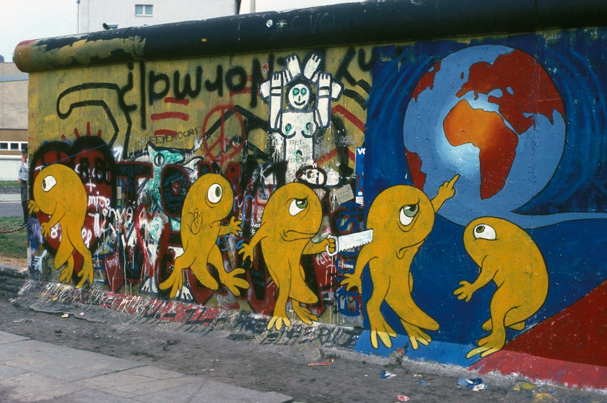
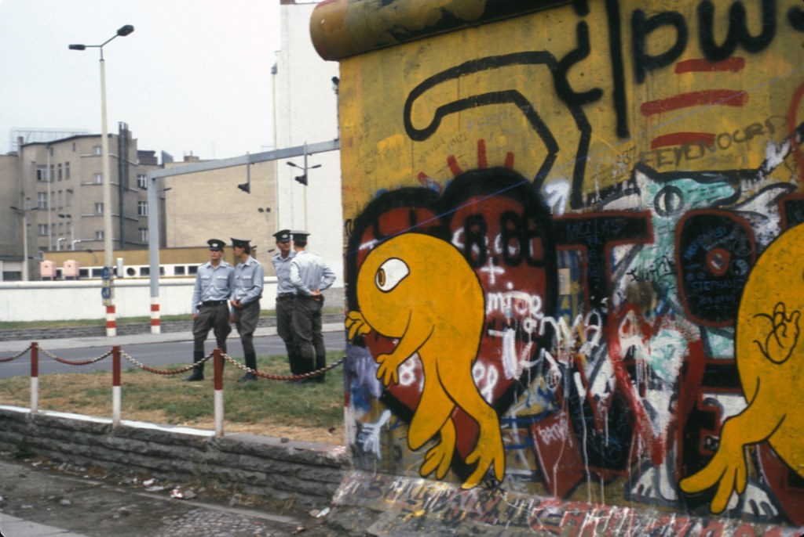
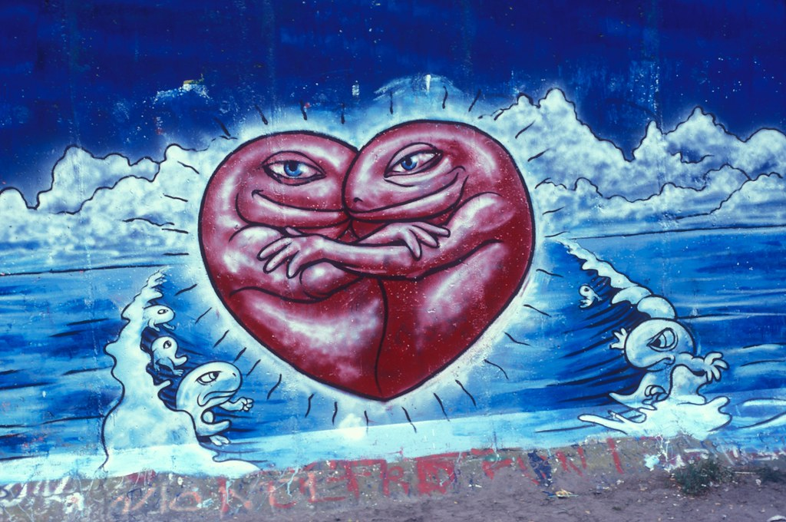
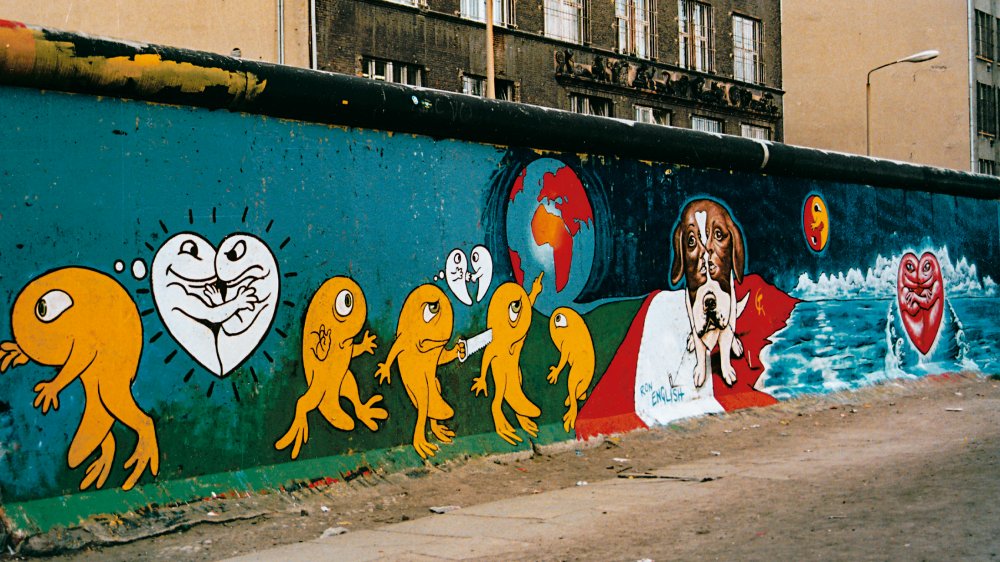

**Sections**

  
    <a href="index.html">Home</a> ·
    <a href="solo-exhibitions.html">Solo&nbsp;exhibitions</a> ·
    <a href="group-exhibitions.html">Group&nbsp;exhibitions</a> ·
    <a href="murals-and-street-works.html">Murals&nbsp;&amp;&nbsp;street&nbsp;works</a> ·
    <a href="pop-ups-shops-brand-activations.html">Pop-ups,&nbsp;shops&nbsp;&amp;&nbsp;brand&nbsp;activations</a> ·
    <a href="benefit-auctions-charity-projects.html">Benefit&nbsp;auctions&nbsp;&amp;&nbsp;charity&nbsp;projects</a> ·
    <a href="film-screenings-festivals-film-events.html">Film&nbsp;screenings,&nbsp;festivals&nbsp;&amp;&nbsp;film&nbsp;events</a> ·
    <a href="digital-projects-nft-crypto-art.html">Digital&nbsp;projects,&nbsp;NFT&nbsp;&amp;&nbsp;crypto-art</a> ·
    <a href="public-talks-lectures-book-signings.html">Public&nbsp;talks,&nbsp;lectures&nbsp;&amp;&nbsp;book&nbsp;signings</a> ·
    <a href="special-events-parties-tours.html">Special&nbsp;events,&nbsp;parties&nbsp;&amp;&nbsp;tours</a>
  

# Murals and Street Works

| Year | Dates | Location | Event | Mural title | Comment | References |
| --- | --- | --- | --- | --- | --- | --- |
| 1989 | Early November 1989 (week before the fall of the Wall) | Berlin Wall, Checkpoint Charlie, West Berlin, West Germany | Berlin Wall painting at Checkpoint Charlie | Checkpoint Charlie mural (“Peace on Earth”) | Ron spent about a week painting an unauthorized mural on the western side of the Berlin Wall at Checkpoint Charlie just days before the Wall fell, working so close to the border that East German guards tried to grab him while refugees camping nearby shouted warnings; photographs, film footage and a “Peace on Earth” postcard dated 12 November 1989 preserve the work and later histories of Berlin Wall art still cite it as a key early activist mural. **[Images ↓](#berlin-wall-1989)** | [ILoveGraffiti](https://ilovegraffiti.de/blog/2009/11/10/ron-english-am-checkpoint-charlie-1989/)   [The Rumpus](https://therumpus.net/2009/11/09/ron-english-remembers-the-berlin-wall-1989/)   [Pond5](https://www.pond5.com/stock-footage/item/10920270-west-berlin-west-germany-1988-berlin-wall-graffiti-art-bulld?dd_referrer=https%3A%2F%2Fwww.google.com%2F)   [Stiftung Berliner Mauer](https://sammlung.stiftung-berliner-mauer.de/Result?sId=605&pId=13670919&sw=Postkarte&page=1&list=0&k=WEB_0405&sort=DatumAsc&smode=And&collectionTitel=Themen&collectionSubTitel=Mauerkunst&pageSize=16)   [Poiein Kai Prattein](http://poieinkaiprattein.org/beyond-images/photography/kuzdas/exhibition-at-goethe-in-athens/index.htm)   [Festival of Lights Magazine](https://magazin-festival-of-lights.de/en/berliner-mauer-kunst) |

---
## Image gallery

### 1989 – Berlin Wall, Checkpoint Charlie

  
  
  
  

