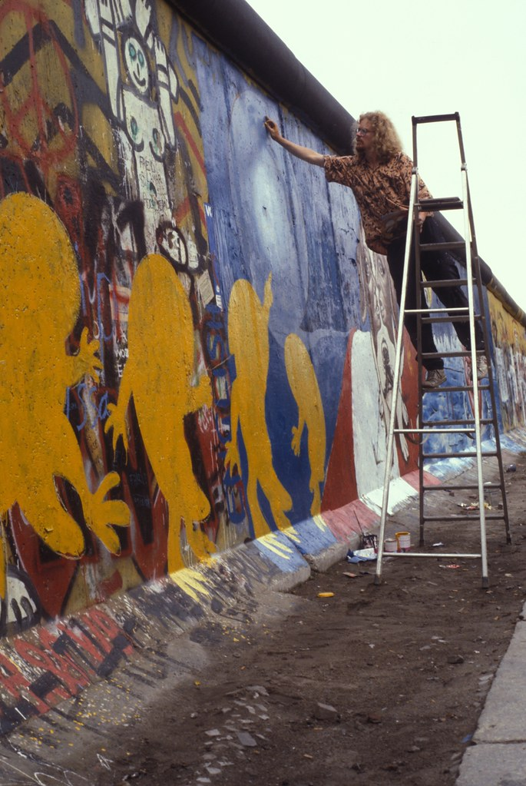

  
    <a href="index.html">Home</a> ·
    <a href="solo-exhibitions.html">Solo&nbsp;exhibitions</a> ·
    <a href="group-exhibitions.html">Group&nbsp;exhibitions</a> ·
    <a href="murals-and-street-works.html">Murals&nbsp;&amp;&nbsp;street&nbsp;works</a> ·
    <a href="pop-ups-shops-brand-activations.html">Pop-ups,&nbsp;shops&nbsp;&amp;&nbsp;brand&nbsp;activations</a> ·
    <a href="benefit-auctions-charity-projects.html">Benefit&nbsp;auctions&nbsp;&amp;&nbsp;charity&nbsp;projects</a> ·
    <a href="film-screenings-festivals-film-events.html">Film&nbsp;screenings,&nbsp;festivals&nbsp;&amp;&nbsp;film&nbsp;events</a> ·
    <a href="digital-projects-nft-crypto-art.html">Digital&nbsp;projects,&nbsp;NFT&nbsp;&amp;&nbsp;crypto-art</a> ·
    <a href="public-talks-lectures-book-signings.html">Public&nbsp;talks,&nbsp;lectures&nbsp;&amp;&nbsp;book&nbsp;signings</a> ·
    <a href="special-events-parties-tours.html">Special&nbsp;events,&nbsp;parties&nbsp;&amp;&nbsp;tours</a>
  

# Murals and Street Works

| Year | Dates | Location | Event | Mural title | Comment | References |
| --- | --- | --- | --- | --- | --- | --- |
| 1989 | Early November 1989 (week before the fall of the Wall) | Berlin Wall, Checkpoint Charlie, West Berlin, West Germany | Berlin Wall painting at Checkpoint Charlie | Checkpoint Charlie mural (“Peace on Earth”) | Ron spent about a week painting an unauthorized mural on the western side of the Berlin Wall at Checkpoint Charlie just days before the Wall fell, working so close to the border that East German guards tried to grab him while refugees camping nearby shouted warnings; photographs, film footage and a “Peace on Earth” postcard dated 12 November 1989 preserve the work and later histories of Berlin Wall art still cite it as a key early activist mural. **[Images ↓](#berlin-wall-1989)** | </li><li>[ILoveGraffiti](https://ilovegraffiti.de/blog/2009/11/10/ron-english-am-checkpoint-charlie-1989/)   </li><li> [The Rumpus](https://therumpus.net/2009/11/09/ron-english-remembers-the-berlin-wall-1989/) </li><li> [Pond5](https://www.pond5.com/stock-footage/item/10920270-west-berlin-west-germany-1988-berlin-wall-graffiti-art-bulld?dd_referrer=https%3A%2F%2Fwww.google.com%2F) </li><li> [Stiftung Berliner Mauer](https://sammlung.stiftung-berliner-mauer.de/Result?sId=605&pId=13670919&sw=Postkarte&page=1&list=0&k=WEB_0405&sort=DatumAsc&smode=And&collectionTitel=Themen&collectionSubTitel=Mauerkunst&pageSize=16) </li><li> [Poiein Kai Prattein](http://poieinkaiprattein.org/beyond-images/photography/kuzdas/exhibition-at-goethe-in-athens/index.htm) </li><li> [Festival of Lights Magazine](https://magazin-festival-of-lights.de/en/berliner-mauer-kunst) |
| 2008 | December 2008 (Art Basel Miami week) | Wynwood streets (Primary Flight), Miami, Florida, US | PRIMARY FLIGHT 2008 | Primary Flight mural | Ron English participated in the second edition of *Primary Flight*, the massive Wynwood mural program that paralleled Art Basel Miami Beach. Curated by BooksIIII, Lynn Yohana Howard, Logan Hicks, and Anthony Spinello, the project mapped out dozens of warehouses and façades as an organized open-air exhibition. English’s contribution became part of the early wave of Wynwood walls that helped shift Miami’s street-art reputation globally. **[Images ↓](#primary-flight-2008)** | [Cool Hunting](https://coolhunting.com/culture/2008-art-basel/)   [Marc Woehr](https://marcwoehr.com/project/art-basel-miami-2008-wynwood-art-district/)   [Art Crimes – 2008 archive](https://ftp.icm.edu.pl/packages/graffiti.old/index/history2008.html)   [Arrested Motion](https://arrestedmotion.com/2009/12/basel-week-miami-09-ron-english-primary-flight-mural/)   [Designboom (general Primary Flight coverage)](https://www.designboom.com/art/primary-flight-at-art-basel-miami-12-05-08/) |
| 2021 | June 5–6, 2021 | Jersey City Mural Festival, Jersey City, New Jersey, US | Jersey City Mural Festival (inaugural edition) | Jersey City Mural Festival mural | Ron English participated in the first-ever Jersey City Mural Festival, a two-day event that turned Journal Square and Hamilton Park into a public street-art circuit. The festival highlighted large-scale works as a civic asset, and English appeared as one of its featured artists—part of a lineup that merged local talent with internationally known names. Coverage from organizers and street-art outlets shows how his POPaganda style stood out in a program designed to position Jersey City as a major East Coast hub for murals. **[Images ↓](#jersey-city-2021)** | [Hoboken Girl](https://www.hobokengirl.com/jersey-city-mural-festival-2021/)   [Jersey City Mural Festival](https://jerseycitymuralfestival.com/artist/ron-english/)   [Brooklyn Street Art](https://www.brooklynstreetart.com/2021/06/10/community-and-street-aesthetics-popping-at-jersey-city-mural-festival-2021/)   [Everything Jersey City](https://everythingjerseycity.com/jersey-city-mural-arts-festival-recap/)   [Mad Hatters NYC](https://madhattersnyc.com/blog/best-jersey-city-street-art-murals-graffiti)   [JC Mural Arts Map](https://www.jcmap.org/our-murals?mural=5d84f300a524ed46c578619b)   [NJCU – Mural Arts Project](https://www.njcu.edu/about/why-njcu/game-changer/our-city/jersey-city-mural-arts-project-sponsorship)   [NJ.com](https://www.nj.com/hudson/2019/08/world-renowned-street-artist-ron-english-brings-his-popaganda-to-jersey-city-photos.html) |
| 2018 | December 2018 (Art Basel Miami Beach week) | Wynwood Walls (citywide programming), Miami, Florida, US | Basel-week murals and appearances | Wynwood Walls – Basel Week murals | Ron English took part in Wynwood’s Basel-week programming in 2018, adding new work to the walls around the Wynwood Walls complex as Miami Art Week activated the neighborhood with live painting and artist appearances. Coverage from SprayPlanet, World Red Eye, and Hypebeast highlights how the curated roster blended established muralists with global contemporaries, with English contributing signature POPaganda imagery during one of the busiest street-art weeks of the year. **[Images ↓](#wynwood-2018)** | [SprayPlanet – Art Basel Recap](https://www.sprayplanet.com/blogs/news/spray-planet-s-official-art-basel-miami-2018-recap)   [World Red Eye – Wynwood Walls VIP Dinner](https://worldredeye.com/2018/12/wynwood-walls-vip-dinner-party/)   [Hypebeast – Wynwood Walls Programming](https://hypebeast.com/2018/11/wynwood-walls-art-basel-2018-vhils-programming)   [SprayPlanet (duplicate link)](https://www.sprayplanet.com/blogs/news/spray-planet-s-official-art-basel-miami-2018-recap) |

---
## Image gallery

### 1989 – Berlin Wall, Checkpoint Charlie

  
  
  
  

### 2018 – Wynwood Walls (Basel Week)

