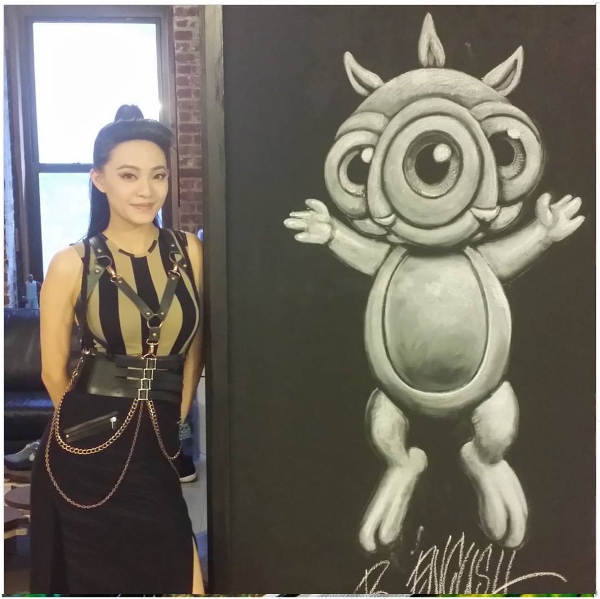

---

[⬅ Back to murals index](../murals-and-street-works.html#compound-harlem-2015-row)

# 2015 – Ronnie Rabbbit chalk drawing (The Compound, Harlem)

**Year:** 2015  
**Location:** The Compound, Harlem, New York, US  

A full-body chalk rendering of **Ronnie Rabbbit**, created by Ron English during a studio visit at **The Compound** in Harlem. The piece was documented in a photograph featuring Jian Kong and posted by English on July 28, 2015, confirming authorship and location.

## Gallery

## Sources

- [Ron English – Instagram (July 28, 2015)](https://www.instagram.com/p/5q0VtKk8M2/)

[⬅ Back to murals index](../murals-and-street-works.html#compound-harlem-2015-row)
