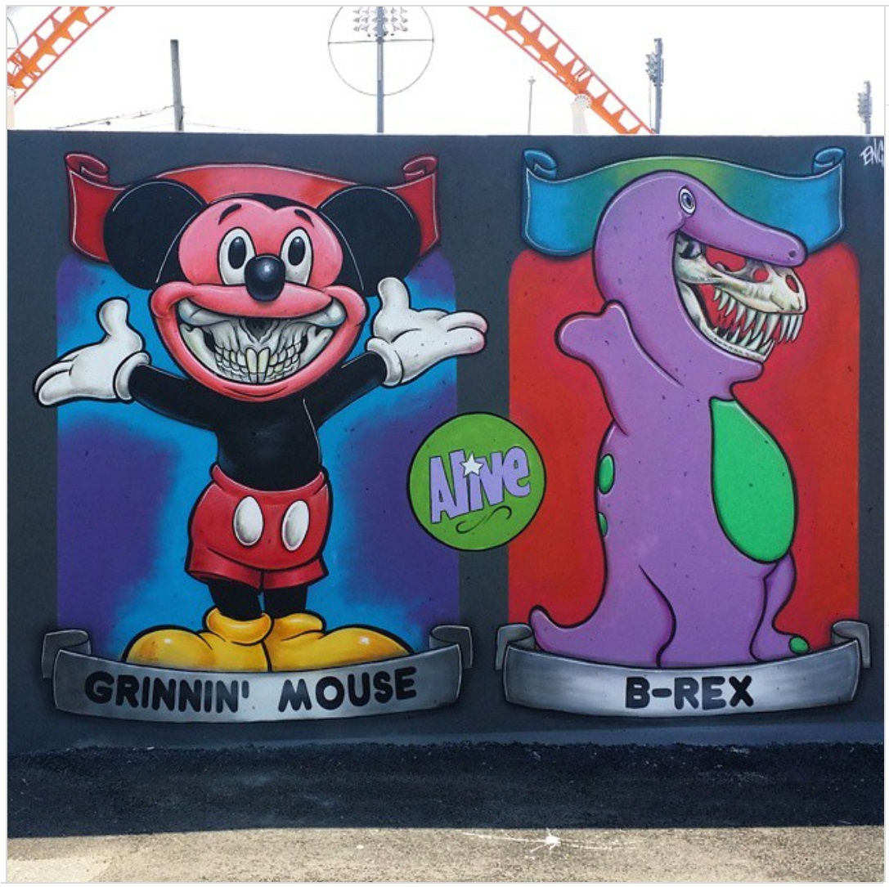
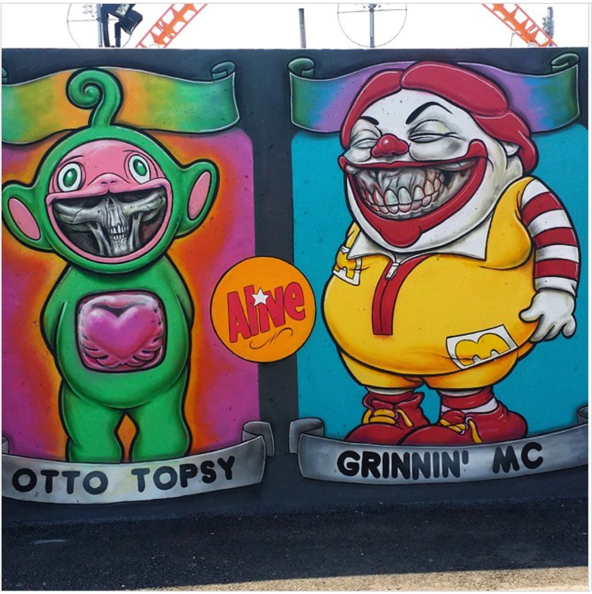

---

[⬅ Back to murals index](../murals-and-street-works.html#coney-island-2015-row)

# 2015 – “Grinnin’ McB” (Coney Art Walls)  
**Coney Island, Brooklyn, New York, US**

**Year:** 2015  
**Location:** Coney Art Walls, Coney Island, Brooklyn, New York, US  

For the inaugural season of **Coney Art Walls**, curated by Jeffrey Deitch, Ron English contributed a full-wall **“Grinnin’ McB”** mural that quickly became one of the project’s most recognizable works. The piece fuses fast-food mascots and skeletal grins into a loud, carnival-scale image that fits Coney Island’s history of spectacle. Photo sets from Time Out, Flickr and Brooklyn Street Art highlight how the wall emerged as a standout backdrop for visitors and a key visual in the effort to revive Coney Island’s public-art profile.

---

## Images

---

## Sources

- [Alamy – Coney Art Walls photo](https://www.alamy.com/coney-walls-art-otto-topsy-grinnin-mc-b-rex-coney-island-seaside-brooklyn-new-york-ny-usa-image230898857.html)
- [Flickr – Elise Feinstein photo](https://www.flickr.com/photos/elisefeinstein/18932924542/)
- [PMS Stop Motion – Coney Art Walls blog post](https://pmsstopmotion.weebly.com/pms-blog/coney-art-walls)
- [Time Out New York – Coney Art Walls returns](https://www.timeout.com/newyork/blog/coney-island-bring-backs-the-popular-street-art-exhibition-coney-art-walls-060316)
- [Brooklyn Street Art – Coney Art Walls: 30 reasons to go](https://www.brooklynstreetart.com/2015/06/24/coney-art-walls-exceeds-expectations-30-reasons-to-go/)

