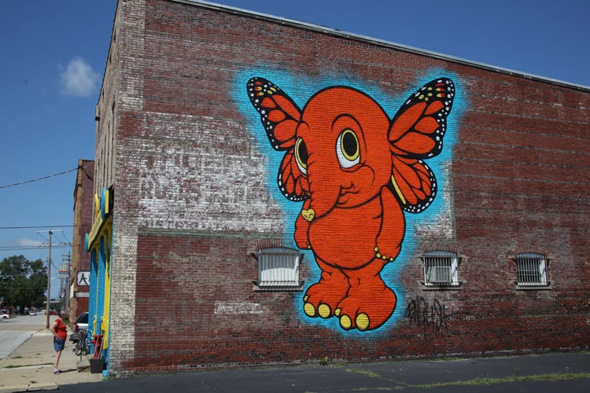

  <a href="../index.html">Home</a>
  <a href="solo-exhibitions.html">Solo exhibitions</a>
  <a href="group-exhibitions.html">Group exhibitions</a>
  <a href="../murals-and-street-works.html">Murals &amp; street works</a>
  <a href="../pop-ups-shops-brand-activations.html">Pop-ups, shops &amp; brand activations</a>
  <a href="../benefit-auctions-charity-projects.html">Benefit auctions &amp; charity projects</a>
  <a href="../film-screenings-festivals-film-events.html">Film screenings, festivals &amp; film events</a>
  <a href="../digital-projects-nft-crypto-art.html">Digital projects, NFT &amp; crypto-art</a>
  <a href="../public-talks-lectures-book-signings.html">Public talks, lectures &amp; book signings</a>
  <a href="../special-events-parties-tours.html">Special events, parties &amp; tours</a>

[⬅ Back to murals index](../murals-and-street-works.html#decatur-elefanka-2017-row)

# 2017 – Decatur, Illinois: “Elefanka” mural

**Year:** 2017 (completed mid-July)  
**Location:** Ken’s Aquarium & Pet Supply, 730 E. Cerro Gordo, Decatur, Illinois, US  
**Artist:** Ron English  

## Description

In 2017 Ron English returned to his hometown of Decatur to produce “Elefanka,” a mural painted on the exterior wall of Ken’s Aquarium & Pet Supply. The character — emblematic of English’s POPaganda universe — joins other community murals commissioned under the Decatur Area Arts Council’s Mural Project. :contentReference[oaicite:3]{index=3}  

The mural emerged as part of a larger local effort to enrich public space with art, making visible the artist’s roots and playful aesthetic in the city of his birth. :contentReference[oaicite:4]{index=4}  

## Sources

- [Decatur Magazine – “The Godfather of Street Art Makes his Mark on Decatur” (July 28, 2017)](https://decaturmagazine.com/godfather-street-art-makes-mark-decatur/)  
- [Decatur Area Arts Council – Decatur Mural Project overview](https://www.decaturarts.org/decatur-mural-project)  
- [Wikipedia – Ron English (born in Decatur, Illinois)](https://en.wikipedia.org/wiki/Ron_English)  

