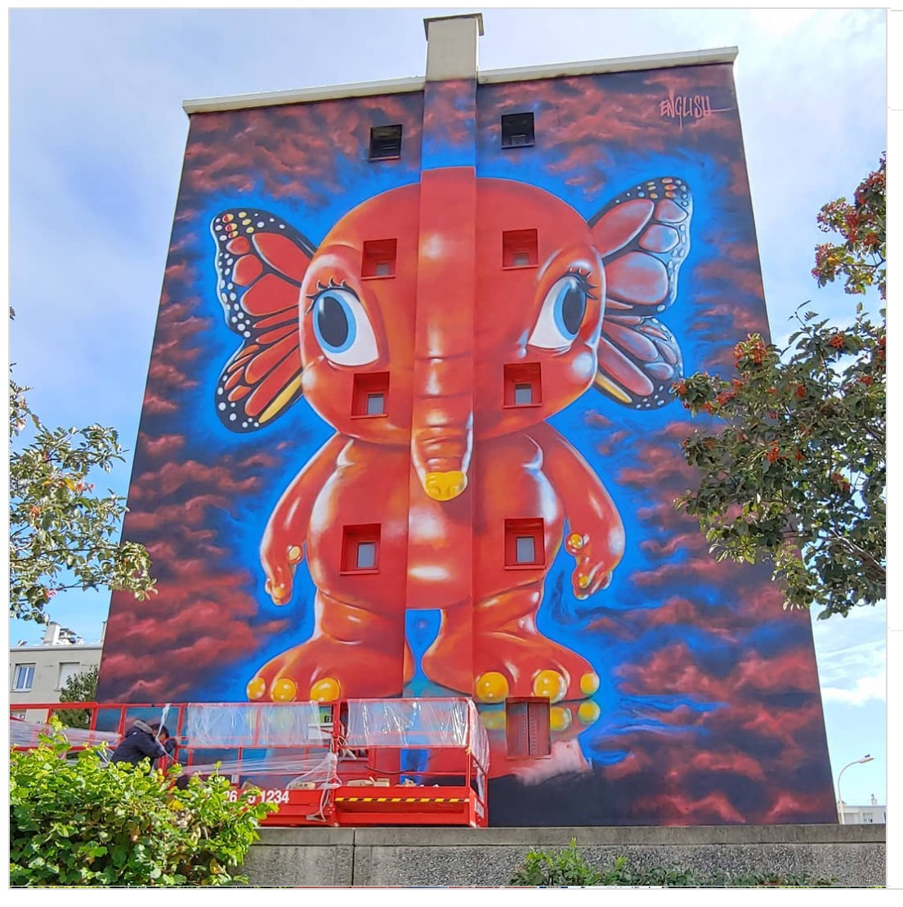

---

# 2019 – *Elefanka* (Lyon, France)

**Year:** 2019 (approx.)  
**Location:** Lyon, France  
**Program:** Large-format Lyon mural circuit

English’s *Elefanka* brought his hybrid-animal surrealism into Lyon’s growing ecosystem of XXL murals.  
Guides and walking-tour circuits list it as an unexpected POPaganda appearance among the city’s monumental façades, and local documentation from 2019–2020 confirms it as one of Lyon’s standout destinations for mural hunters exploring the expanding urban-art landscape.

---

## Images

---
## Sources

- [Ptit Loley – Lyon street art blog post](https://ptitloley.canalblog.com/archives/2019/11/06/37767436.html)
- [Street Art Safari – Lyon mural photo](https://www.street-art-safari.com/Picture@1120%E2%9C%AA)
- [Bleu Saturne – Balade street art Lyon](https://bleusaturne.wordpress.com/2020/01/23/balade-street-art-lyon/)
- [Lucky Sophie – Street art Murs XXL Lyon](https://www.luckysophie.com/2023/01/street-art-murs-xxl-a-lyon.html)

[⬅ Back to murals index](../murals-and-street-works.html#elefanka-lyon-2019-row)
