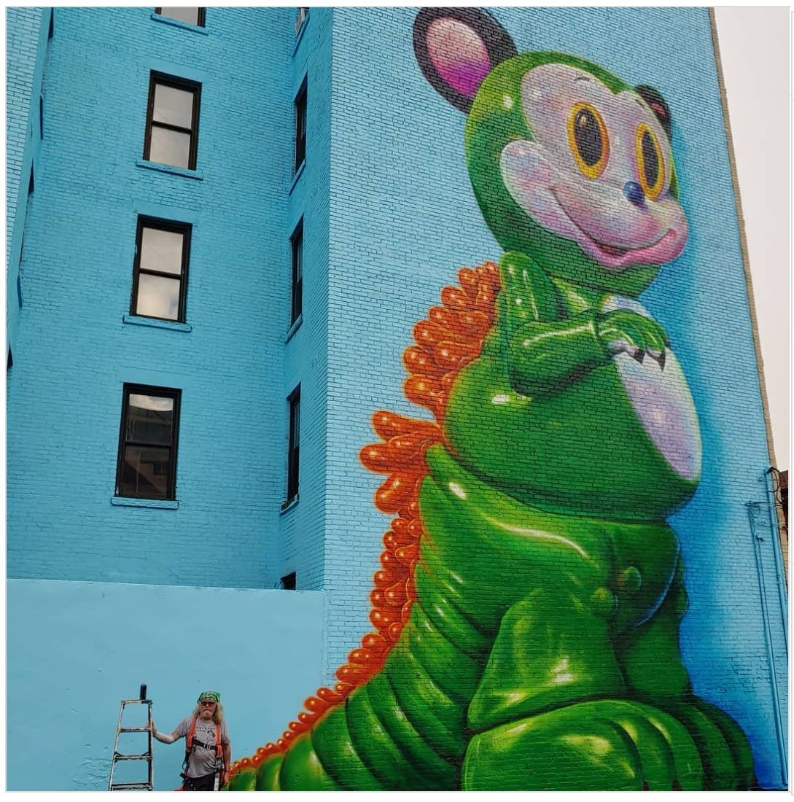
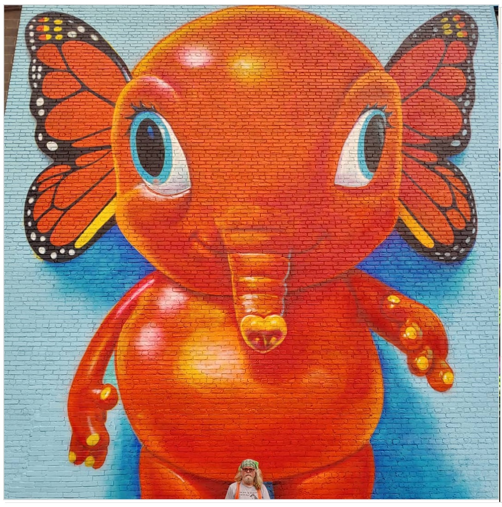

---

[⬅ Back to murals index](../murals-and-street-works.html#elefanka-mousezilla-2019-row)

# 2019 – *Elefanka and Mousezilla* (Erie & 16th St., Jersey City)

**Year:** 2019  
**Location:** Erie Street basketball court, 266 Erie St, Jersey City  
**Program:** Jersey City Mural Arts Program

Commissioned as part of the Jersey City Mural Arts Program, this two-wall, sixty-foot installation pairs a butterfly-winged orange **Elefanka** with a towering green **Mousezilla**, both drawn from English’s *Delusionville* universe.  
Painted overlooking a neighborhood schoolyard, the mural became one of Jersey City’s signature POPaganda landmarks. Local press and mural-map guides note how English — then a Jersey City resident — helped shape the city’s early push to turn everyday corners into open-air galleries.

---

## Images

---
## Sources

- [Visit Hudson – “Elefanka and Mousezilla” mural](https://www.visithudson.org/elefanka-and-mousezilla/)
- [JCMap – Mural entry](https://www.jcmap.org/our-murals?mural=5c5f8b9edd694bcdd7dfe274)
- [NJCU – Jersey City Mural Arts Project sponsorship](https://www.njcu.edu/about/why-njcu/game-changer/our-city/jersey-city-mural-arts-project-sponsorship)
- [NJ.com – Ron English brings POPaganda to Jersey City](https://www.nj.com/hudson/2019/08/world-renowned-street-artist-ron-english-brings-his-popaganda-to-jersey-city-photos.html)
- [Mad Hatters NYC – Best Jersey City street art](https://madhattersnyc.com/blog/best-jersey-city-street-art-murals-graffiti)
- [Hoboken Girl – Outdoor murals in Hoboken & Jersey City](https://www.hobokengirl.com/outdoor-murals-art-hoboken-jersey-city/)
- [Visit Hudson – Ultimate guide to Jersey City murals](https://www.visithudson.org/the-ultimate-guide-to-jersey-city-murals/)
- [YouTube – Jersey City mural video](https://www.youtube.com/watch?v=l2fFMNN_BFM)

