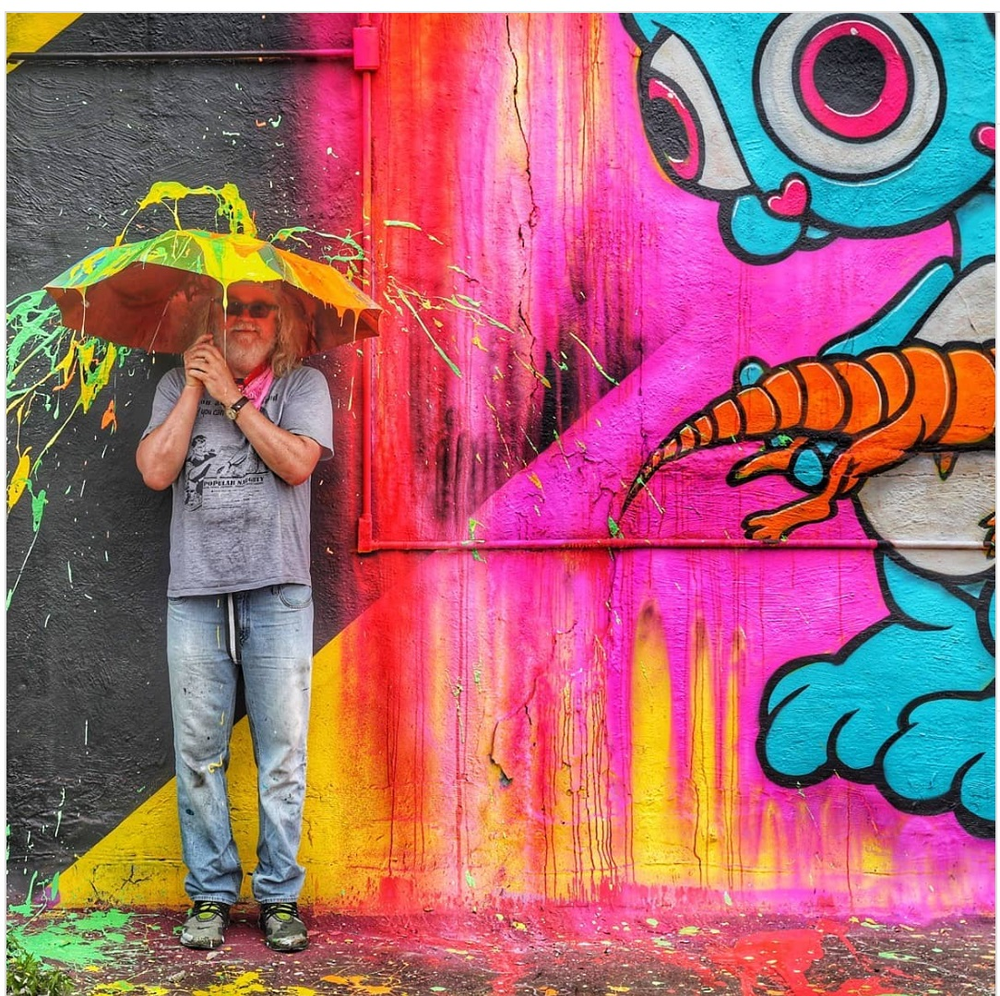
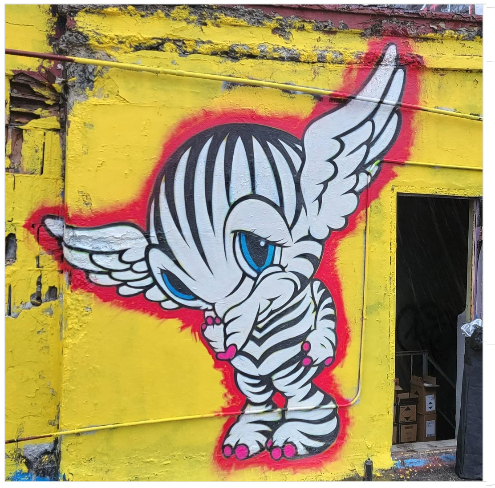
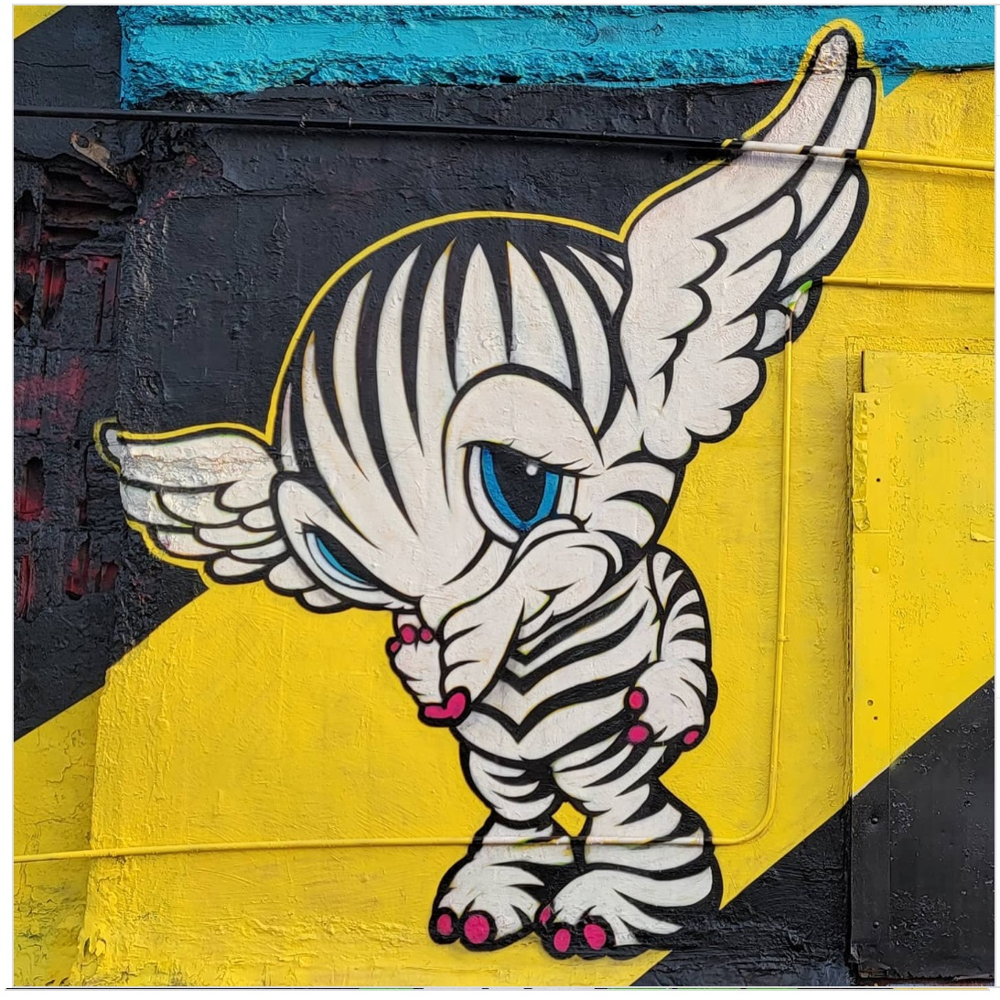
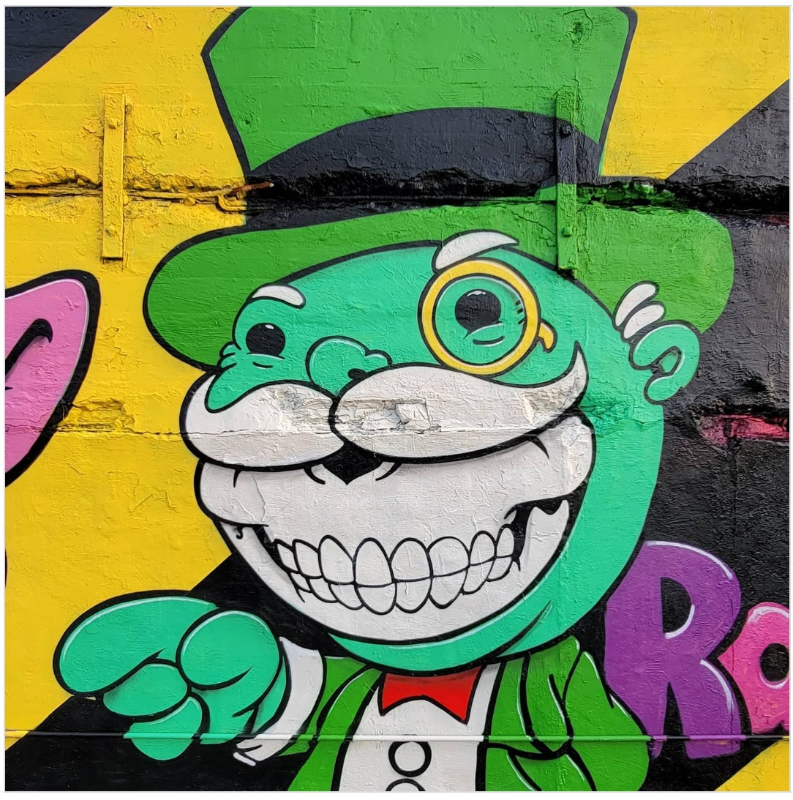

---

[⬅ Back to murals index](../murals-and-street-works.html#jersey-city-mural-festival-2021-row)

# 2021 – Jersey City Mural Festival Rooftop Mural

**Year:** June 5–6, 2021  
**Location:** Coles Street rooftop, Jersey City  
**Program:** Jersey City Mural Festival (inaugural edition)

Painted live during the inaugural **Jersey City Mural Festival**, this multi-character rooftop façade extended English’s long-running relationship with Jersey City’s public-art scene.  
Festival coverage described the weekend as a “Woodstock for artists,” noting how English’s Delusionville characters and flowing paint streams transformed the warehouse roof into a POPaganda spectacle visible across the festival zone.

---

## Images

---

## Sources

- [Patch – Jersey City welcomes Woodstock artists for new mural fest](https://patch.com/new-jersey/jersey-city/jersey-city-welcomes-woodstock-artists-new-mural-fest)
- [Brooklyn Street Art – Jersey City Mural Festival preview](https://www.brooklynstreetart.com/2021/06/05/jersey-city-mural-festival-popping-this-weekend/)
- [Brooklyn Street Art – Community & street aesthetics at Jersey City Mural Festival 2021](https://www.brooklynstreetart.com/2021/06/10/community-and-street-aesthetics-popping-at-jersey-city-mural-festival-2021/)
- [Jersey City Mural Festival – Ron English artist page](https://jerseycitymuralfestival.com/artist/ron-english/)
- [Jersey City Mural Festival – Official site](https://jerseycitymuralfestival.com/)
- [Everything Jersey City – Mural Arts Festival recap](https://everythingjerseycity.com/jersey-city-mural-arts-festival-recap/)
- [Jersey’s Best – How murals are transforming N.J. communities](https://www.jerseysbest.com/community/takin-it-to-the-streets-how-murals-are-transforming-n-j-communities/)
- [YouTube – Jersey City mural footage](https://www.youtube.com/watch?v=v933G0Z3bt0)

