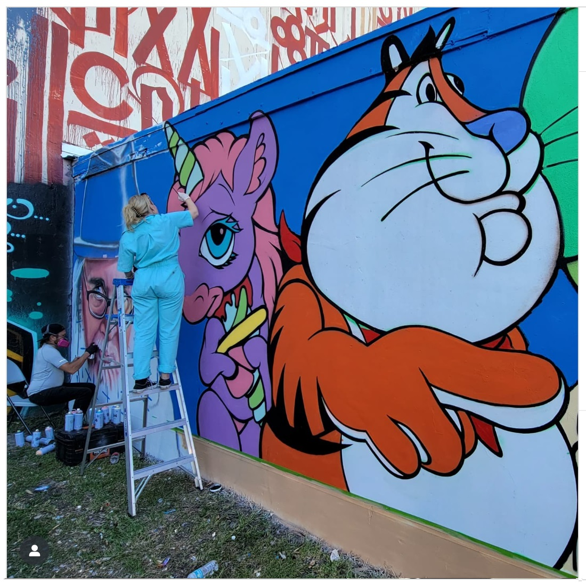
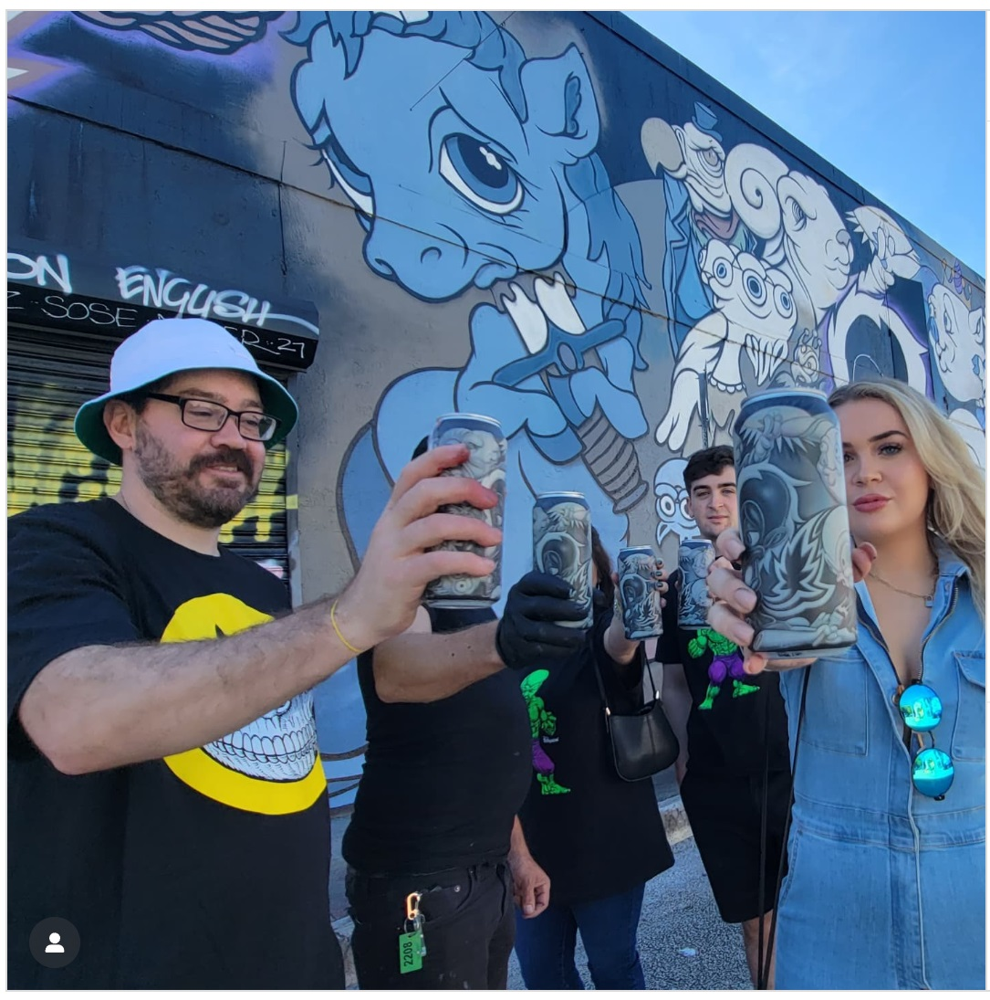
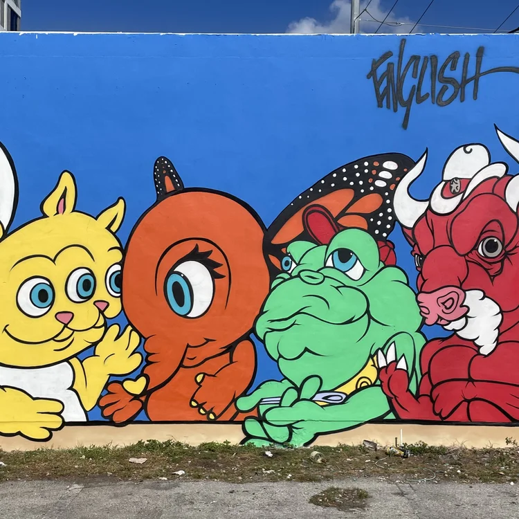

# 2021 – “The Last Supper in Delusionville” (Miami, Art Basel)

**Year:** December 2021  
**Location:** Wynwood, Miami, Florida, US  
**Event:** Art Basel Miami / Wynwood Walls–adjacent street installations  
**Artist:** Ron English  

  
  

## Description

During **Art Basel Miami 2021**, Ron English created a massive mural titled **“The Last Supper in Delusionville,”** featuring an ensemble of his stylized animal characters gathered in a parody of Leonardo da Vinci’s “Last Supper.”  
Painted in Wynwood during the annual flood of Art Basel street-art activations, the mural became one of the most photographed works of that year, appearing in festival guides, street-art blogs, and Miami art press.

## Sources

- **Ron English (official Instagram)** – post documenting the mural’s completion during Art Basel, tagged *#lastsupper*, *#delusionville*, *#artbasel*, *#wynwood*  
  https://www.instagram.com/p/CW_0X4frSUz/  

- **DailyArt Magazine – “Best Street Art at Art Basel Miami 2021”**  
  (includes Ron English’s “Last Supper in Delusionville”)  
  https://www.dailyartmagazine.com/street-art-art-basel-miami-2021/  

- **Widewalls – “Art Basel Miami 2021 Street Art Highlights”**  
  (mentions Ron English’s Basel murals and Delusionville characters)  
  https://www.widewalls.ch/magazine/art-basel-miami-street-art  

- **Wynwood Insider – Art Week coverage**  
  (multiple Ron English walls documented)  
  https://wynwoodmiami.com/art-week/  

- **Art Basel Miami photo archives (Google/IG/Twitter aggregated)**  
  (hashtags #delusionville, #ronenglish, #artbasel2021)  
  https://www.instagram.com/explore/tags/delusionville/  

- **Popaganda (Ron English official site)** – Delusionville characters & Miami appearances  
  https://popaganda.com/tag/delusionville/  

[⬅ Back to murals index](../murals-and-street-works.html#last-supper-delusionville-2021-row)
