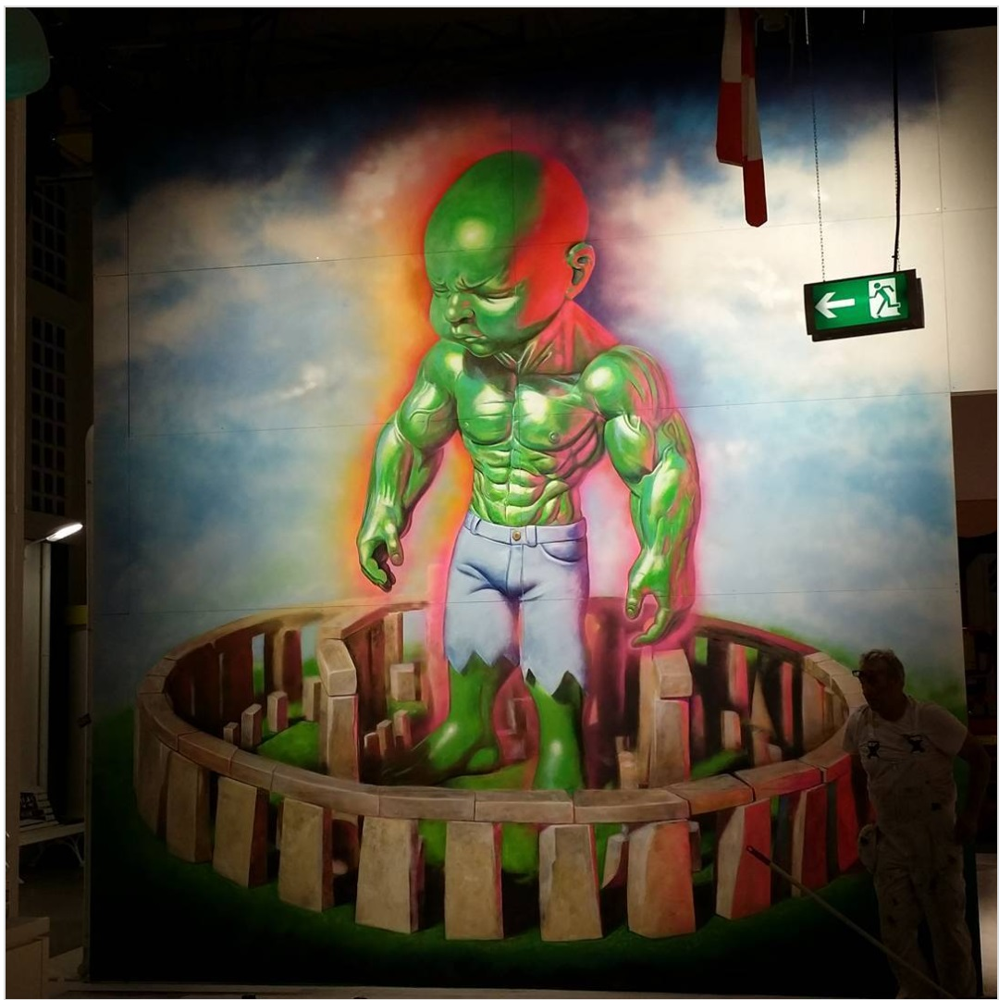
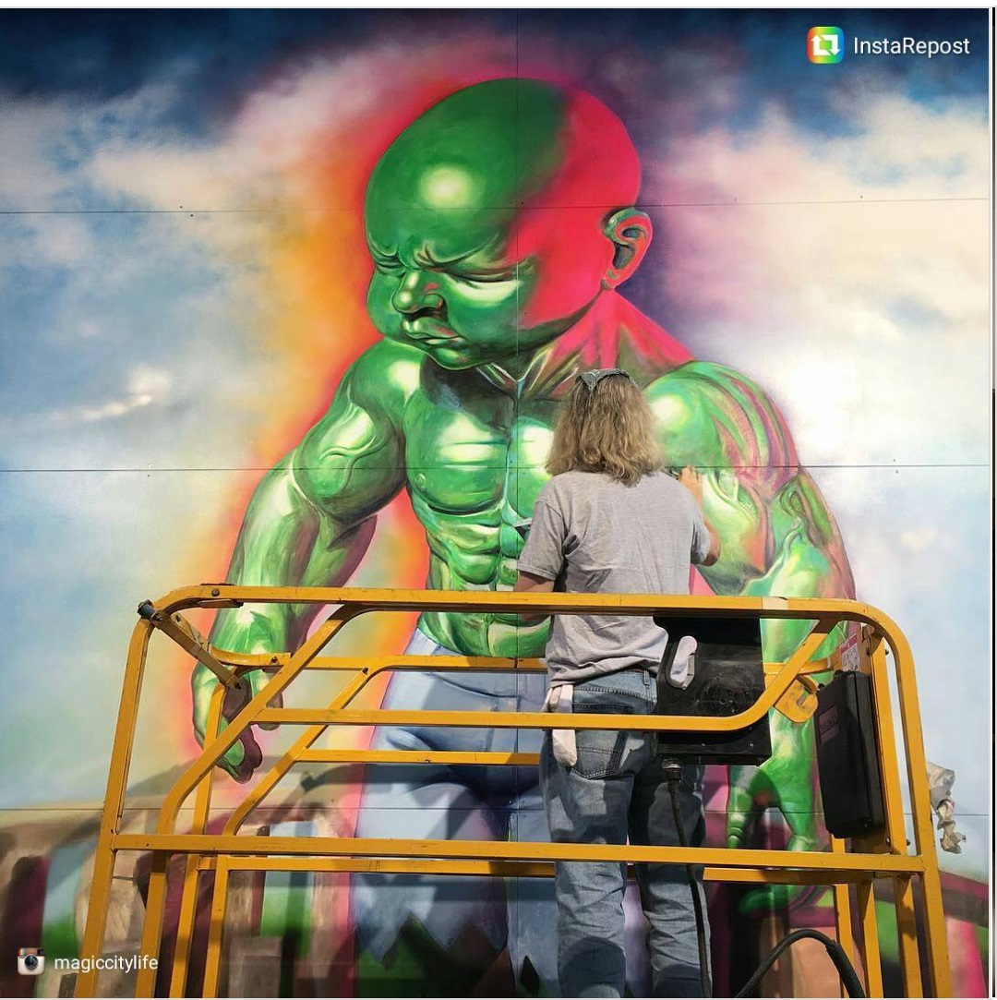

---

[⬅ Back to murals index](../murals-and-street-works.html#magic-city-dresden-2016-row)

# 2016 – Temper Tot at Magic City (Dresden)

**Year:** 2016  
**Location:** *MAGIC CITY – The Art of the Street*, Dresden, Germany  

## Sources

- **Magic City – The Art of the Street (Official Artist List)**  
  https://www.magiccity.art/artists  
  *(Ron English listed among participating artists)*

- **Magic City Dresden Exhibition Overview – StreetArtNews**  
  https://www.streetartnews.net/2016/10/magic-city-art-of-street-opens-in.html  
  *(Features Ron English among artists contributing large-scale works)*

- **Magic City Exhibition Review – Widewalls**  
  https://www.widewalls.ch/magazine/magic-city-art-of-the-street-dresden  
  *(Confirms English’s participation in the Dresden installation)*

- **Magic City exhibition press materials (via OSTRA-Dome + MKTG Germany)**  
  https://www.ostra-dome.de/magic-city/  
  *(Lists Ron English as one of the featured muralists)*

- **Ron English – Instagram posts documenting the installation (Sept 2016)**  
  https://www.instagram.com/p/BK2tH8kg4al/  
  https://www.instagram.com/p/BK1E9GLgWOP/
