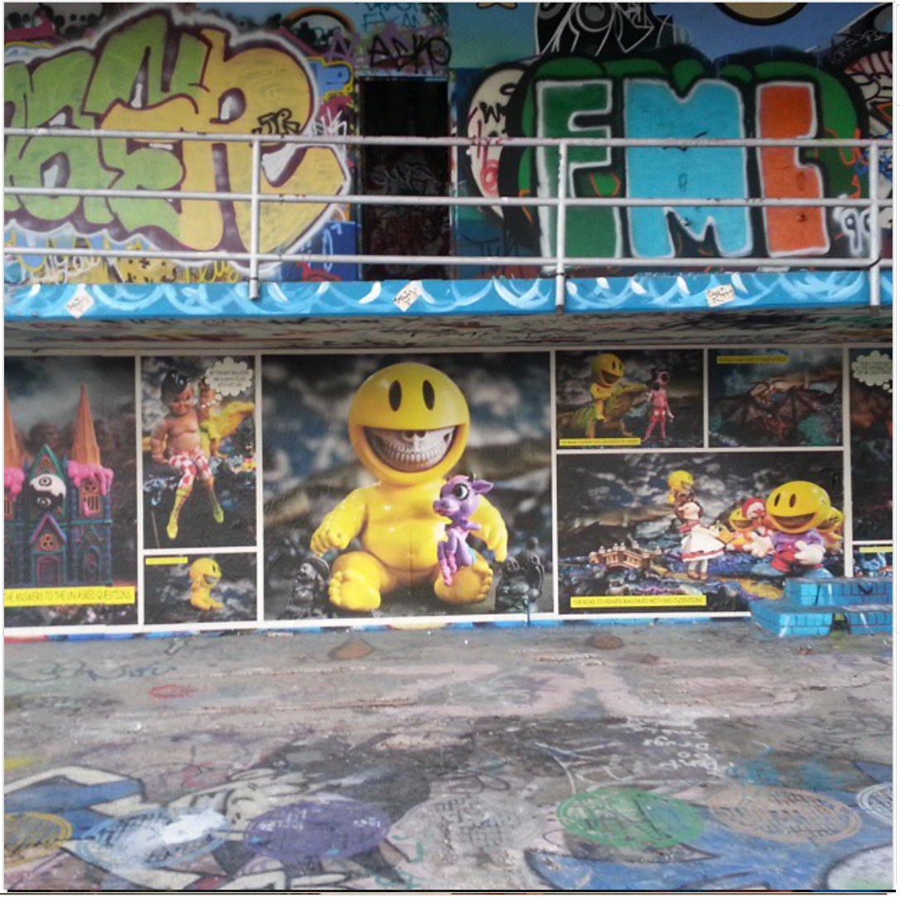
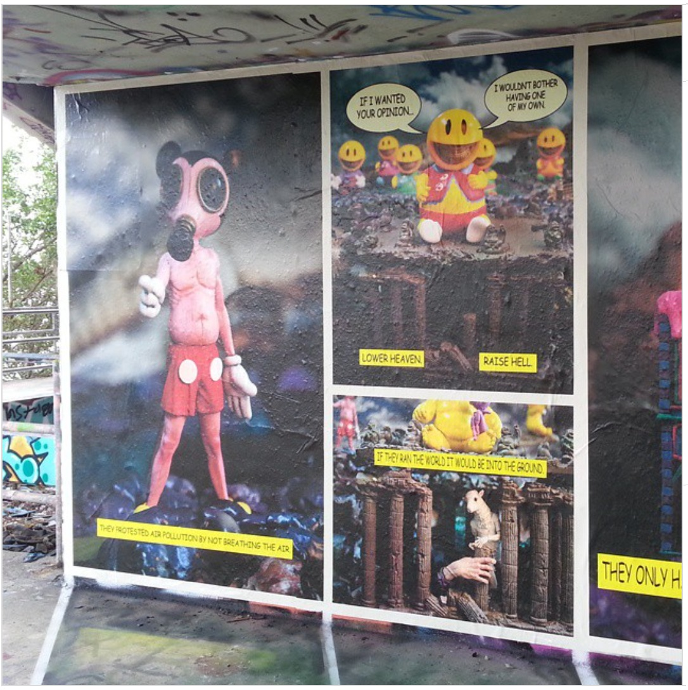

  <a href="../index.html">Home</a> ·
  <a href="../exhibitions/solo-exhibitions.html">Solo exhibitions</a> ·
  <a href="../exhibitions/group-exhibitions.html">Group exhibitions</a> ·
  <a href="../murals-and-street-works.html">Murals &amp; street works</a> ·
  <a href="../pop-ups-shops-brand-activations.html">Pop-ups, shops &amp; brand activations</a> ·
  <a href="../benefit-auctions-charity-projects.html">Benefit auctions &amp; charity projects</a> ·
  <a href="../film-screenings-festivals-film-events.html">Film screenings, festivals &amp; film events</a> ·
  <a href="../digital-projects-nft-crypto-art.html">Digital projects, NFT &amp; crypto-art</a> ·
  <a href="../public-talks-lectures-book-signings.html">Public talks, lectures &amp; book signings</a> ·
  <a href="../special-events-parties-tours.html">Special events, parties &amp; tours</a>

---

[⬅ Back to murals index](../murals-and-street-works.html#miami-marine-stadium-2014-row)

# 2014 – Miami Marine Stadium (Art | History Mural Project)  
**Miami, Florida**

**Year:** 2014  
**Location:** Miami Marine Stadium, Miami, Florida, US  

Created for the **Art & History Mural Project**, Ron English’s murals were produced directly on the aging concrete structure of the abandoned Miami Marine Stadium. English joined a roster of major street artists—including Crash, Tristan Eaton, Logan Hicks, The London Police, Reinier Gamboa, and Jose Mertz—transforming both the stadium interior and exterior into a large-scale collaborative installation.

The initiative aimed to raise awareness for the historic stadium’s preservation. Photographs of the murals were later issued as limited-edition prints to support restoration efforts, with related exhibitions shown during Miami Art Week.

---

## Gallery

### **Marine-Stadium-1**

### **Marine-Stadium-2**

### **Marine-Stadium-3**

---

## Sources

- [Brooklyn Street Art – Miami Marine Stadium street art project](https://www.brooklynstreetart.com/2014/10/09/a-miami-waterfront-stadium-slaughtered-by-street-artists/)
- [Miami Marine Stadium – The Art History Mural Project](https://www.marinestadium.org/the-art-history-mural-project)
- [Miami New Times – Art History Project transforms Marine Stadium](https://www.miaminewtimes.com/arts/art-history-project-transforms-miami-marine-stadium-6490994)
- [Time Out Miami – Art History Project](https://www.timeout.com/miami/art/art-history-project)
- [The Miami Hurricane – Abandoned Miami Marine Stadium: Art History Project](https://themiamihurricane.com/2014/12/04/abandoned-miami-marine-stadium-art-history-project/)

