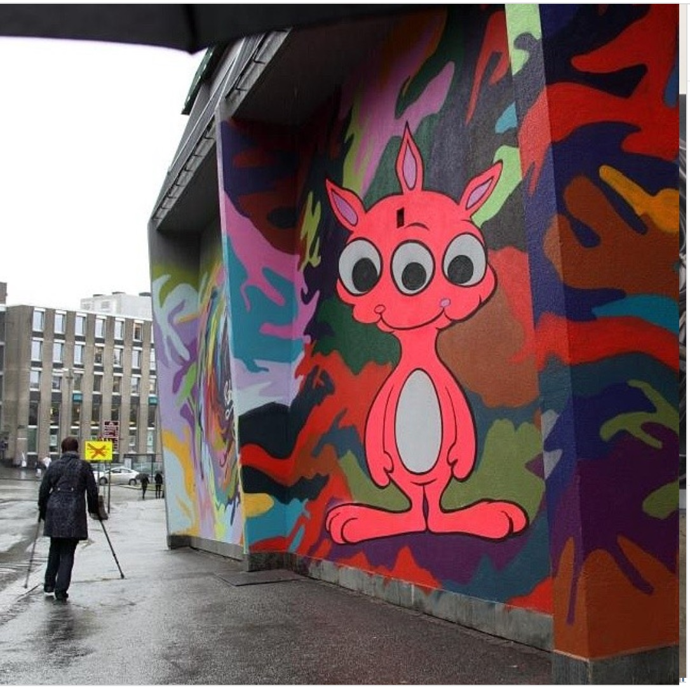

---

# 2012 – Nuart Festival mural  
**Atlantic Hotel façade, Stavanger, Norway**

**Year:** 2012  
**Location:** Stavanger, Norway (Atlantic Hotel façade)

As one of the headlining artists of **Nuart 2012**, Ron English transformed the side of the Atlantic Hotel into a towering vertical composition filled with grinning rabbit figures. The sheer scale of the work, paired with the high visibility of its placement, made it one of the most photographed murals of the festival. Norwegian press and international street-art media highlighted how the mural became a defining visual of Nuart’s 2012 edition, reinforcing Stavanger’s reputation as Europe’s premier outdoor street-art hub.

---

## Images

---

## Sources

- [Nuart Festival – Official site](https://nuartfestival.no/)
- [Brooklyn Street Art – Nuart 2012 archive](https://www.brooklynstreetart.com/tag/nuart-2012/)
- [StreetArtNews – Ron English at Nuart 2012](https://streetartnews.net/2012/09/stavanger-norway-nuart-2012-ron-english.html)
- [Juxtapoz – Ron English for Nuart Festival](https://www.juxtapoz.com/news/mural/ron-english-for-nuart-festival-in-norway/)
- [HuffPost – Nuart Festival in Stavanger](https://www.huffpost.com/entry/nuart-festival-stavanger_n_1860099)

[⬅ Back to murals index](../murals-and-street-works.html#nuart-2012-row)
