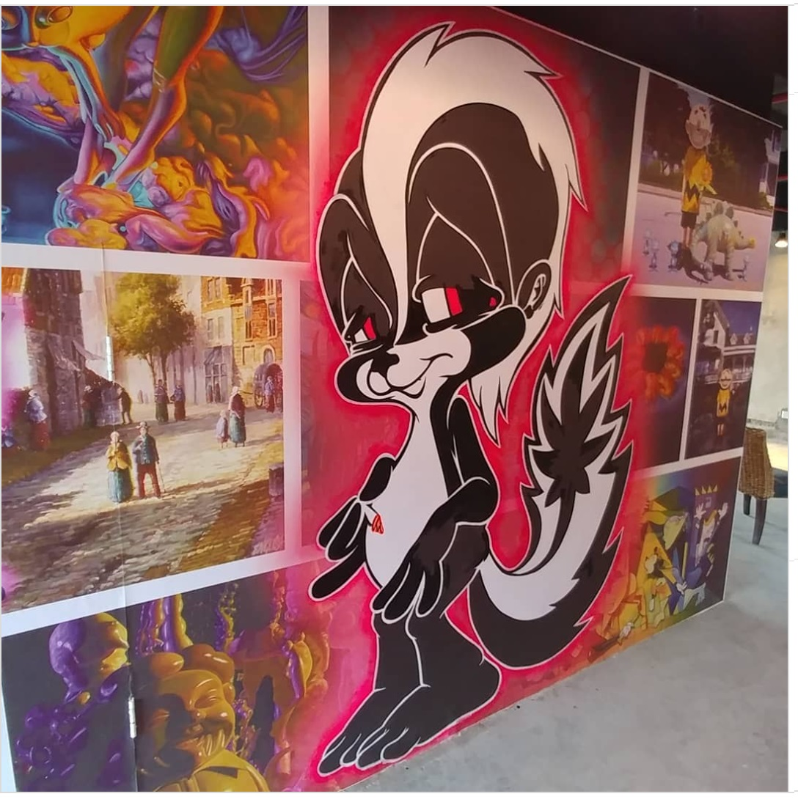

---

[⬅ Back to murals index](../murals-and-street-works.html#proam-studio-city-7th-floor-2018-row)

# 2018 – Seventh-floor POPaganda walls, ProAm Studio City (Dongguan, China)

**Year:** 2018  
**Location:** ProAm Studio City building, Changping Town, Dongguan, Guangdong, China  

Ron English developed a suite of POPaganda characters on the seventh floor of the ProAm Studio City building, part of Pop Life Global’s creative hub in Dongguan. The project links his ongoing collaborations with Pop Life to the company’s in-house “ProAm Studio City” complex, where multiple artists were invited to turn entire floors into immersive environments.

  
  
  
  
  
  
  
  

## Sources

- [ToysREvil – “Marvin the Martian Grin” by Ron English](https://toysrevil.blogspot.com/2018/07/marvin-martian-grin-by-ron-english-for.html) – cites Ron English’s Instagram post tagged `#PROAM` and `#proamstudiicity`, documenting his Pop Life / ProAm Studio City work in May 2018. :contentReference[oaicite:0]{index=0}  
- [Pop Life Global – Pro-Am Studio City contact page](https://pop-life.com/products.html) – lists **Pro-Am Studio City** in Dongguan, China, as Pop Life’s in-house creative and production facility. :contentReference[oaicite:1]{index=1}  
- [The Art of Chase – China street art / vinyl toys (ProAm Studio City Building)](https://www.theartofchase.com/new-blog/tag/china%2Bstreet%2Bart) – describes the ProAm Studio City Building in Dongguan as a multi-floor mural and creative hub for PopLife/MindStyle, with different artists assigned to separate floors. :contentReference[oaicite:2]{index=2}  
- [Instagram – #proamstudiicity](https://www.instagram.com/explore/tags/proamstudiicity/) – hashtag feed including Ron English’s ProAm Studio City posts from May 2018.  
- [Instagram – @ronenglishart](https://www.instagram.com/ronenglishart/) – Ron English’s official account; May 7–18 posts from 2018 document the seventh-floor ProAm Studio City walls.

