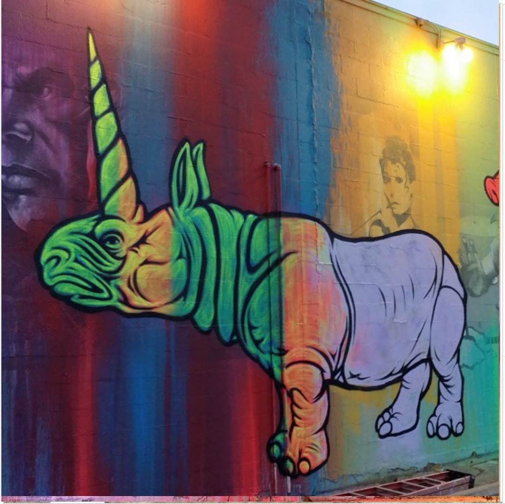
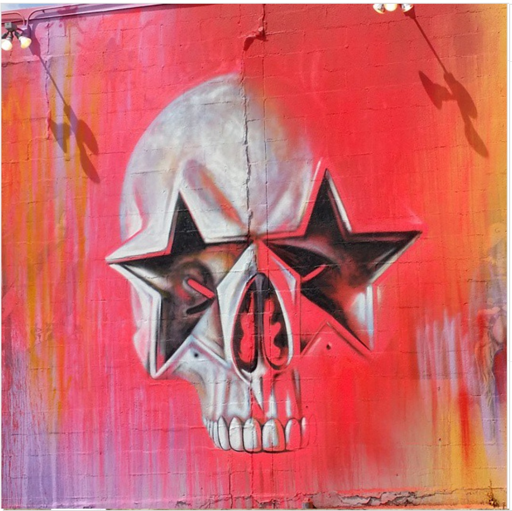

---

# 2015 – RXSM / Spider House Ballroom mural  
**Austin, Texas — collaboration with RISK**

**Year:** 2015  
**Location:** Spider House Cafe & Ballroom, Austin, Texas, US  

Painted during the **6th annual RXSM Self-Medicated Film Expo**—right in the middle of SXSW—this massive exterior wall became a high-visibility collaboration between **Ron English** and **Kelly “RISK” Graval**. The new painting replaced Spider House’s long-standing movie-themed mural with a saturated POPaganda scene: skull-smiley iconography, explosive colors, and a controversial scantily clad cow character that sparked commentary in Austin press.

Popaganda, Montana-Cans, and local blogs frame the piece as a defining moment of the festival year—an unexpected collision of film-expo energy, SXSW chaos, and two of the most recognizable aesthetics in contemporary street art. The mural has since become one of English’s most photographed works in Austin.

---

## Images

---

## Sources

- [Urban Nation – Paint, Protest, Party (BSA x Art Basel Miami)](https://urban-nation.com/2016/12/paint-protest-party-bsa-x-art-basel-miami-16-dispatch-5/)
- [Montana Cans – Risk & Ron English’s latest mural in Austin](https://www.montana-cans.blog/risk-ron-englishs-latest-mural-austin-texas/)
- [POPaganda – Archive: POPaganda x SXSW “Awesome”](https://www.popaganda.com/news/archive-popaganda-x-sxsw-awesome)
- [POPaganda – Archive: RXSM “The Expression”](https://www.popaganda.com/news/archive-rxsm-the-expression)
- [The Daily Texan – Spiderhouse mural concerns reader](https://www.dailytexanonline.com/2015/04/23/spiderhouse-mural-concerns-reader/)

[⬅ Back to murals index](../murals-and-street-works.html#rxsm-spiderhouse-2015-row)
