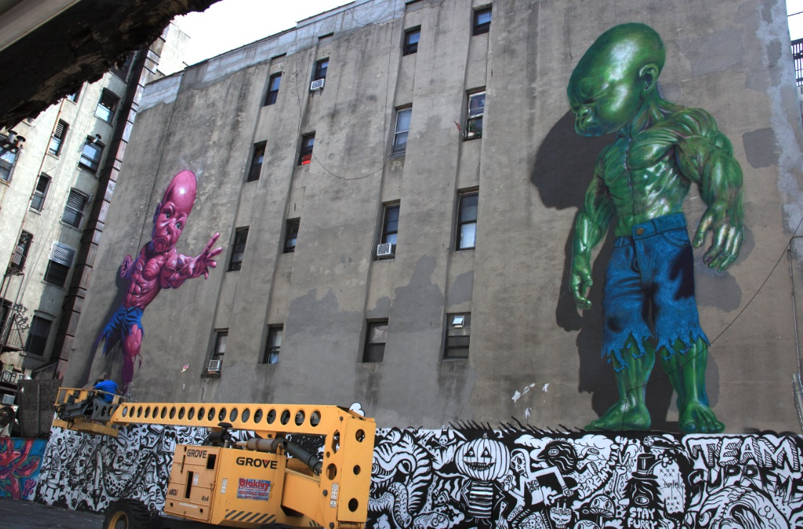

---

[⬅ Back to murals index](../murals-and-street-works.html#temper-tot-little-italy-2015-row)

# 2015 – Temper Tot (Pink), Little Italy  
**LoMan Arts Festival — Manhattan, New York, US**

**Year:** 2015  
**Location:** Little Italy (Mulberry St.), Manhattan, NYC  

Painted for the first **LoMan Arts Festival**, Ron English returned to Mulberry Street and reimagined Temper Tot in a vivid **pink** variant towering above the neighborhood. The refreshed mural transformed a familiar POPaganda landmark into a new festival centerpiece. Coverage from StreetArtNews, Viewing NYC, and Brooklyn Street Art highlighted how this piece helped solidify LoMan as Lower Manhattan’s inaugural large-scale mural festival, drawing heavy foot traffic and becoming one of the event’s most shared installations.

---

## Images

---

## Sources

- [StreetArtNews – Ron English mural in Little Italy](https://streetartnews.net/2015/08/new-york-ron-english-new-mural-in-little.html)
- [Viewing NYC – Pink Temper Tot mural in Little Italy](https://www.viewing.nyc/ron-english-paints-new-mural-of-pink-temper-tot-in-little-italy/)
- [Brooklyn Street Art – “Something in the Air”](https://www.brooklynstreetart.com/2015/08/11/something-in-the-air/)
- [The L.I.S.A. Project NYC – Official site](https://www.thelisaprojectnyc.org/)
- [Untapped Cities – Temper Tot comes to LoMan Arts Festival](https://untappedcities.com/2015/08/10/ron-englishs-temper-tot-comes-in-pink-for-loman-arts-festival/)
