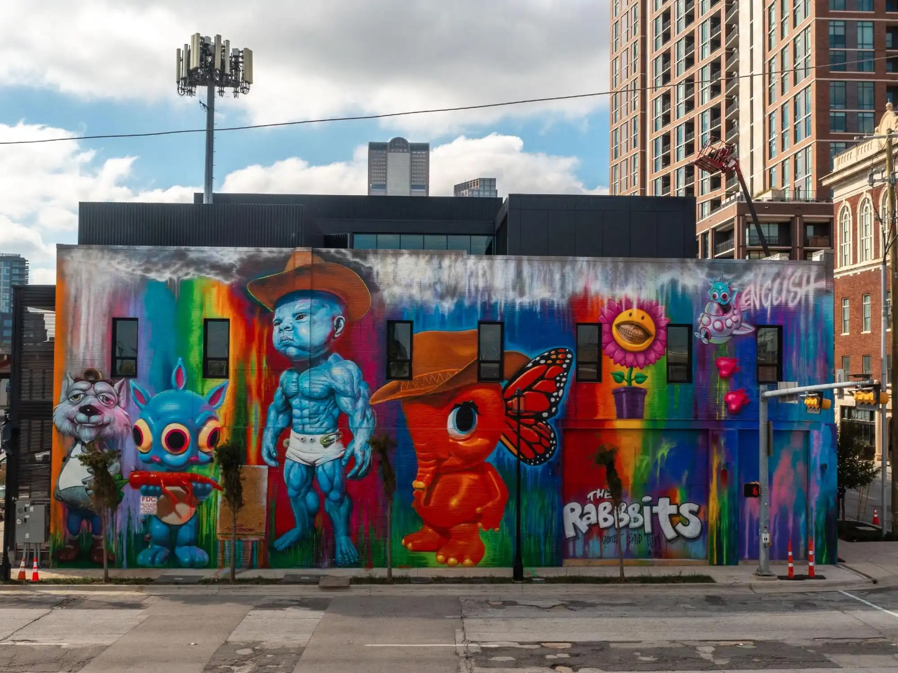
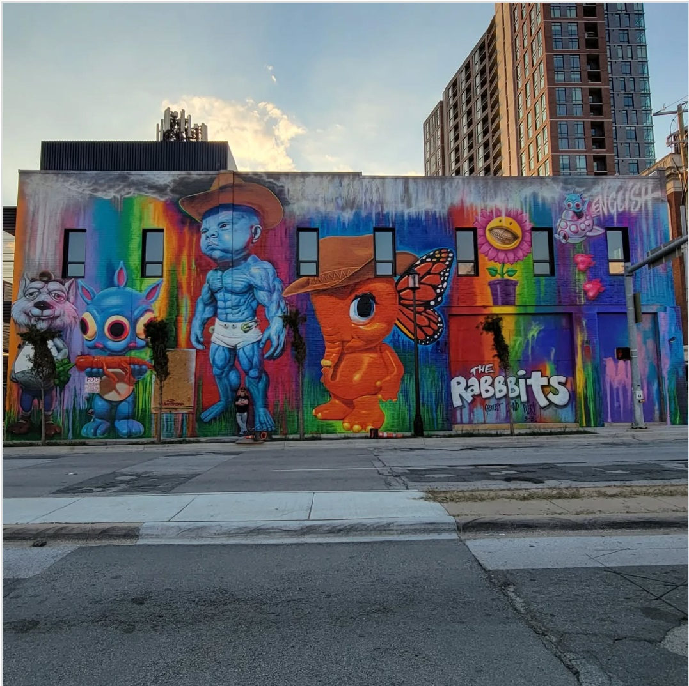

---

# 2022 – *Texas Tantrum Trots and Pals* (Deep ElIum, Dallas)

**Year:** November 2022  
**Location:** Deep Ellum, Dallas, Texas  
**Program:** Deep Ellum neighborhood mural initiative

Installed in the heart of Deep Ellum’s arts district, *Texas Tantrum Trots and Pals* marked English’s return to Texas with one of the area’s most flamboyant pieces.  
Blending POPaganda characters with Texas-themed surrealism, the work immediately became a district landmark. Coverage from **D Magazine** and **StreetArtCities** highlights how the mural fits into Deep Ellum’s tradition of bold, maximalist walls and its broader revitalization as a contemporary public-art zone.

---

## Images

---

## Sources

- [Reddit – ATBGE thread](https://www.reddit.com/r/ATBGE/comments/12ol6oi/this_mural_to_keep_the_arts_district_weird/)
- [Dreamstime – Texas Tantrum Trots mural photo](https://www.dreamstime.com/mural-titled-texas-tantrum-trots-pals-ron-english-deep-ellum-east-dallas-texas-pictured-mural-titled-texas-image262664464)
- [D Magazine – Ron English comes home to Deep Ellum](https://www.dmagazine.com/arts-entertainment/2022/11/legendary-graffiti-artist-ron-english-comes-home-to-deep-ellum-with-a-new-mural/)
- [Street Art Cities – Marker page](https://streetartcities.com/markers/4f8a47dd-06de-47c4-9fb2-e40d9149f5fa)
- [CultureMap Dallas – Deep Ellum mural article](https://dallas.culturemap.com/news/arts/deep-ellum-mural-ron-english/)

[⬅ Back to murals index](../murals-and-street-works.html#texas-tantrum-trots-and-pals-row)
